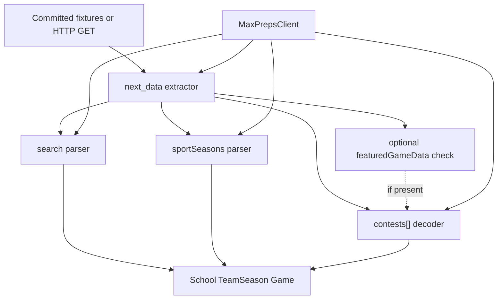
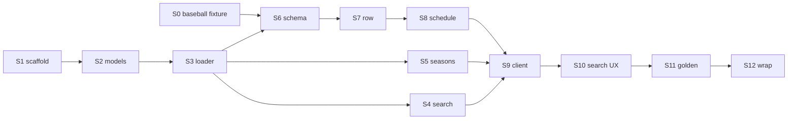

# Phase 2

This file has two parts:

1. **Approved plan** — the final Phase 2 Slice 0–12 plan as approved after planning review. It records intent, not what was later implemented.
2. **Implementation Notes** — what completed slices actually did. Differences from the plan belong there, not as silent edits to the approved plan text.

Do not treat Implementation Notes as amendments to the approved plan.

---

# Phase 2 — Fixture-Driven MaxPreps Client

## 1. Phase objective and completion criteria

**Objective:** Deliver a tested Python client that can:

1. Search schools by short name and return disambiguated `School` results.
2. Parse school-home `sportSeasons[]` into **all** supplied `TeamSeason` rows (including historical leftovers such as Pike County `11-12`). No production current-year/rollover filter.
3. Fetch a head-to-head schedule and return normalized `Game` objects from `contests[]` (plus team metadata present on that page).

This is PRODUCT.md §30 with Slice 18 research revisions. It is **not** the Home Assistant integration.

**Product sport priorities for Phase 2 acceptance:**

1. Football (existing evidence — required)
2. Baseball (schedule payload **not yet captured** — required fixture acquisition; see Slice 0 row requirement)
3. Basketball (research-observed, not committed — optional inexpensive extra coverage)
4. Softball only if it becomes technically useful (not required; not representational)

Volleyball remains a valid **regression** fixture. It is not a product acceptance target.

**Phase 2 is complete when all of the following are true:**

- `search_schools` → `get_school_teams` → `get_schedule` works end-to-end against committed fixtures.
- Football and baseball decode through the **same** contest parser (basketball too, if its fixture was acquired). Baseball counts only if Slice 0 produced **at least one** contest row that validates against the researched 41-column / 32-participant structure.
- Identity, URL, timezone, status, and transport conventions from [docs/MAXPREPS_RESEARCH.md](docs/MAXPREPS_RESEARCH.md) Slices 17–18 survive in code and tests.
- `contests[]` is the schedule source; `featuredGameData` is an optional consistency check, not a decode prerequisite.
- Tennis, golf, track/meet, and legacy ASPX are **not** implemented; existing tennis/track fixtures are canaries for missing Next.js data, not a production “this is ASPX” classifier.
- No Home Assistant entities, coordinators, config flow, cards, or HACS metadata exist yet.
- Tests run without live MaxPreps traffic (Slice 0 acquisition is the only planned live fetch).
- Living plan Implementation Notes plus a PRODUCT.md drift report exist; silent product changes did not occur.

**Repository starting point:** Existing git repo at `/srv/data/projects/hacs-highschoolscores` with public GitHub `origin` (`https://github.com/willbur83/hacs-highschoolscores.git`); `main` tracks `origin/main`. Docs, sanitized fixtures, and [scripts/explore/capture.py](scripts/explore/capture.py) are present in the worktree. No Python client package yet.

Treat this as a **public GitHub repository intended to become a public HACS custom integration**. Do not design, comment, or gate Phase 2 around a private-repo possibility.

---

## 2. Evidence inventory vs acquisition

### Already committed (use as-is)

- Search: Centennial, Bainbridge, Pike County, St. Edward
- Team enumeration (`sportSeasons[]`): all four schools, including Centennial Boys Varsity Baseball `canonicalUrl` `https://www.maxpreps.com/ga/roswell/centennial-knights/baseball/` (`sportSeasonId` `0e872276-…`, Spring 26-27)
- Football schedules: Centennial, Bainbridge, Pike County, St. Edward (Next.js `contests[]` + `featuredGameData`, arity 41, populated rows)
- Volleyball schedule: Centennial (Next.js; Slice 14). **Regression only.**
- Tennis / girls track: Centennial pages without `__NEXT_DATA__` / `contests[]` (research classified as legacy ASPX). **Test canaries for missing Next.js data only.**

### Observed in research, not committed

- Centennial Girls Varsity Basketball schedule: live GET in Slice 14 (`…/basketball/girls/schedule/`), Next.js, sparse 6-row preseason, same arity 41. Private cache path recorded as `captures/private/www.maxpreps.com/a89b0d585a1ebd0c.*`. **Not** in `tests/fixtures/`. Workspace `captures/` may be empty when Phase 2 starts.

### Not captured

- **Baseball schedule** — no payload. Exists only as enumeration rows.
- **Softball schedule** — not captured. Guessed `…/softball/schedule/` 404; canonical is `…/softball/fall/`.
- Boys varsity basketball schedule — not fetched (girls confirmatory only).

### Slice 0 — Bounded fixture acquisition (required before baseball acceptance tests)

**Objective:** Obtain one sanitized Centennial **Boys Varsity Baseball** schedule fixture using already-established capture rules. Do not reopen sports research.

**Allowed live traffic (maximum):**

1. **Required:** `GET https://www.maxpreps.com/ga/roswell/centennial-knights/baseball/schedule/`  
   Base URL = payload `canonicalUrl`. Request the established `schedule/` child via safe URL joining (section 3.2). Use [scripts/explore/capture.py](scripts/explore/capture.py), existing User-Agent, ≥2s delay, no cookies, no retries on 403/429/challenge, no guessed slug segments.
2. **Optional, inexpensive basketball coverage (not an acceptance blocker):**
   - If the Slice 14 private cache still exists, sanitize and commit it (**zero** new live requests).
   - If the cache is gone, **one** GET of the already-documented girls basketball URL `https://www.maxpreps.com/ga/roswell/centennial-knights/basketball/girls/schedule/` is allowed.
   - Do **not** fetch boys basketball, additional schools, or additional sports for coverage.
3. **Softball:** do **not** fetch. Path-in-season is already proven by enumeration + the 404 lesson. Revisit softball **only** after a stop/report if baseball evidence is insufficient. Do not silently retarget volleyball as the acceptance sport.

**Sanitize and commit** baseball as `tests/fixtures/maxpreps/centennial/baseball-schedule-26-27.json` in the same envelope style as football (`pageProps` extract + metadata). Optionally `centennial/basketball-girls-schedule-26-27.json`.

**Pass / stop rules (not a new research program):**

- Baseball is Next.js `__NEXT_DATA__` with `contests[]` that contains **at least one row**, and that row validates against arity **41** / participant width **32** → proceed; baseball is the second-sport **parser** acceptance fixture.
- Baseball is Next.js with **empty** `contests[]` (including an empty list that merely proves the schedule URL/transport exists) → **stop and report**: baseball evidence is insufficient for the football+baseball parser gate. Do not claim that gate passed. Product owner decides whether another bounded baseball capture or basketball should supply the second-sport validation.
- Baseball is a different but still columnar Next.js shape → stop and report; do not invent a second parser in later slices.
- Baseball has no `__NEXT_DATA__` / no `contests[]` → stop and report. Do not diagnose the page as “known legacy ASPX” solely from missing Next data. Product owner may then choose basketball (if committed, and if it has validating contest rows) as the second-sport stand-in; volleyball stays regression-only.

**Research doc:** Append a short **Phase 2 fixture addendum** to [docs/MAXPREPS_RESEARCH.md](docs/MAXPREPS_RESEARCH.md) (URL, status, transport, contest count, arity, whether `featuredGameData` was present). Do not expand Slice 15-style investigation.

**Non-goals:** Tennis/golf/track, other schools’ baseball, standings pages, timezone probes.

**Git:** Commit and push the new fixture(s) + research addendum to existing `origin/main`.

If implementation finds `origin` missing, a different remote, or `main` not tracking `origin/main`, **stop and report**. Do not `git init` or rewrite remotes.

---

## 3. Proposed architecture

Favor the simplest layering Slice 18 specified. No provider plugin interface, sport strategy hierarchy, or HA coordinator.



**Package location** (PRODUCT.md §22; public HACS-bound repo, no separate library):

```
custom_components/maxpreps/   # HA-free in Phase 2; no manifest/config_flow/sensor
  __init__.py
  models.py
  exceptions.py
  client.py
  parsing/
    next_data.py
    search.py
    sport_seasons.py
    contests.py
  transport.py
tests/
  conftest.py / fixture helpers   # research-envelope unwrapping lives here
  test_*.py
  fixtures/maxpreps/
docs/PHASE2_PLAN.md
scripts/demo_client.py
```

Normalized models have **no** MaxPreps positional indices. All MaxPreps decoding stays in `parsing/`. No `Provider` ABC.

**Client methods** (Slice 18 signatures, not PRODUCT.md §10 `team_id`):

- `search_schools(query: str) -> list[School]`
- `get_school_teams(school: School) -> list[TeamSeason]` using `school.canonical_url` — **all** rows from the payload
- `get_schedule(team: TeamSeason) -> Schedule` using safe join of team `canonical_url` + `schedule/`

`sport_season_id` is identity metadata, **not** a fetch key.

**Invariants the code must not simplify away:**

- Persist/compare team-seasons as `(school_id, sport_season_id)` plus semantic fields.
- Team `canonical_url` from the payload is the authoritative base URL (section 3.2).
- Treat `teamId` as `school_id`.
- Do not read `pageProps.query` as required.
- Do not depend on `buildId` or chunk hashes.
- Preserve contest `date` as **naive** local datetime; do not attach school/state/JSON-LD timezone.
- Unknown `contestState` → `status=unknown` plus raw message; do not invent live/postponed/cancelled.
- Parse **all** `sportSeasons[]` rows; do not filter by year in production.
- `contests[]` is the schedule source (section 3.1).
- Research-fixture envelope differences stay in **test helpers**, not production parsers (section 3.3).
- Missing `__NEXT_DATA__` is not automatically “known legacy ASPX” (section 3.4).

### 3.1 `featuredGameData` vs `contests[]` (technical)

Research derived the positional map by aligning `contests[]` to named `featuredGameData`, then reused that **versioned index map** on other head-to-head pages. `contests[]` is the full schedule; `featuredGameData` is one named contest. Absence of `featuredGameData` on tennis/track coincided with **no `contests[]` and no `__NEXT_DATA__`**, which is missing Next.js schedule data — not proof that Next.js schedules cannot be decoded without the featured object.

**Safe decode does not require `featuredGameData` at runtime.** Requiring it would turn a reverse-engineering aid into a false dependency and would treat “no featured game” as “cannot parse the schedule.”

Proposed fixture-tested behavior:

- **Valid `contests[]` shape + valid `featuredGameData`:** Decode every row from `contests[]` using versioned indices. Run a consistency check: featured `contestId` must match some `row[1]`, and named `location` / `date` / `contestState` / `canonicalUrl` must match that row’s mapped slots. If the check passes, proceed.
- **Valid `contests[]` shape + absent `featuredGameData`:** Decode from `contests[]` anyway, after structural guards (list of rows; arity 41; two participants width 32; required slots have expected types). Do **not** raise schema failure solely because the featured object is missing.
- **Malformed / unexpected `contests[]`:** `ContestSchemaError`. Do not guess new indices. Do not fall back to `featuredGameData` as a substitute schedule (it is at most one game and is not the schedule source).
- **Present but contradictory `featuredGameData`:** `ContestSchemaError`. The index map may have drifted. Do not ignore the contradiction; do not emit a schedule from the featured object alone.

Index constants live in one module. The optional featured check is a separate function. Tests must cover all four cases with synthetics plus real fixtures (football always has featured today; baseball capture will record whether featured was present).

### 3.2 Canonical URLs

The payload-provided school or team `canonical_url` is the **authoritative base URL**.

The researched head-to-head client may construct **only** the established `schedule/` child route, using safe URL joining that preserves the payload path (including whatever gender/season/level segments MaxPreps already encoded).

Never reconstruct school, team, sport, gender, season, or year slug grammar. Never turn `…/softball/fall/` into `…/softball/schedule/` by dropping segments.

`sport_season_id` / `ssid` must not be used to build fetch URLs.

### 3.3 Fixture envelopes vs production parsers

Committed research JSON is inconsistently wrapped (search `pageProps`; Centennial sport-seasons nested under `schoolContext`; other schools’ sport-seasons as a top-level array; schedule `pageProps` plus capture metadata). Those differences come from **how captures were sanitized/stored**, not from proven school-specific MaxPreps HTML contracts.

Production parsers consume:

- HTML → `__NEXT_DATA__` → `props.pageProps` (live or synthetic HTML), or
- A `pageProps`-equivalent dict already extracted by tests

Test/fixture utilities unwrap research files into that shape. Do **not** teach production `parsing/` modules Centennial-vs-Pike envelope branches unless upstream research establishes a real MaxPreps payload difference (the known real difference remains St. Edward `pageProps.query` possibly null — handle by not requiring `query`, using `teamContext` / `tracking`).

### 3.4 Missing `__NEXT_DATA__`

A response without `<script id="__NEXT_DATA__">` is **not** automatically a known unsupported legacy ASPX transport. Causes can include a truncated body, a non-schedule page, an error/challenge document, capture sanitization, or a legacy stack.

Production should raise a distinct “expected Next.js document data not found” error (name as implemented). Do not label it legacy ASPX, tennis, or track unless additional positive evidence is present — and Phase 2 does **not** implement an ASPX detector.

Tennis/track committed fixtures remain useful tests that the extractor fails closed when Next.js data is absent. Tests may record that research classified those pages as ASPX; production diagnostics must not.

### 3.5 Team-season listing (no cohort policy)

`parse_sport_seasons()` and `get_school_teams()` return every normalized row MaxPreps supplied.

Pike County shows historical rows can coexist with current rows. Research did **not** establish a reliable current-year or rollover algorithm. Phase 2 does not convert year frequency, max `YY-YY`, or similar into product behavior. There is **no** ambiguous-cohort exception.

Fixture tests and `scripts/demo_client.py` **explicitly select** the known `26-27` (or other fixture-stated) target team needed for that test. Which cohort the user should see by default is later HA/config-flow product design.

Keep multi-term rows (e.g. Centennial Boys JV Soccer Spring + Winter). Do not implement `teamSeasonPickerData` historical APIs.

---

## 4. Ordered Composer 2.5 slices

Each slice: one objective; tests; PRODUCT drift check; Implementation Notes; `git commit` **and** `git push` to existing `origin`. Leave the tree green.

**Git protocol (all slices):** Confirm `origin` is the existing GitHub remote and `main` tracks `origin/main`. Commit, then push. **Never** `git init`, change remotes, or replace git config. If that state is absent, stop and report.

If research files (`docs/MAXPREPS_RESEARCH.md`, `scripts/`, `tests/fixtures/`) are still untracked when Slice 0/1 starts, include them in the first appropriate commit as continuation of this repo — not as a new repository.

**Public-repo hygiene (standing rule, not per-slice prompt text):** This is a public GitHub repository. Before every commit/push, inspect the staged diff. Do not rely on capture redaction. Block cookies/tokens/auth headers, emails, local paths (`/srv/`, `/home/`, `/Users/`, `captures/private/`), request/response header dumps beyond harmless public metadata, User-Agent in fixtures, and raw HTML in committed JSON. For IP literals: staged files must contain no private/local infrastructure IPs (including RFC1918) or unexpected IP literals; if any IPv4 string is present, inspect it manually and confirm it is legitimate public upstream data before committing. Capture redaction does not strip `/srv/` — grep it explicitly. Do not delete harmless public MaxPreps payload strings that happen to look like dotted quads after that review. Slice 1 lands this as `.cursor/rules/public-repo-hygiene.mdc` (`alwaysApply: true`). Later slice prompts do not repeat the checklist.

### Slice 0 — Bounded baseball (and optional basketball) fixture

See section 2. First implementation slice. No client code except using the existing capture script.

### Slice 1 — Scaffold the HA-free client package

- **Objective:** Installable/testable Python layout with a living Phase 2 plan file.
- **Scope:** Minimal `pyproject.toml` (Python ≥3.12, pytest only). `custom_components/maxpreps/` placeholders, pytest import path. Preserve existing [docs/PHASE2_PLAN.md](docs/PHASE2_PLAN.md) Slice 0 notes and append Slice 1 Implementation Notes. README: only document how to run pytest and remove/replace local-machine repository paths in the touched section — do not rewrite README structure, branding, roadmap, installation, or HACS usage claims. Add `.cursor/rules/public-repo-hygiene.mdc` (`alwaysApply: true`) with the standing hygiene rule. **Do not add `httpx` or any HTTP client dependency.**
- **Non-goals:** Parsing, models, HA `manifest.json`, live HTTP, HTTP libraries “for later,” creating/replacing git remotes, `git init`.
- **Fixtures/research:** PRODUCT.md §22.
- **Tests:** Package imports.
- **Acceptance:** `pytest` passes; plan file exists; commit pushed to `origin`.
- **Docs:** Scaffolding choices, Python version. No legal/release caveats.
- **Git:** commit + push.

### Slice 2 — Normalized models only

- **Objective:** Define `School`, `TeamSeason`, `Game`, and `Schedule`.
- **Scope:** Snake_case fields from research. `Game.status`: `deleted` | `scheduled` | `final` | `unknown`. `home_away`: `home` | `away` | `neutral`. `Game.date` timezone-naive. Identity helpers must not treat `sport_season_id` as globally unique.
- **Non-goals:** Parsing, HA `PRE`/`IN`/`POST`/`OFF`, postponed/cancelled enums, timezone localization, relevant-game selection.
- **Fixtures/research:** PRODUCT §§6–7, 30; research Slices 03–07, 09, 17.
- **Tests:** Construction; naive `date`; same `sport_season_id` + different `school_id` are distinct.
- **Acceptance:** Models exist; no parser code.
- **Docs:** Flag PRODUCT §30 offset timestamps as **not implemented**.
- **Git:** commit + push.

### Slice 3 — HTML `__NEXT_DATA__` extractor; test-only fixture helpers

- **Objective:** Production: extract `pageProps` from Next.js HTML. Tests: unwrap research JSON envelopes without putting those quirks in production parsers.
- **Scope:** `extract_page_props(html)` on a real/synthetic HTML document. Missing `__NEXT_DATA__` → Next.js-data-not-found error (section 3.4), **not** a legacy-ASPX type. Test helpers load search/sport-seasons/schedule fixture files into `pageProps` or `sportSeasons` lists. Synthetic HTML wrappers for extractor tests.
- **Non-goals:** Search/season/contest semantics; ASPX HTML parsing; `buildId`; production branches on fixture envelope shape or school slug.
- **Fixtures/research:** Slice 01; Slice 15 tennis/track as missing-Next-data canaries; Slice 16 envelope differences (test helpers only).
- **Tests:** HTML round-trip; tennis/track fail closed without claiming ASPX; helpers load each research envelope; production parser tests use HTML or already-unwrapped `pageProps`.
- **Acceptance:** `parsing/` has no Centennial-vs-Pike fixture-wrapper logic.
- **Docs:** Tennis/track are missing-Next-data canaries, not sports support and not an ASPX classifier.
- **Git:** commit + push.

### Slice 4 — School search parser

- **Objective:** `pageProps.initialSchoolResults` → `list[School]`.
- **Scope:** Map `schoolId`, `name`, `city`, `state`, `zip`, `mascot`, `canonicalUrl`, `mascotUrl`. Ignore career results. Null/missing → empty list. Do not use `ranking` for identity. Do not add city/state to the query string.
- **Non-goals:** HTTP; `St.` retry (Slice 10); config-flow copy; athlete search.
- **Fixtures/research:** Slices 02, 16, 16b; four search fixtures; synthetic empty-results (qualifier captures were not committed).
- **Tests:** Target school `school_id` + `canonical_url`; empty list; career ignored.
- **Acceptance:** Four school fixtures parse; empty is valid.
- **Docs:** PRODUCT §30 search string is wrong; short name + picker only.
- **Git:** commit + push.

### Slice 5 — `sportSeasons` parser (all rows)

- **Objective:** School-home rows → complete `TeamSeason` list with no year filtering.
- **Scope:** Map identity and semantic fields; display `{gender} {level} {sport}`; keep multi-term duplicates. `parse_sport_seasons` / `get_school_teams` return **all** rows. Do not collapse on `(sport, gender, level)`. Do not treat `all_season_id` as school/team identity. Do not reconstruct URLs. Store `is_published`; do not invent unpublished filtering. Enumeration stays generic (tennis/golf/track rows remain in the list).
- **Non-goals:** Current-year helpers, most-frequent-year, max `YY-YY`, ambiguous-cohort errors, `teamSeasonPickerData`, schedule fetch, hiding sports from the list.
- **Fixtures/research:** Slices 04, 05, 12, 16, 17; all four `sport-seasons-26-27.json` files.
- **Tests:** All Centennial rows parse; Pike County parse **includes** the two `11-12` soccer rows; tests that need current football **explicitly** select `year == "26-27"` in the test; football `sport_season_id` `2286cd80-…` identical across schools with different `school_id`; `all_season_id` identical across schools for Boys Varsity Football.
- **Acceptance:** Production API is unfiltered; cohort choice is not implemented.
- **Docs:** Default user-visible cohort is later HA/config-flow work; not a PRODUCT.md change.
- **Git:** commit + push.

### Slice 6 — Contest positional schema (optional featured check)

- **Objective:** Isolate the undocumented columnar map; structural validation of `contests[]`; optional `featuredGameData` consistency check per section 3.1.
- **Scope:** Named constants (arity 41, width 32, Slice 06 index map). `validate_contests_shape`. `check_featured_game_consistency` only when featured is present. Ignore `buildId`.
- **Non-goals:** Producing `Game` objects; treating missing featured as schema failure; treating empty `contests[]` as proof of the 41/32 schema; JSON-LD; live/postponed mapping.
- **Fixtures/research:** Slices 06, 14, 16, 16b, 17; football fixtures; Slice 0 baseball **only if it has ≥1 validating row**; volleyball **regression**; basketball if acquired with ≥1 row.
- **Tests:** Real populated Next.js fixtures pass shape validation; featured present → consistency check passes. Synthetics: valid contests + no featured → shape OK; wrong arity → error; featured contestId/date mismatch → error; empty list is empty, not a schema pass for baseball acceptance.
- **Acceptance:** Indices live in one module; featured is not the schedule source.
- **Docs:** Empirically validated, not a documented API.
- **Git:** commit + push.

### Slice 7 — Single contest row → `Game`

- **Objective:** Decode one columnar row using the Slice 6 map.
- **Scope:** Status from `contestState` + `hasResult` + `row[28]` (1 deleted, 2 scheduled, 4+hasResult final; else unknown). Scores/result from `row[37]`/`[38]` (never `row[29]` prose). Opponent via participant `teamId` ≠ configured `school_id`. `home_away` from selected-school `[11]` (`0/1` proven, `2` inferred). `venue` from `row[5]` only. Preserve naive `row[11]`.
- **Non-goals:** Filtering deleted from lists; timezone; PRE/POST; live scores.
- **Fixtures/research:** Slices 06–09, 14. Football worked examples; baseball rows from Slice 0 if present; volleyball regression row if useful.
- **Tests:** Johns Creek final, Alpharetta scheduled, Dunwoody neutral, Riverwood deleted; unknown `contestState` → `unknown` + message; at least one baseball row **if Slice 0 passed**.
- **Acceptance:** One row in, one `Game` out.
- **Docs:** Neutral=`2` remains inferred.
- **Git:** commit + push.

### Slice 8 — Schedule page adapter

- **Objective:** `pageProps` → `Schedule` from `contests[]`.
- **Scope:** Validate shape; optional featured check; decode all rows; **drop `deleted` from `games`**. Chrome from `teamContext.data` (name, mascot URL, `sportSeasonId`, `teamId`→`school_id`). Record from `standingsData.overallStanding.overallWinLossTies` when present. Do not require `pageProps.query`. Identity from `teamContext` / `tracking`.
- **Non-goals:** Relevant-game picking; polling; standings pages; HA attributes; JSON-LD; using featured as the game list.
- **Fixtures/research:** Slices 06–11, 16b; football + baseball (if Slice 0 passed); volleyball regression; basketball if present.
- **Tests:** Centennial football: 10 user-visible games, Riverwood absent; baseball user-facing list matches non-deleted `contests[]` when baseball passed; St. Edward succeeds without relying on `pageProps.query`; Centennial football record `"2-0"`.
- **Acceptance:** Adapter is the only schedule entry point.
- **Docs:** Logo URLs only; hotlink reliability unproven.
- **Git:** commit + push.

### Slice 9 — `MaxPrepsClient` and injectable transport

- **Objective:** Facade methods; zero live traffic in tests.
- **Scope:** `Transport.fetch(url) -> str`. `FixtureTransport` maps fixture `source_url`s to synthetic HTML. Search URL `/search/?q={lower}&q2={original}`; team GET uses payload `canonical_url`; schedule GET is **safe join** of that base with `schedule/` only (section 3.2). No `ssid`-only URLs. **Do not add an HTTP library unless this slice actually implements live transport** and that implementation is justified; fixture transport is sufficient for Phase 2 tests. If live transport is added, that is the slice that introduces the dependency (httpx or stdlib), with conservative User-Agent, no cookies, no retries on 403/429, no browser/challenge bypass — still unused by CI.
- **Non-goals:** Caching/TTL, polling, Playwright, proxies, `St.` retry (Slice 10), adding httpx “just in case.”
- **Fixtures/research:** Slice 18 endpoints; Slice 14 softball 404 lesson.
- **Tests:** Centennial: search → Roswell → teams include varsity football **and** baseball → both schedules decode (baseball only if Slice 0 passed). Requested URLs asserted (canonical base + `schedule/` child). Tennis fixture URL → Next.js-data-not-found (not an ASPX-specific error).
- **Acceptance:** PRODUCT §30 pipeline works on fixtures through the client for football and baseball (when baseball evidence is sufficient).
- **Git:** commit + push.

### Slice 10 — Search client behavior (query-sensitive)

- **Objective:** Match researched search behavior, including saint-name retry.
- **Scope:** If results empty/null and the query looks like spelled-out `Saint …`, retry once with `St.`. Do not retry city or “High School” qualifiers. No faceted `state=` search.
- **Non-goals:** Ranking best-match; autocomplete; pasted URLs.
- **Fixtures/research:** Slices 02, 16b.
- **Tests:** `Saint Edward` then `St. Edward` (2 fetches); `Centennial High School` stays empty.
- **Acceptance:** Retry is exactly the researched case.
- **Git:** commit + push.

### Slice 11 — Cross-school golden path and §30 demo

- **Objective:** Football + baseball acceptance; volleyball regression; printable fixture demo.
- **Scope:** Client tests: four schools’ football; Centennial baseball **if Slice 0 passed**; shared football `sport_season_id` + distinct `school_id`; volleyball parser regression (not product gate); basketball if fixture exists with validating rows. Tests and [scripts/demo_client.py](scripts/demo_client.py) **explicitly select** the fixture’s `26-27` target teams (do not call a production cohort filter). Demo prints PRODUCT §30-shaped JSON with **naive** `date`. Fixtures only.
- **Non-goals:** Live MaxPreps demo; HA; historical-season UX; treating volleyball as acceptance; implementing default cohort selection.
- **Fixtures/research:** Slices 16, 16b, 18; Slice 0 baseball; PRODUCT §30.
- **Tests:** Goldens above; demo `--fixtures` exits 0.
- **Acceptance:** Reviewer runs pytest + demo with no network. Football+baseball parser gate is claimed **only** if baseball had ≥1 validating contest row.
- **Docs:** Demo vs PRODUCT example: search query and timezone differences; demo’s explicit `26-27` pick is a test choice, not product default-season behavior.
- **Git:** commit + push.

### Slice 12 — Fail-safe tests and Phase 2 wrap-up

- **Objective:** Lock fail-safe behavior; drift report; still no HA.
- **Scope:** Synthetics: arity change; valid contests without featured (decode); contradictory featured (error); unknown enum on one row (that game `unknown`, others decode); missing `__NEXT_DATA__` is Next.js-data-not-found, not ASPX; mocked HTTP 403/429 no retry **only if** live transport exists. Fill Implementation Notes. Write `docs/PHASE2_PRODUCT_DRIFT.md` for genuine PRODUCT mismatches (search example, `team_id` method, §30 offset date, §8 sport-agnostic wording vs this phase’s head-to-head charter, HA PRE/IN/POST not in client, default cohort/rollover **not** implemented). **Do not silently edit PRODUCT.md.** README: Phase 2 client status and how to test. No legal/release gating language.
- **Non-goals:** PRODUCT.md rewrites; HA layer; tennis/golf/track parsers; TZ policy; postponed/cancelled support; current-year heuristics.
- **Tests:** Fragility cases; full `pytest` green.
- **Acceptance:** Completion gate (section 7) checked in Implementation Notes.
- **Git:** commit + push.

---

## 5. Slice dependencies



Slice 0 may run first (uses existing `capture.py`) or immediately after Slice 1; it must complete before Slices 6–11 baseball tests. If Slice 0 stops because baseball evidence is insufficient, later slices continue for football (and volleyball regression) but **must not** claim the football+baseball parser gate. Implement remaining slices in order. Do not parallelize in one Composer pass.

---

## 6. Unresolved questions — must remain unresolved in Phase 2 code

Do **not** decide these in implementation:

1. **Kickoff timezone / offset** (Slice 08; Pensacola inconsistency). Store naive `date` only.
2. **Live / in-progress, postponed, cancelled** (not observed). Unknown enum ≠ those states.
3. **HA entity model:** config-entry scope, schedule representation, `PRE`/`POST` retention, adaptive polling, notifications vs state triggers (PRODUCT §27 A–G).
4. **Which team-seasons the user sees by default**, school-year rollover, and historical-season UX. Phase 2 returns all `sportSeasons[]` rows. No `teamSeasonPickerData` API.
5. **Whether config UI should hide tennis/golf/track** after enumeration. Phase 2 lists them; schedule fetch fails when Next.js schedule data is absent.
6. **`isPublished: false` semantics** — store the field; do not invent a filter from absent samples.
7. **Logo hotlink / HA media behavior** — expose URLs only.
8. **Final-score posting latency** — unmeasured; no polling intervals in the client.
9. **PRODUCT.md §30 example** (`Centennial High School, Roswell GA`, offset timestamps, `team_id`) — research-invalid; flag in drift doc; do not “fix” PRODUCT.md in a coding slice.
10. **What to do if baseball capture has no validating contest row** (empty `contests[]`, missing Next data, or unexpected shape) — stop and report; do not silently substitute volleyball; product owner chooses a follow-up capture or basketball.

---

## 7. Phase 2 completion gate (before any Home Assistant work)

Recommend HA-layer work **only if** all are true:

1. Slices 0–12 merged (or Slice 0 stop/report explicitly accepted by the product owner), tests green, Implementation Notes filled, drift report written, commits pushed to existing `origin`.
2. Fixture pipeline matches PRODUCT §30 *intent* (search → teams → schedule → normalize) using research-correct search and identity. Tests/demo pick `26-27` teams explicitly.
3. Football + **baseball** share one contest decoder **only if** baseball provided ≥1 contest row that validated 41/32 structure; three additional schools’ football fixtures pass; volleyball remains a passing regression if still present. Empty baseball `contests[]` does **not** satisfy this gate.
4. Composite identity tests prove `sport_season_id` is not a global team key.
5. Naive datetimes only; no TZ inference.
6. `contests[]` is the schedule source; missing `featuredGameData` does not by itself fail a well-shaped `contests[]` payload; contradictory featured fails loudly.
7. Unknown schema/enum/missing Next.js data fail safely without false ASPX diagnosis; no ASPX/tennis/golf/track parsers.
8. No HA files (`manifest.json`, `config_flow.py`, `coordinator.py`, `sensor.py`).
9. CI/tests make **zero** live MaxPreps requests.
10. Product owner has reviewed `docs/PHASE2_PRODUCT_DRIFT.md` (open items still open).
11. External technical review of client boundaries can be done from Implementation Notes without reverse-engineering commits.

---

## 8. Documentation hygiene

- **Product authority:** [docs/PRODUCT.md](docs/PRODUCT.md) — do not silently rewrite.
- **Empirical authority:** [docs/MAXPREPS_RESEARCH.md](docs/MAXPREPS_RESEARCH.md) — do not reinterpret; Slice 0 may add a short fixture addendum only.
- **Implementation authority:** [docs/PHASE2_PLAN.md](docs/PHASE2_PLAN.md) Implementation Notes — what code actually does.
- Drift goes to `docs/PHASE2_PRODUCT_DRIFT.md` for product-owner review, not into casual PRODUCT edits.

Each slice’s Implementation Notes must include: what landed, decisions, pytest command/result, deviations (technical correction vs newly discovered constraint vs **proposed** product change), and PRODUCT drift check.

---

# Implementation Notes

## Implementation Notes — Slice 0 (fixture acquisition)

### What was captured

- **Acceptance:** one sanitized Centennial Boys Varsity Baseball schedule fixture from a single live GET of the payload `canonicalUrl` + established `schedule/` child:
  `https://www.maxpreps.com/ga/roswell/centennial-knights/baseball/schedule/`
  (`sportSeasonId` `0e872276-ae3c-4868-8b66-cb53e9727cfb` from `tests/fixtures/maxpreps/centennial/sport-seasons-26-27.json`; URL not reconstructed; not fetched by `ssid`).
- **Optional extra coverage:** Centennial Girls Varsity Basketball schedule fixture promoted from the Slice 14 private cache (`captures/private/www.maxpreps.com/a89b0d585a1ebd0c.*`) with **zero new live requests**.
- Softball, boys basketball, other schools, and additional sports were not fetched.
- No MaxPreps client, parsers, models, HA integration, or tests beyond inspecting the captured JSON.

### Decisions

- Baseball was not in the private cache (`8f65b1d976c5408b` absent), so one live GET via `scripts/explore/capture.py` was required.
- Slice 14 girls basketball cache still existed, so it was sanitized and committed without a live refetch.
- Fixture envelope matches `tests/fixtures/maxpreps/centennial/schedule-26-27.json`: `description`, `source_url`, `captured_at`, `status_code`, `content_type`, `transport`, `buildId`, `page`, `query`, `pageProps`.
- `query` recorded from `__NEXT_DATA__.query` (present). `pageProps.query` key was absent — not invented, not recorded as `null`.
- Raw HTML stays in gitignored `captures/private/`; committed fixtures contain sanitized `pageProps` JSON only.

### Exact commands

Git protocol check (passed: `origin` is `https://github.com/willbur83/hacs-highschoolscores.git`; `main` tracks `origin/main`):

```
git remote -v && git status -sb && git branch -vv
```

Live baseball capture (existing User-Agent `hacs-highschoolscores-explore/0.1`; no cookies/auth; `capture.py` sleeps ≥2s on cache miss). Stdout was piped through a local inspector that dropped `body` from the terminal dump; `capture.py` still wrote the full private cache:

```
python3 scripts/explore/capture.py "https://www.maxpreps.com/ga/roswell/centennial-knights/baseball/schedule/" --slice "phase2-0" --notes "Centennial Boys Varsity Baseball schedule HTML; Phase 2 Slice 0 fixture acquisition"
```

Private cache written: `captures/private/www.maxpreps.com/8f65b1d976c5408b.{raw,json}` (`cache: miss`, status 200, 383386 bytes).

Basketball: no `capture.py` invocation. Fixture extracted from existing `captures/private/www.maxpreps.com/a89b0d585a1ebd0c.json`.

Fixture extraction was a one-off local Python inspect/`__NEXT_DATA__` parse (not committed as client code): regex `<script id="__NEXT_DATA__"[^>]*>…</script>`, envelope + redaction of IPs/local paths/emails, write:

- `tests/fixtures/maxpreps/centennial/baseball-schedule-26-27.json`
- `tests/fixtures/maxpreps/centennial/basketball-girls-schedule-26-27.json`

### Test/inspection results

| Check | Baseball | Girls basketball (promoted) |
|-------|----------|-----------------------------|
| HTTP status | 200 | 200 (cached) |
| Challenge / 403 / 429 | None | n/a (no live GET) |
| `__NEXT_DATA__` | Present | Present |
| `contests[]` | Present, length **30** | Present, length **6** |
| `len(row)` | **41** (all rows) | **41** (all rows) |
| `len(row[0][0])` / `len(row[0][1])` | **32** / **32** | **32** / **32** |
| `featuredGameData` | Present | Present |

**Pass/stop verdict:** **Pass.** Baseball is the second-sport parser fixture (Next.js `contests[]` with ≥1 row, arity 41, two participants width 32). Later slices may use it. Basketball is extra coverage only, not a substitute for baseball.

### Deviations

- `capture.py` full JSON (including HTML `body`) was not printed to the terminal; private cache files are complete.
- Optional basketball was promoted from Slice 14 cache rather than captured live (allowed; cache still present).
- `buildId` retained a trailing newline from the `__NEXT_DATA__` blob (`7e0e0dba-22c4d787\n`), same class of artifact as the volleyball Slice 14 fixture.
- Research artifacts that were still untracked (`docs/MAXPREPS_RESEARCH.md`, `scripts/`, `tests/fixtures/`) are included in this slice’s commit as continuation of this repo.

### PRODUCT.md drift check

Slice 0 did **not** change product behavior and did **not** edit `docs/PRODUCT.md`. PRODUCT.md still lists baseball as an example entity / exploration sport / Layer 1 fixture name, but has no baseball-specific schedule or parser text. That gap is not a reason to edit PRODUCT.md in this slice.

---

## Implementation Notes — Slice 1 (HA-free package scaffold)

### What landed

- `pyproject.toml` — Python ≥3.12, optional `dev` extra with pytest, `[tool.pytest.ini_options] pythonpath = ["."]`, `[tool.setuptools.packages.find] include = ["custom_components*"]` (excludes gitignored `captures/` from editable install discovery)
- `custom_components/maxpreps/__init__.py` — package placeholder (one-line docstring only)
- `tests/test_package.py` — smoke test that `custom_components.maxpreps` imports
- `README.md` — minimal Development section edits: GitHub repo URL (replacing local machine path), how to run pytest
- `.cursor/rules/public-repo-hygiene.mdc` — `alwaysApply: true` staged-diff inspection rule for commits/pushes

No `models.py`, `client.py`, `parsing/`, `transport.py`, HA integration files, HTTP clients, or new fixtures.

### Decisions

- **Python ≥3.12** — matches modern HA / dev tooling expectations; no runtime dependencies beyond the stdlib for the package itself.
- **pytest via `[tool.pytest.ini_options] pythonpath`** — lets tests `import custom_components.maxpreps` without conftest or `PYTHONPATH` hacks.
- **No httpx / requests / playwright** — Slice 1 is scaffold-only; HTTP transport belongs in a later slice when the client facade is implemented.
- **Hygiene rule** — standing repo policy so later slices do not restate pre-commit inspection in every prompt.

### Test command and result

```
pip install -e ".[dev]"
pytest
```

Result: **pass** (1 smoke import test).

### Deviations

None.

### PRODUCT.md drift check

Slice 1 is scaffold-only. PRODUCT §22 proposes HA files (`manifest.json`, `config_flow.py`, `coordinator.py`, `sensor.py`, translations) — those remain for later slices; not added here and PRODUCT.md not edited.

---

## Implementation Notes — Slice 2 (normalized models)

### What landed

- `custom_components/maxpreps/models.py` — `School`, `TeamSeason`, `Game`, `Schedule` dataclasses; `GameStatus` and `HomeAway` `StrEnum`s
- `tests/test_models.py` — synthetic constructor tests (no fixture parsing)

No parsers, HTTP client, HA entities, or timezone localization.

### Field choices

| Model | Fields | Notes |
|-------|--------|-------|
| **School** | `school_id`, `canonical_url`, `name`, `city`, `state`; optional `zip`, `mascot`, `mascot_url` | Identity is `school_id` + `canonical_url` (secondary). No ranking or URL slugs. |
| **TeamSeason** | `school_id`, `sport_season_id`, `canonical_url`, `sport`, `gender`, `level`, `year`, `season`; optional `all_season_id`, `is_published` | One `sportSeasons` row. No `team_id` field — MaxPreps `teamId` is the school UUID. `display_label` is a derived `{gender} {level} {sport}` property, not an identity key. |
| **Game** | `id` (contest UUID), naive `date`, `status`, `team_name`, `opponent_name`, `home_away`; optional scores, `result`, `venue`, `game_url`, `opponent_id`, `status_message` | `status` limited to `deleted` / `scheduled` / `final` / `unknown`. No HA PRE/IN/POST/OFF. |
| **Schedule** | `team_season`, `games`, optional `team_logo`, `team_record` | No relevant-game selection. |

### Composite team-season identity

`TeamSeason.identity_key()` returns `(school_id, sport_season_id)`. Equality and hashing use that pair so the same `sport_season_id` at different schools are distinct. `sport_season_id` alone is not treated as globally unique.

### Naive-date decision

`Game.date` is a timezone-naive `datetime`. Slice 2 does not attach `tzinfo`, school timezone, state timezone, or JSON-LD offset. Timezone localization is deferred to a later slice.

### Test command and result

```
pip install -e ".[dev]"
pytest
```

Result: **pass** (package smoke import + model tests).

### Deviations

None.

### PRODUCT.md drift check

Slice 2 implements normalized models only. PRODUCT §30 example JSON uses offset timestamps (`2026-08-20T16:30:00-04:00`) — models store naive datetimes instead. PRODUCT §10 `get_schedule(team_id)` / `get_team(team_id)` naming is not implemented; internal identity uses `school_id` + `sport_season_id`, not a `team_id` field. PRODUCT.md not edited.

---

## Implementation Notes — Documentation repair (approved plan restored)

`docs/PHASE2_PLAN.md` had become Implementation Notes-only. The full approved Phase 2 Slice 0–12 plan was restored above the Implementation Notes heading. Slice 0–2 notes were preserved verbatim. The approved plan text was not rewritten to match completed work. Slice 3 was not implemented. PRODUCT.md was not edited.

---

## Implementation Notes — Slice 3 (HTML `__NEXT_DATA__` extractor; test-only fixture helpers)

### What landed

- `custom_components/maxpreps/exceptions.py` — `NextDataNotFoundError`, `MalformedNextDataError` (distinct from any ASPX/legacy transport type)
- `custom_components/maxpreps/parsing/next_data.py` — `extract_page_props(html)` returns `props.pageProps` from `<script id="__NEXT_DATA__">`
- `tests/helpers/fixtures.py` — test-only loaders unwrap research JSON envelopes; `wrap_page_props_in_html` for synthetic HTML
- `tests/test_next_data.py` — extractor round-trip, missing-Next-data errors, envelope helpers, tennis/track null `pageProps` canaries

No search/season/contest field mapping, HTTP client, ASPX parser, or production envelope branches.

### Decisions

- **Production vs tests:** `extract_page_props` lives under `parsing/` and accepts HTML only. Centennial `schoolContext.sportSeasons` vs Pike/Bainbridge/St. Edward top-level `sportSeasons` unwrapping stays in `tests/helpers/fixtures.py`.
- **Missing Next data ≠ ASPX:** `NextDataNotFoundError` message text does not mention ASPX, legacy transport, tennis, or track. Tennis/track fixtures are not passed to `extract_page_props`; tests assert helpers return `None` for their null `pageProps`.
- **Malformed JSON:** `MalformedNextDataError` when the script body is not valid JSON; missing `props.pageProps` → `NextDataNotFoundError`.
- **No `buildId` / `/_next/data`:** extractor reads embedded script JSON only.

### Test command and result

```
pip install -e ".[dev]"
pytest
```

Result: **pass** (20 tests — package smoke, models, next_data + fixture helpers).

### Deviations

None.

### PRODUCT.md drift check

Slice 3 adds HTML extraction only. PRODUCT.md not edited.

---

## Implementation Notes — Slice 4 (school search parser)

### What landed

- `custom_components/maxpreps/exceptions.py` — `SearchSchemaError` for invalid `initialSchoolResults` container shape
- `custom_components/maxpreps/parsing/search.py` — `parse_search_page_props(page_props)` → `list[School]` from `initialSchoolResults`
- `tests/test_search.py` — four committed search fixtures, synthetic empty/null results, career-results ignored, malformed-container and malformed-row errors

No HTTP client, query-string construction, `St.` retry, athlete search, or research-envelope branches in production parsers.

### Field mapping

| MaxPreps (`initialSchoolResults[]`) | `School` |
|-------------------------------------|----------|
| `schoolId` | `school_id` |
| `canonicalUrl` | `canonical_url` |
| `name`, `city`, `state` | same |
| `zip`, `mascot`, `mascotUrl` | `zip`, `mascot`, `mascot_url` (optional; blank strings → `None`) |

`ranking` is ignored. `initialCareerResults` / athletes are ignored.

### Decisions

- **Missing/null/empty list:** `initialSchoolResults` absent, `null`, or `[]` → `[]` (approved plan: “Null/missing → empty list”).
- **Container shape:** `initialSchoolResults` present but not a list → `SearchSchemaError`. Row not an object → `SearchSchemaError`.
- **Row-level required fields:** `schoolId`, `canonicalUrl`, `name`, `city`, `state` must be non-blank strings. Any row missing a required field → `SearchSchemaError` naming the row index and field (no partial `School` objects, no silent omission).
- **Production input:** already-unwrapped `pageProps` dict. Test helpers (`load_search_page_props`) unwrap fixture envelopes.

### Test command and result

```
pip install -e ".[dev]"
pytest
```

Result: **pass** (31 tests).

### Deviations

- **Centennial search fixture does not fully parse** under the current `School` model: two international rows at indices 28 and 30 have blank `city` (and index 28 also has whitespace-only `state`). Parser raises `SearchSchemaError` at the first such row rather than omitting them. This surfaces open evidence that MaxPreps returns schools without a non-blank `city`; whether `city` should become optional is deferred to product owner — not solved by silently discarding rows.

### PRODUCT.md drift check

Slice 4 implements school search parsing only. PRODUCT §30 example search string `"Centennial High School, Roswell GA"` does not match observed MaxPreps behavior — short name plus picker from `initialSchoolResults[]` (research Slices 02, 16–16b). Qualifiers such as city or “High School” return zero schools. PRODUCT.md not edited.

---

## Implementation Notes — Slice 5 (`sportSeasons` parser; all rows)

### What landed

- `custom_components/maxpreps/exceptions.py` — `SportSeasonsSchemaError` for invalid `sportSeasons` row shape
- `custom_components/maxpreps/parsing/sport_seasons.py` — `parse_sport_seasons(rows)` → `list[TeamSeason]` from an already-extracted `sportSeasons` list
- `tests/test_sport_seasons.py` — four committed `sport-seasons-26-27.json` fixtures via `load_sport_seasons`, composite football identity, Pike County `11-12` leftovers, Centennial multi-term JV soccer, tennis/golf enumeration

No HTTP client, `get_school_teams`, year/cohort filtering, `teamSeasonPickerData`, schedule fetch, or research-envelope branches in production parsers.

### Field mapping

| MaxPreps (`sportSeasons[]`) | `TeamSeason` |
|-----------------------------|--------------|
| `schoolId` | `school_id` |
| `sportSeasonId` | `sport_season_id` |
| `allSeasonId` | `all_season_id` (optional) |
| `canonicalUrl` | `canonical_url` |
| `sport`, `gender`, `level`, `year`, `season` | same |
| `isPublished` | `is_published` (optional; stored only, not filtered) |

`display_label` is the existing derived property `{gender} {level} {sport}` — not stored. `teamId` is not used; rows key on `schoolId` + `sportSeasonId`.

### Decisions

- **All rows returned:** Production parser maps every input row with no year filtering, no collapse on `(sport, gender, level)`, and no `is_published` filtering. Pike County’s two `11-12` soccer rows are included.
- **Multi-term duplicates kept:** Centennial Boys JV Soccer appears for both Spring and Winter as separate `TeamSeason` objects.
- **Composite identity:** Boys Varsity Football `sport_season_id` `2286cd80-c46d-4739-8dd1-92a67ca8daa7` is identical across all four schools; `school_id` differs; `identity_key()` / equality treat them as distinct. `all_season_id` `22e2b335-334e-4d4d-9f67-a0f716bb1ccd` is stored for Boys Varsity Football across schools but is not school/team identity.
- **Enumeration is generic:** Tennis and golf rows remain in the parsed list; this does not establish schedule/parser support or v1 product scope for those sports.
- **No cohort policy:** Most-frequent-year, max `YY-YY`, current-year helpers, and ambiguous-cohort errors are not implemented. Tests that need `26-27` football filter `year == "26-27"` in the test, not in production.
- **Row-level required fields:** `schoolId`, `sportSeasonId`, `canonicalUrl`, `sport`, `gender`, `level`, `year`, `season` must be non-blank strings. Missing/blank → `SportSeasonsSchemaError` naming index and field (no silent omission).
- **Production input:** already-extracted `list[dict]`. Test helpers (`load_sport_seasons`) unwrap fixture envelopes.

### Test command and result

```
pip install -e ".[dev]"
pytest
```

Result: **pass** (41 tests).

### Deviations

None.

### PRODUCT.md drift check

Default user-visible season / cohort selection is later Home Assistant config-flow work — not implemented in this slice. PRODUCT.md not edited.

## Implementation Notes — Slice 6 (contest positional schema; optional featured check)

### What landed

- `custom_components/maxpreps/exceptions.py` — `ContestSchemaError` for invalid `contests[]` shape or `featuredGameData` drift
- `custom_components/maxpreps/parsing/contests.py` — index constants (`CONTEST_ROW_ARITY` 41, `PARTICIPANT_WIDTH` 32, Slice 06 row/participant map), `validate_contests_shape(contests)`, `check_featured_game_consistency(contests, featured_game_data)`
- `tests/test_contests.py` — seven populated schedule fixtures via `load_schedule_page_props`; synthetics for empty list, arity/participant width errors, featured absent (shape-only), featured contestId/date mismatch, empty `contests` + present featured

No `Game` decoding, deleted-row filtering, schedule adapter, HTTP client, JSON-LD, or research-envelope branches in production parsers.

### Positional map authority

The `contests[]` columnar layout is **empirically validated** from committed fixtures and `docs/MAXPREPS_RESEARCH.md` Slice 06 — **not** a documented MaxPreps API. Indices live in one module for Slice 7 reuse.

**Schedule source:** `contests[]` is the authoritative game list. `featuredGameData` is an optional same-response consistency check only (contestId plus `location`, `date`, `contestState`, `canonicalUrl` against row `[5]`, `[11]`, `[15]`, `[18]`). Missing featured is not a schema failure. Empty `contests[]` is a valid empty shape but does not prove the 41/32 schema and is not baseball-acceptance evidence.

### Decisions

- **Structural guards only:** `validate_contests_shape` checks list shape, row arity 41, two width-32 participants, and stable scalar types at proven indices. Optional metadata (`location`, `canonicalUrl`, status message) may be null/empty without failing shape validation. Participant `teamId` (`[1]`) may be null for TBA opponents (volleyball regression fixture).
- **Featured is not a fallback:** Malformed `contests[]` is not repaired from featured data. `check_featured_game_consistency([], featured)` fails when no matching row exists.
- **No `buildId` / `pageProps.query`:** Production consumes already-unwrapped `pageProps` (test helper only for fixtures). Tennis/track fixtures with `pageProps: null` are out of scope for 41/32 schema tests.

### Test command and result

```
pip install -e ".[dev]"
pytest
```

Result: **pass** (55 tests).

### Deviations

None.

### PRODUCT.md drift check

PRODUCT.md not edited. `contests[]` remains the schedule source; featured is supplementary consistency only.

## Implementation Notes — Slice 7 (single contest row → `Game`)

### What landed

- `custom_components/maxpreps/parsing/contests.py` — `decode_contest_row(row, school_id) -> Game`; participant read indices `PART_IDX_NAME` (14), `PART_IDX_RESULT` (5), `PART_IDX_SCORE` (6) on `row[37]`/`row[38]` copies; status/home-away decode helpers
- `tests/test_contests.py` — Centennial football worked examples (Johns Creek final/home, Alpharetta scheduled, Dunwoody neutral final, Riverwood deleted/away); baseball row decode; synthetics for unknown `contestState`, `contestState` 4 without `hasResult`, timezone-aware date rejection, missing school; optional volleyball TBA `opponent_id` None regression

No deleted-row filtering, `Schedule` adapter, HTTP client, timezone localization, or new `Game` fields.

### Evidence tiers (decode behavior)

| Mapping | Tier | Notes |
|---------|------|-------|
| `id` ← `row[1]` contestId | **Proven** | Matches research Slice 06 |
| `date` ← `row[11]` ISO, timezone-naive | **Proven** | Raises `ContestSchemaError` if tz-aware; no JSON-LD/featured/school-TZ |
| `contestState` 1 → `deleted` | **Proven** | Riverwood row |
| `contestState` 2 → `scheduled` | **Proven** | Alpharetta Pregame row |
| `contestState` 4 + `hasResult` → `final` | **Inferred** | Dunwoody/Johns Creek finals; not a named enum in fixtures |
| Other `contestState` / 4 without `hasResult` → `unknown` | **Proven** (behavior) | Message from `row[28]` preserved; no live/postponed/cancelled inference |
| `homeAwayType` 0/1 → home/away | **Proven** | Research Slice 06 |
| `homeAwayType` 2 → `neutral` | **Inferred** | Dunwoody row only; not upgraded to proven |
| Scores/result from `row[37]`/`row[38]` `[6]`/`[5]` | **Inferred** | Featured alignment; only when `hasResult` true; never `row[29]` prose |
| `venue` ← `row[5]` only | **Proven** | Participant city/state `[15]`/`[16]` intentionally unused (school address, not game venue) |
| `game_url` ← `row[18]` | **Proven** | Null on deleted Riverwood |
| `status_message` ← `row[28]` when non-blank | **Proven** | Required for `unknown`; also stored on deleted/scheduled |

Slice 6 index constants not mapped to `Game` fields (`IDX_SPORT_SEASON_ID`, participant row id/index, etc.) remain unused on purpose — not omissions.

### Decisions

- **Configured-school orientation:** `row[37]` is the selected-school view, `row[38]` the opponent — not winner-first. Participant `teams[*]` supplies `team_name`, `opponent_name`, `opponent_id`, and `home_away` for the school matching `school_id`; missing school raises `ContestSchemaError`.
- **Deleted rows decode:** `decode_contest_row` returns a `Game` for `contestState` 1; filtering is Slice 8.
- **TBA opponents:** `opponent_id` null/blank → `None`; `opponent_name` null/blank → `""` (required `str` on `Game`).
- **No `teamContext`:** `team_name` comes from the participant row, not page chrome.

### Test command and result

```
pip install -e ".[dev]"
pytest
```

Result: **pass** (65 tests).

### Deviations

None.

### PRODUCT.md drift check

PRODUCT.md not edited. Timezone-naive dates preserved per Phase 2 charter; no HA PRE/IN/POST or live-score states added.

## Implementation Notes — Slice 8 (schedule pageProps → `Schedule`)

### What landed

- `custom_components/maxpreps/parsing/schedule.py` — `parse_schedule_page_props(page_props) -> Schedule`; sole schedule entry point
- `tests/test_schedule.py` — Centennial football (11 rows → 10 games, Riverwood absent, record `"2-0"`, identity from `teamContext.data`); baseball (30 user-visible games, record `None`); St. Edward without `pageProps.query`; volleyball/basketball regression; Bainbridge/Pike County; empty `contests[]`; synthetic participant-order swap locking school_id orientation
- `custom_components/maxpreps/parsing/__init__.py` — export `parse_schedule_page_props`

No HTTP client, relevant-game picking, standings-page fetch, JSON-LD, or `Game` field changes.

### Pipeline

1. `TeamSeason` from `teamContext.data`: `teamId` → `school_id`; required `sportSeasonId`, `canonicalUrl`, `sport`, `gender`, `level`, `year`, `season`; optional `allSeasonId` / `isPublished` when present on `data`
2. `validate_contests_shape(contests)` — missing/not-a-list → `ContestSchemaError`
3. Optional `check_featured_game_consistency` when `featuredGameData` present; absent featured is not a failure
4. Every row decoded via `decode_contest_row(row, school_id)`; **`Schedule.games` excludes `GameStatus.DELETED` only** (scheduled, final, unknown retained)
5. `team_logo` ← `teamContext.data.schoolMascotUrl` (URL string only; no image fetch)
6. `team_record` ← `teamContext.standingsData.overallStanding.overallWinLossTies` when present; missing/`overallStanding` null → `None`

`pageProps.query` is never read. No URL reconstruction or tracking fallback chain.

### Decisions

- **Adapter is the only schedule entry point:** production parsing consumes already-unwrapped `pageProps`; fixture envelope unwrapping stays in test helpers
- **`contests[]` is the schedule source;** `featuredGameData` is an optional consistency check only — not used as the game list
- **Deleted rows:** decoded then dropped from `games` (Riverwood `contestState` 1 absent from Centennial football output)
- **Identity from page chrome:** `teamId` → `school_id`; `sport_season_id` from `teamContext.data`, not inferred from contest rows or `query`
- **Participant orientation unchanged:** `decode_contest_row(row, school_id)` matches participant `[1]` (`teamId`) to configured school; `row[37]`/`row[38]` remain selected-school/opponent score views — not used to discover identity
- **Logo URLs only:** hotlink reliability unproven (no CDN `HEAD` test)
- **Neutral=`2` and `[37]`/`[38]` scores:** evidence tiers unchanged from Slice 7 (inferred, not upgraded)

### Test command and result

```
pip install -e ".[dev]"
pytest
```

Result: **pass** (82 tests).

### Deviations

None.

### PRODUCT.md drift check

PRODUCT.md not edited. Schedule adapter drops deleted games per product expectation; no live/postponed states or HA attributes added.

## Implementation Notes — Slice 9 (`MaxPrepsClient` and injectable transport)

### What landed

- `custom_components/maxpreps/transport.py` — `Transport` protocol (`fetch(url) -> str`)
- `custom_components/maxpreps/urls.py` — `build_search_url`, `build_schedule_url` (safe `schedule/` join only)
- `custom_components/maxpreps/client.py` — `MaxPrepsClient(transport)` with `search_schools`, `get_school_teams`, `get_schedule`
- `tests/helpers/fixture_transport.py` — `FixtureTransport` maps committed fixture `source_url` values to synthetic HTML; records `requested_urls`; unknown URL → `FixtureUrlNotMappedError`
- `tests/test_client.py` — Centennial pipeline (search URL fetch + Slice 4 blank-city drift), Bainbridge search, football/baseball schedules, optional girls basketball path preservation, tennis `NextDataNotFoundError` (no ASPX/legacy wording)

No live transport, HTTP library dependency, caching, `St.` retry, or PRODUCT §10 `team_id` methods.

### Transport and fetch URLs

- **Fixture transport only** in tests; production client depends on injectable `Transport`, not httpx/requests/stdlib HTTP.
- **Search:** `GET https://www.maxpreps.com/search/?q={query.lower()}&q2={query}` (percent-encoded; no `state=` facet; no saint-name retry — Slice 10).
- **School teams:** `GET school.canonical_url` (payload URL; no reconstruction).
- **Schedule:** safe join of `team.canonical_url` with child `schedule/` only — trailing-slash base so `urljoin` cannot drop the last segment (`…/football/` + `schedule/` → `…/football/schedule/`; `…/basketball/girls/` preserved). `sport_season_id` is identity metadata, **not** a fetch key.
- **Fixture wrapping (tests only):** search → `load_search_page_props`; school home → `{"schoolContext": {"sportSeasons": load_sport_seasons(...)}}`; schedule Next.js → `load_schedule_page_props`; tennis/track (`pageProps` null) → HTML without `__NEXT_DATA__`.

### Client pipeline

1. `search_schools` → `extract_page_props` → `parse_search_page_props`
2. `get_school_teams` → `extract_page_props` → `schoolContext.sportSeasons` (schema errors if missing/wrong type) → `parse_sport_seasons` — **all rows**, no year filter
3. `get_schedule` → `extract_page_props` → `parse_schedule_page_props` (parser unchanged; `decode_contest_row` / participant `[1] == school_id` orientation; `row[37]`/`row[38]` score views only)

### Decisions

- **Centennial search Slice 4 drift:** `search_schools("Centennial")` still raises `SearchSchemaError` on blank city in the committed fixture; tests assert the search URL is fetched and continue the pipeline from the known Roswell `School` (`CENTENNIAL_ROSWELL_ID` / URL). No ranking, city/state filtering, or Centennial special-casing.
- **Missing `schoolContext` / `sportSeasons`:** `SportSeasonsSchemaError` at the client boundary; not treated as an empty school.
- **No generic HTTP error translation** in `MaxPrepsClient` this slice.

### Test command and result

```
pip install -e ".[dev]"
pytest
```

Result: **pass** (89 tests).

### Deviations

- Centennial search does not return Roswell through the client until Slice 4 product decision (documented above; pipeline continues from known school in tests).

### PRODUCT.md drift check

PRODUCT.md not edited. PRODUCT §10 `get_schedule(team_id)` and `state=` search not implemented. Default cohort / search-result selection remain later config-flow work. Participant invariant unchanged: configured school via `teams[*]` participant `[1] == school_id`; `row[37]`/`row[38]` are selected-school/opponent score views only.

## Implementation Notes — Search city/state optionality (pre-Slice 10 corrective)

### What landed

- `School.city` and `School.state` are `str | None = None` (same pattern as `zip`)
- Search parser required identity fields: `schoolId`, `canonicalUrl`, `name` only; blank/missing `city`/`state` map to `None` via `_optional_string` and do not drop the row or fail the whole search
- Centennial committed fixture (`search-centennial.json`) now fully parses (32 rows); Roswell present; incomplete-location rows preserved (e.g. index 28 Welland: `city is None`, whitespace-only `state` → `None`)
- `search_schools("Centennial")` succeeds through `MaxPrepsClient`; pipeline tests can start from that search result
- `docs/PRODUCT.md` §3 Step 1: picker display `School Name | City, State` with optional mascot; missing location degrades in UI, not discovery

### Decisions

- **Required search identity:** `schoolId`, `canonicalUrl`, `name` — missing/blank still `SearchSchemaError`
- **Optional display metadata:** `city`, `state` — blank or whitespace-only → `None`; row kept
- **No Centennial or international special cases** in parser or client
- Resolves Slice 9 “blank-city drift” without rewriting Slice 4 or Slice 9 historical plan notes in place

### Test command and result

```
pip install -e ".[dev]"
pytest
```

(Result recorded at commit time.)

Result: **pass** (90 tests).

### Deviations

None.

### PRODUCT.md drift check

§3 Step 1 picker wording updated for incomplete location. PRODUCT §30 qualified search example string unchanged (known separate drift: short name vs full qualified query).
