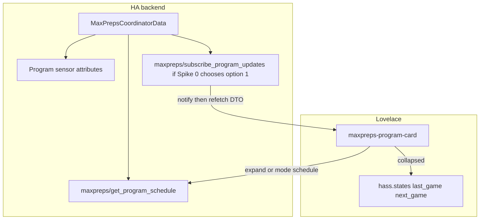

# Phase 4

This file has two parts:

1. **Approved plan** — the Phase 4 product-experience plan as approved after planning review, **plus owner amendments dated 2026-09-09** that close the custom-card and same-repo frontend questions and pin schedule-refresh, websocket ownership, term order, card `mode` names, and missing-bundle load behavior.
2. **Implementation Notes** — what completed slices actually did. Do not rewrite historical notes as though later owner decisions existed at the time. Differences from the then-current plan belong there.

Do not treat Implementation Notes as amendments to the approved plan.
Do not rewrite historical Phase 3 notes in [docs/PHASE3_PLAN.md](PHASE3_PLAN.md).

### Owner amendments (2026-09-09)

These decisions supersede any planning-time “working hypothesis” language about native/existing cards, a separate frontend repository, card `mode` synonyms, or “entity `state_changed` is enough to refresh an expanded schedule.”

- **Custom Lovelace card: decided.** Phase 4 implements a project-owned custom card. Native Home Assistant cards and existing community cards (including Team Tracker) were evaluated and rejected for the desired stacked last+next plus full-schedule UX. Do not spend implementation slices re-litigating option A/B.
- **Frontend lives in this repository for Phase 4.** Source under `frontend/`. Do **not** create a separate frontend GitHub repository. Phase 5 may later decide HACS plugin-vs-integration packaging; that is not a Phase 4 repo split.
- **Public card `mode` values** are exactly `both` (default), `last_next`, and `schedule`. Do not introduce a synonym such as `last_next_and_schedule`.
- **Python owns term order.** The websocket DTO returns terms already ordered for presentation. The frontend must not duplicate `_CONVENTIONAL_TERM_ORDER` or independently sort season terms.
- **Missing built JS must not fail the integration.** Generated `www/*.js` is gitignored in Phase 4. If the bundle is absent, log and skip frontend registration; config entries, coordinators, and sensors continue.
- **Schedule refresh is a Spike 0 decision**, not “refetch when the program entity updates.” See section 5.
- **Collapsed hero relevance (2026-09-09):** When both `last_game` and `next_game` exist, the collapsed card still shows **both**, but the game whose provider-naive datetime is **closer to the user's browser wall clock** is the primary hero matchup; the other is a compact secondary strip. Tie-break: prefer `last_game`. This is **frontend-only visual relevance** — not a new backend “relevant game” entity/state, not for automations, and not for schedule/backend ordering. Displayed date/time remains naive via `datetime.ts`.

---

# Phase 4 — Product experience (Lovelace)

## 1. Phase objective and completion criteria

**Objective:** Determine and implement the best Home Assistant dashboard experience for subscribed school-sports programs using the Phase 3 backend contract.

Desired UX (PRODUCT.md §§2, 17, 18 — product direction, not pixel specification):

- Team Tracker-style **stacked last + next** presentation (not a single “relevant game”)
- Full current-school-year schedule/results view
- Schedule-only presentation remains possible
- Polished Home Assistant-native look (theme tokens, mobile-usable)
- Backend must not be overfit to a single card implementation

Phase 4 is **not**:

- Phase 5 HACS packaging, `hacs.json`, or store listing
- Renaming the integration or MaxPreps legal/branding review
- Provider scraping, polling, adaptive, or live-score changes
- Timezone invention or Calendar entities
- Tennis/golf/track or allowlist expansion
- Historical-season browsing
- Q1 `PRE` / `IN` / `POST` / `OFF` (leave open)
- One entity per game
- Serializing the full schedule into entity **state** or `extra_state_attributes`

**Phase 4 is complete when the completion gate in section 10 is satisfied.** Do not mark that gate completed in this planning document.

---

## 2. Authority and baseline

Treat these as authorities, in this order:

| Authority | Role |
|-----------|------|
| [docs/PRODUCT.md](PRODUCT.md) | Product behavior. Current / Decided vs Future / Desired vs Open / TBD. Do not silently overwrite. |
| This plan | Phase 4 implementation intent, including 2026-09-09 owner amendments |
| [docs/PHASE3_PLAN.md](PHASE3_PLAN.md) | Historical Phase 3 evidence (Spike E, logos, rollover, Layer 3 gate). Implementation Notes are history, not product authority. |
| [docs/HA_DEVELOPMENT.md](HA_DEVELOPMENT.md) | Core 2026.9 pins, Layer 1/2/3 conventions |
| Landed Phase 3 code and tests | Technical contract Phase 4 must consume |

Do **not** invent product behavior to resolve remaining ambiguities. Surface those in section 6.

### 2.1 What actually landed in Phase 3

Public GitHub repo `willbur83/hacs-highschoolscores`. Package root `custom_components/maxpreps/`. Phase 3 completion gate closed 2026-09-09 (owner Layer 3 sandbox, Home Assistant Core 2026.9.0).

Standing Phase 3 contracts Phase 4 must **not** break:

- One config entry per school (`unique_id` = MaxPreps `school_id`)
- One device per school; one sensor per subscribed `{sport, gender, level}`
- Entity `unique_id` `{school_id}:{gender}:{level}:{sport}`; entity name `{gender} {level} {sport}` (no term/year parenthetical)
- Compact state `scheduled` \| `final` \| `unknown` derived from last/next
- `last_game` and `next_game` both exposed as attributes when derivable (provider-naive datetime order; **not** compared to wall clock — ignore stale PHASE3_PLAN §3.8 wall-clock next-game filter)
- Full schedule source of truth: `MaxPrepsCoordinatorData.programs[].terms[]` on `entry.runtime_data` (Spike E). Not entity state, not a games list on attributes
- 12h normal coordinator interval; daily only while `WAITING_FOR_APPLICABLE_YEAR`
- Graceful last-good retention; per-program failure isolation; multi-school isolation
- School `entity_picture`; optional opponent logo on last/next; logo failure never fails scores
- Allowlist: Football, Baseball, Basketball, Volleyball
- No YAML user configuration
- Entities do not fetch

Fixture evidence of schedule size: football ~10 games, baseball ~30 non-deleted (Centennial). Small enough for on-demand websocket; not a reason to dump onto attributes.

### 2.2 Public-repo discipline

Standing rules: [`.cursor/rules/public-repo-hygiene.mdc`](../.cursor/rules/public-repo-hygiene.mdc) and [`.cursor/rules/ha-integration.mdc`](../.cursor/rules/ha-integration.mdc).

Do not commit secrets, cookies, credentials, emails, private/local IPs, private filesystem/operator details, or unexpected generated frontend binaries. Phase 4 gitignores built `www/*.js` unless a later owner decision (Phase 5) explicitly adopts committing the bundle.

Use existing project storage/development conventions. Do not create new persistent infrastructure outside established paths. Do not put operator compose, host ports, or machine-specific paths in this public plan.

---

## 3. Product UX requirements

Treat as product direction. Meaningful remaining UX choices are in section 6.

### Collapsed / primary program presentation (`mode: both` default, and `mode: last_next`)

- Small text-only header: `SCHOOL | SPORT | SEASON/YEAR` (year is the applicable school year attribute, not a MaxPreps term); team record subordinate when present; **no school logo in header chrome**
- When both `last_game` and `next_game` exist: **both remain visible**, but the game temporally closer to the user's browser wall clock is the **hero** scoreboard; the other is a compact secondary strip (owner amendment 2026-09-09; tie-break `last_game`)
- Hero: centered scoreboard — away left, home right, `at` in center; prominent logos with readable short names beneath; final hero shows W/L + score; upcoming hero shows naive date/time without fake scores
- Secondary strip: compact text summary of the non-hero game (no large logos)
- Date/time display as supplied by the provider, with **no false timezone claims** (`datetime.ts`; hero relevance may compare naive game datetimes to browser `now` for presentation only)
- No tickets / watch / preview clutter (`game_url` may exist on the DTO; do not render as chrome)

### Expanded / full schedule (`mode: both` when expanded, and `mode: schedule`)

- Full current school-year schedule
- Date/time \| opponent \| result/status
- Future scheduled games and completed results
- Multi-term programs sectioned by term (Fall / Spring, etc.) using **backend-supplied term order**
- Next game may be highlighted (`next_game.id`)
- No historical-season browser

### Missing / edge

- Missing last or next: omit/hide that block; do not invent a relevant-game substitute
- Empty schedule: empty state, not Q1 `OFF`
- Unavailable / unresolved: HA unavailable empty state
- Stale rollover-retained data: DTO exposes status; **visual copy is an owner checkpoint** (section 6)

---

## 4. Frontend architecture options and recommendation

Planning evaluated three options against PRODUCT §18 (entities first; try native/existing; custom card only if it meaningfully improves usability).

### A. Native Home Assistant cards / more-info

**Can:** Markdown, Mushroom template, or button-card can show *some* last/next fields from existing attributes if the user writes templates. Default sensor more-info dumps attributes as key/value JSON.

**Cannot:**

- Lovelace cannot read `ConfigEntry.runtime_data` (`as_dict()` omits it). Cards see `hass.states` plus whatever websocket/service/HTTP the integration adds.
- No built-in card shows stacked last+next with school/opponent logos, home/away, and W/L in one glance.
- Full schedule is not on attributes (Spike E), so more-info cannot show the season list.
- Calendar entities are blocked by timezone-naive provider datetimes.

### B. Existing frontend-card ecosystem

**Team Tracker** (`custom:teamtracker-card`) is the closest analog and the wrong product: it expects `PRE|IN|POST|BYE|NOT_FOUND`, shows one relevant game, has no full-year schedule, and would force Q1 plus backend overfitting. Do not wrap MaxPreps sensors to look like Team Tracker.

Auto Entities / flex-table would need a games list on attributes, which Phase 3 and PRODUCT forbid as the source of truth.

### C. Project-owned custom Lovelace card — **chosen (owner, 2026-09-09)**

Justified because the desired UX requires stacked last+next **and** a full-year schedule. Native/existing options can only deliver a degraded last/next via user templates and cannot consume coordinator `terms[]` at all.

**Location:** `frontend/` in **this** repository (Lit 3 + Vite). Custom element `maxpreps-program-card` → Lovelace type `custom:maxpreps-program-card`. Domain stays `maxpreps`. Picker display name is an owner-facing copy decision (recommend “High School Sports program”).

**Loading (YAML-free):** `async_setup` registers `hass.http.async_register_static_paths` for `custom_components/maxpreps/www/` and `frontend.add_extra_js_url` when the built file exists. Lovelace Resources UI (`type: module`) is the documented fallback if Spike 0A finds auto-register insufficient. Do not require `configuration.yaml`.

**Build artifacts:** Phase 4 does **not** commit generated `www/*.js`. Developers run `npm run build`; output is gitignored and available via the existing bind-mount. Phase 5 decides whether HAOS/HACS users need a committed or CI-produced bundle.

**Missing bundle (owner, 2026-09-09):** Absence of the built JS must **never** prevent the integration from loading. See Spike 0A.

**HA 2026.6+ card picker:** `window.customCards` with `getEntitySuggestion` only for program sensors. Picker suggestion may inspect attributes (`school_id` + `sport` + `gender` + `level`) as a UX hint. **Websocket ownership must not trust those attributes** (section 5).

Use `getConfigForm` (`entity` + `mode`), `getCardSize` / `getGridOptions` (column counts in multiples of 3).

**Theme:** CSS variables (`--primary-text-color`, `--secondary-text-color`, `--ha-card-background`, `--divider-color`, `--ha-card-border-radius`). No hardcoded Team Tracker colors.

**Primary expansion UX:** in-card expand/collapse. Do not depend on undocumented `custom_ui_more_info` as the primary path.

The backend stays card-agnostic: compact entity attributes unchanged; schedule via websocket DTO; no card-specific fields on entity state.

---

## 5. Data-access architecture options and recommendation

Lovelace cannot consume coordinator `runtime_data` as-is. A bridge is required for the full schedule. Collapsed last/next continues to use existing entity attributes (no extra fetch).

### Options compared

- **Entity attributes dump** — rejected. Contradicts Spike E and PRODUCT §7. Recorder/bootstrap/more-info cost. Wrong place even if 10–30 games is “small.”
- **Service `SupportsResponse`** — useful later for automations; Lovelace-idiomatic cards use `hass.callWS` / `connection.sendMessagePromise`. Do not add a parallel service in Phase 4 unless Spike 0 shows websocket is blocked.
- **Events as the only query model** — rejected for initial render.
- **HTTP view** — works, less idiomatic for Lovelace.
- **Custom websocket command** — **chosen** for on-demand schedule DTO.



### Command sketch

```
{ "type": "maxpreps/get_program_schedule", "entity_id": "sensor.…" }
```

Return JSON (not dataclasses): school chrome, `applicable_school_year`, `resolution_status`, per-term `{ season, year, status, games[] }`. Game objects match `game_attribute()` field set plus term refresh status. Exclude `deleted` games. Never fetch MaxPreps from the handler.

Reuse [program_sensor.py](../custom_components/maxpreps/program_sensor.py) helpers. Add a **pure** serializer module (no Home Assistant import) for Layer 1 tests.

### Term ordering (owner, 2026-09-09)

The Python serializer owns deterministic term ordering. The websocket DTO returns `terms` already ordered for presentation using the existing backend convention in [programs.py](../custom_components/maxpreps/programs.py) (`_CONVENTIONAL_TERM_ORDER`: Fall, Winter, Spring, Summer, then unknown names case-insensitive). Reuse that helper (or a small shared function). The frontend renders the returned order and **must not** duplicate `_CONVENTIONAL_TERM_ORDER` or independently sort season terms.

### Entity resolution / ownership (owner, 2026-09-09)

Do **not** trust entity attributes such as `school_id`, `sport`, `gender`, or `level` to determine integration ownership. Another sensor could theoretically expose the same attributes.

- Resolve `entity_id` through Home Assistant’s **entity registry**.
- Verify the registry entry belongs to the `maxpreps` integration/platform.
- Obtain the owning `config_entry_id` from the registry entry.
- Resolve that config entry’s coordinator / `runtime_data`.
- Match the requested program against the integration’s **stable program identity** (`unique_id` `{school_id}:{gender}:{level}:{sport}`), not arbitrary `hass.states` attributes.
- Standard authenticated Home Assistant websocket access is sufficient; do **not** make the command admin-only unless HA conventions require it.

Errors: `entity_not_found` / not a MaxPreps program / no coordinator data → error result. The card shows empty/unavailable. Never fetch MaxPreps.

### Schedule-refresh signal (owner, 2026-09-09)

Do **not** assume program entity `state_changed` is sufficient to signal every full-schedule change. A coordinator refresh may alter a non-last/non-next game (venue/time weeks out) while leaving compact sensor state and visible last/next/record attributes unchanged.

Spike 0 must test the supported Home Assistant mechanism for keeping an **already-expanded** schedule current.

Preferred options, in order:

1. **Preferred.** A lightweight authenticated websocket **subscription** tied to the config entry/program that notifies the card after successful coordinator updates; the card then **refetches** the schedule DTO. Do not push the full schedule on the notify event.
2. A small card-agnostic coordinator revision/freshness value exposed through an existing HA-visible contract, **only if** it has independent product/diagnostic value. Do not add a dummy attribute solely so the card can poll state.
3. If neither is justified, explicitly document that schedule data refreshes on expand/reopen rather than claiming automatic live refresh.

**Forbidden:** polling the websocket from the card on a timer; refetching on every unrelated `hass` update; dumping `terms[]` onto attributes to piggyback `state_changed`.

If option 1 is straightforward against Core 2026.9 (`DataUpdateCoordinator.async_add_listener` + `connection.subscriptions`), Spike 0 should dispose **#1** and Slice 0/1 may land a minimal notify-only subscribe command. Card consumption of the notify is Slice 4.

### Do not

- Put `terms[]` on `extra_state_attributes` or `_unrecorded_attributes`
- Create one entity per contest
- Overfit the DTO to one card’s DOM

---

## 6. Owner decisions / open questions

### Decided (2026-09-09) — do not re-litigate in coding slices

1. **Custom card:** yes. Project-owned Lovelace card in this repo.
2. **Frontend location:** this repository (`frontend/`). No separate frontend repository in Phase 4.
3. **Schedule access:** websocket DTO, not attribute dump.
4. **Card `mode`:** `both` (default), `last_next`, `schedule`.
5. **Expansion:** in-card expand/collapse for `mode: both`.
6. **Term order:** Python DTO order; frontend must not re-sort.
7. **Missing built JS:** non-fatal; backend still loads.
8. **Q1 `PRE` / `IN` / `POST` / `OFF`:** Phase 4 does **not** require it. Leave Q1 **Open / TBD**. Design around `last_game` / `next_game` + compact state.
9. **Naive datetime:** display calendar date + clock from the ISO string **without** timezone suffix, without `Date` local/UTC conversion, without “in 2 hours.” Limitation does **not** block last/next or schedule list; it **does** block countdown, calendar, and guaranteed kickoff automations (already documented).
10. **JS auto-register:** `add_extra_js_url` when the bundle exists, for YAML-free sandbox. Lovelace resource UI is fallback only.
11. **Unavailable / unresolved:** card shows HA unavailable empty state; do not fake `OFF`.
12. **No clutter links:** do not render tickets/watch/preview even if `game_url` is on the DTO.

### Still open — stop and report if a slice would invent these

- **Schedule-refresh mechanism:** Spike 0 must dispose option 1 vs 2 vs 3 (prefer 1).
- **Stale/rollover visual treatment:** DTO exposes `resolution_status` and per-term `STALE`. Subtle “prior year data” vs prominent banner is an **owner checkpoint after Slice 5** — do not invent user-facing copy in Slice 1 beyond exposing the fields.
- **Card picker display name** (recommend “High School Sports program”).
- **Opponent logo hotlink failure in the card:** hide image, keep name. CDN proxy only if Layer 3 card check shows systematic block (school `entity_picture` already worked in owner sandbox).
- **Whether `game_url` stays on the DTO** for future use (yes, if cheap) vs omitted (also fine). Must not render.

---

## 7. Spikes needed before implementation

Evidence-first. Stop and report if a spike fails; do not “just dump the schedule on attributes.”

### Spike 0A — frontend load path (HA 2026.9 sandbox)

Tiny module via `async_register_static_paths` + `add_extra_js_url` **when the built file exists**; confirm the card picker can see `custom:maxpreps-program-card` without YAML. Fallback: Lovelace Resources UI (`type: module`).

**Missing frontend build artifact must never prevent the MaxPreps integration from loading.** If the expected built JS file is absent:

- log a clear warning/debug message that the optional Phase 4 card is unavailable
- skip static-path / JS registration safely
- backend config entries, coordinators, and sensors continue normally

Test this explicitly at Layer 2.

### Spike 0B — websocket get

Command returns football fixture `games[]` length (or equivalent) from `runtime_data` in Layer 2 (no live HTTP), using **entity-registry ownership** (section 5). Confirm frontend `hass.callWS` / `sendMessagePromise` from the hello-world card in Layer 3 if a bundle is built.

### Spike 0C — naive datetime

JS helper parses `2026-09-04T19:30:00` into weekday/date/time without applying browser timezone. Unit tests only. Relative-time UX is out of scope.

### Spike 0D — schedule refresh signal

Test how an already-expanded card learns that `terms[]` changed when last/next/compact state did not. Prefer option 1 (authenticated notify subscription). Dispose in Implementation Notes. Do not poll. Do not refetch on every hass update.

**Exit criterion:** Spike 0 Implementation Notes covering 0A–0D; Layer 2 missing-bundle test green; then Slice 1.

---

## 8. Ordered implementation slices

Keep the tree green. Each slice: one objective; tests; PRODUCT drift check; Implementation Notes append-only below. Do **not** rewrite PHASE3_PLAN Implementation Notes.

**Live MaxPreps:** Automated tests remain fixtures-only. Owner-supervised live traffic belongs only in Layer 3 sandbox clicks — never CI.

### Slice 0 — Evidence spikes

- **Objective:** Prove YAML-free JS load (and missing-bundle non-fatal), registry-owned WS read of coordinator schedule, honest datetime helper, and a refresh-signal disposition (prefer subscription notify).
- **Touch:** [`__init__.py`](../custom_components/maxpreps/__init__.py) frontend registration guard; `websocket.py` stub/minimal commands; `frontend/` hello scaffold + datetime helper; gitignore `custom_components/maxpreps/www/*.js` and `frontend/node_modules`; Layer 2 tests; Spike 0 Implementation Notes. Optional Layer 3 hello card if a local build is present.
- **Deps:** none.
- **Tests:** Layer 2 integration still loads with **no** `www/*.js`; WS get rejects a non-maxpreps entity and accepts a real program sensor; datetime unit tests; optional subscribe notify test if option 1 is landed.
- **Non-goals:** real last/next UX, HACS, entity schema changes, full schedule DTO polish (Slice 1), card expand UI (Slice 4).
- **Owner checkpoint:** Spike 0D refresh disposition (prefer #1). Custom card itself is already decided.

### Slice 1 — Schedule DTO + websocket (backend)

- **Objective:** Stable JSON contract for one program’s current-year `terms[]`, ordered in Python; registry-owned get (and subscribe-if-#1).
- **Touch:** new `schedule_payload.py` (pure), `websocket.py`, register in `async_setup`; `tests/test_schedule_payload.py`, `tests/test_websocket.py`; add to the Layer 2 pytest invocation in [HA_DEVELOPMENT.md](HA_DEVELOPMENT.md).
- **Deps:** Slice 0B (and 0D if subscribe is chosen).
- **Tests:** football ~10 / baseball ~30; freshman multi-term **already ordered**; empty contests; STALE rollover wait; unresolved; non-maxpreps `entity_id`; entity that copies maxpreps-like attributes but is not this integration; no live MaxPreps.
- **Non-goals:** card UI; changing sensor attributes; a user-facing service.
- **Owner checkpoint:** only if the DTO would add user-visible fields not in PRODUCT (do not add PRE/IN).

### Slice 2 — Card shell, last/next from attributes

- **Objective:** `ha-card` that binds `config.entity`, renders header + stacked last/next from **attributes only** (no schedule WS yet). Honor `mode` (`both` default shows last/next collapsed; `last_next` same collapsed chrome without implying a schedule control yet).
- **Touch:** `frontend/src/*`; Vite build into gitignored `www/`; `customCards` + `getEntitySuggestion`; registration path from Slice 0A.
- **Deps:** Slice 0A.
- **Tests:** Vitest with fixture `hass.states` (Centennial football last/next shapes from existing tests); missing entity error card.
- **Non-goals:** expand, editor polish, theme perfection.

### Slice 3 — Collapsed UX completeness

- **Objective:** PRODUCT collapsed hierarchy: logos, W/L, record, hide missing last or next, hide missing logos, naive datetime, theme tokens, no clutter links.
- **Touch:** frontend presentational components; datetime helper from 0C.
- **Deps:** Slice 2.
- **Tests:** unit cases for missing last, missing next, both, empty unknown, no record, no opponent_logo.
- **Non-goals:** schedule list.
- **Owner checkpoint:** visual review of information hierarchy (Layer 3).

### Slice 4 — Full schedule via websocket

- **Objective:** In-card expand (`mode: both`) fetches WS; render terms **in DTO order**; row date/time \| home/away opponent \| scheduled time or final W/L + scores \| unknown; highlight `next_game.id`. If Spike 0 disposed option 1, subscribe while expanded and refetch DTO on notify.
- **Touch:** frontend schedule view; WS client.
- **Deps:** Slice 1 + 3.
- **Tests:** frontend fixtures for 1-term football and 2-term freshman (assert render order matches DTO, not a JS sort); Layer 3 expand on sandbox entity.
- **Non-goals:** historical years; live IN rows; JS term sorting.

### Slice 5 — Schedule-only + stale/empty

- **Objective:** Honor `mode: both | last_next | schedule`. Empty copy. Unavailable. Optional stale/rollover indicator using DTO fields (copy TBD with owner).
- **Touch:** `getConfigForm`; frontend modes.
- **Deps:** Slice 4.
- **Tests:** mode rendering unit tests; Layer 3 schedule-only dashboard.
- **Owner checkpoint:** stale-year copy/prominence.

### Slice 6 — Docs, Layer 3 gate, development workflow

- **Objective:** Document `npm run build` + bind-mount + YAML-free load + missing-bundle behavior; README Phase 4 status; Layer 3 checklist; propose PRODUCT Future→Current wording **for owner edit** (do not silently rewrite PRODUCT).
- **Touch:** [HA_DEVELOPMENT.md](HA_DEVELOPMENT.md), README, this file’s Implementation Notes.
- **Deps:** Slices 1–5.
- **Tests:** Layer 1+2 still green; frontend unit tests in a documented npm script.
- **Non-goals:** `hacs.json`; legal rename; committing the minified bundle unless the owner explicitly changes Phase 5 convention.

### Slice dependencies

```
S0 spikes
S0A → S2 card shell
S0B + S0D → S1 DTO/WS
S1 + S3 → S4 schedule
S2 → S3 collapsed UX
S4 → S5 modes
S5 → S6 docs/gate
```

---

## 9. Test strategy

Three layers, matching PRODUCT §21 and [HA_DEVELOPMENT.md](HA_DEVELOPMENT.md).

**Frontend unit (new):** Vitest on datetime, last/next layout cases, mode rendering. Zero Home Assistant Core required. Zero MaxPreps HTTP. Do **not** unit-test a JS term-order table; assert the card renders `terms` in payload order.

**Layer 1 — client / pure helpers:** payload serializer with coordinator dataclasses / fixture games (no `homeassistant` import). Term order tests live here.

**Layer 2 — integration:** `pytest-homeassistant-custom-component` + pinned `homeassistant==2026.9.0`; mock transport. Add `tests/test_websocket.py` (and missing-bundle frontend-registration tests) to the canonical pytest invocation. Cover registry ownership, foreign entities, missing `www/*.js`. Do not break compact-state / unique_id / rollover tests.

**Layer 3 — Manual HA sandbox:** owner browser: add card from picker, stacked last+next, expand, schedule-only, two schools, missing logo, theme change, mobile width, and (if option 1) that an expanded schedule updates after a coordinator refresh that does not change last/next. Live MaxPreps only as already used for sandbox data — not in CI.

**Q1:** tests must still assert compact `scheduled` / `final` / `unknown`, not PRE/POST.

---

## 10. Phase 4 completion gate

Recommend Phase 5 **only if** all of the following are true. Do not check these off during planning.

1. YAML-free card load works in Core 2026.9 sandbox when a local build exists (Spike 0A or documented resource fallback).
2. Checkout **without** `www/*.js` still loads the integration (Layer 2 + sandbox).
3. User can add `custom:maxpreps-program-card` for a program sensor and see stacked last+next from attributes (`mode: both` or `last_next`).
4. `mode: schedule` or expand shows full current-year schedule from websocket `terms[]`, including a multi-term program in **backend order**.
5. Missing last, missing next, empty schedule, unavailable, and missing logos do not crash the card.
6. Datetimes render as naive published date/time with no invented timezone.
7. Expanded schedule refresh matches the Spike 0D disposition (subscription notify + refetch, diagnostic freshness, or documented expand/reopen-only). Do not claim live refresh if option 3 was chosen.
8. Q1 still open; compact entity state unchanged.
9. Full schedule still **not** on entity state/attributes.
10. Phase 3 contracts in section 2.1 unchanged (polling, unique_id, allowlist, no YAML config).
11. Automated tests: zero live MaxPreps; frontend units + Layer 2 WS green.
12. No `hacs.json`; no committed secrets/paths; no committed minified bundle unless owner later adopts that for Phase 5.
13. README / HA_DEVELOPMENT describe how to build and load the card, and that a missing bundle is expected.
14. Owner Layer 3 visual sign-off on collapsed + expanded + schedule-only.

---

## 11. Risks

| Risk | Notes |
|-------|--------|
| `add_extra_js_url` loads on all HA pages | Small module; Spike 0A. Skip entirely if bundle missing. |
| Entity `state_changed` misses mid-schedule edits | Spike 0D; prefer subscription notify. |
| CDN opponent logos blocked in Lovelace | School logos already worked; hide broken imgs. |
| JS `Date` silently localizing naive ISO | Spike 0C + tests. |
| Duplicate term-order rules in TS | Forbidden; DTO order is source of truth. |
| Trusting `hass.states` attributes for WS | Forbidden; entity registry + unique_id. |
| Missing `www/*.js` breaks setup | Spike 0A Layer 2 test; must be non-fatal. |
| `custom_ui_more_info` temptation | Out of scope as primary UX. |
| Phase 5 HAOS users cannot npm-build | Document; do not solve packaging here. |

---

## 12. Documentation impact

| File | When |
|------|------|
| [docs/PHASE4_PLAN.md](PHASE4_PLAN.md) | This planning deliverable; Implementation Notes per slice |
| [docs/HA_DEVELOPMENT.md](HA_DEVELOPMENT.md) | Slice 6 (and Slice 1 for Layer 2 file list). npm build, missing-bundle, WS tests. No private host paths. |
| `README.md` | Slice 6 — Phase 4 status, build, limitations |
| [docs/PRODUCT.md](PRODUCT.md) | Owner-driven after the gate. Do not mark the custom card Current/Decided in PRODUCT during coding slices. |
| [docs/PHASE3_PLAN.md](PHASE3_PLAN.md) | Do not rewrite. Cite Spike E as evidence only. |
| `hacs.json` | Phase 5 |

---

# Implementation Notes

_Template only. Coding slices append below this heading. Do not edit the approved plan text above to match later implementation._

Each slice note should include: what landed, decisions, pytest/npm command/result, deviations (technical correction vs newly discovered constraint vs **proposed** product change), and PRODUCT drift check.

## Slice 0 — Evidence spikes (2026-09-09)

### What landed

- **Spike 0A:** `frontend_register.py` guards optional card load. When `custom_components/maxpreps/www/maxpreps-card.js` is absent (normal fresh checkout), logs a warning and skips `StaticPathConfig` + `frontend.add_extra_js_url`. Domain `async_setup` and config-entry coordinators/sensors continue unchanged. `frontend/` hello-world scaffold (`custom:maxpreps-program-card`) + Vite build to gitignored `www/`. `.gitignore` entries for `custom_components/maxpreps/www/*.js` and `frontend/node_modules/`.
- **Spike 0B:** `websocket.py` registers `maxpreps/get_program_schedule` with entity-registry ownership (`platform == maxpreps`, `config_entry_id` → coordinator, program match via `unique_id` `{school_id}:{gender}:{level}:{sport}`). Slice 0 payload: `entity_id`, `game_count`, `term_count`, `resolution_status` from `programs[].terms[]` (football fixture: 10 games, 1 term). Pure helpers in `program_identity.py` and `schedule_spike.py`.
- **Spike 0C:** `frontend/src/datetime.ts` formats provider-naive ISO strings without `Date`, timezone suffixes, or relative time. Vitest coverage for valid, malformed, missing, and timezone-qualified input.
- **Spike 0D (disposition: option 1):** `maxpreps/subscribe_program_schedule_updates` — authenticated websocket subscription per program entity. Coordinator `async_add_listener` registered after subscribe succeeds; unsubscribe stored in `connection.subscriptions[msg["id"]]`; notify event is lightweight (`schedule_updated` + `entity_id` only, no schedule push). Card refetch is Slice 4.

### Tests

| Layer | Command | Result |
|-------|---------|--------|
| Layer 1 | `pip install -e ".[dev]" && pytest tests/test_program_identity.py` | 3 passed |
| Layer 1 (frontend) | `cd frontend && npm install && npm test` | 6 passed |
| Layer 2 | Python 3.14; `pip install pytest-homeassistant-custom-component==0.13.362 && pip install homeassistant==2026.9.0 && pip install -e .`; canonical command in [HA_DEVELOPMENT.md](HA_DEVELOPMENT.md) including `tests/test_websocket.py` | 99 passed |

Layer 2 additions: `tests/test_init.py` missing-bundle cases; `tests/test_websocket.py` get happy path, foreign entity rejection, subscribe notify when coordinator data changes without last/next attribute churn.

### Deviations (technical)

- **`manifest.json` dependencies:** Did not add `"frontend"` / `"http"` manifest dependencies. Declaring `frontend` breaks `pytest-homeassistant-custom-component` runs (`No module named 'hass_frontend'`). `frontend_register.py` imports `http`/`frontend` only inside `_register_bundle_paths_and_js`, called only when the bundle exists; `ImportError` / `ModuleNotFoundError` / `AttributeError` / `RuntimeError` are caught, logged as a warning, and do not fail `async_setup`. Layer 2 regressions in `tests/test_init.py` simulate bundle-present + registration-unavailable. Revisit manifest deps in Slice 6 if HACS packaging needs them.

### PRODUCT drift check

None. `docs/PRODUCT.md` untouched. Phase 3 entity state/attributes, polling, and allowlist unchanged. Q1 PRE/IN/POST/OFF remains open.

## Slice 1 — Schedule DTO + websocket (backend) (2026-09-09)

### What landed

- **`schedule_payload.py`:** Pure websocket schedule DTO serializer with `schema_version` `1`. `build_program_schedule_payload` returns JSON-safe primitives: school chrome (`school_id`, `school_name`), `applicable_school_year`, program identity (`sport`, `gender`, `level`, `display_label` via `program_display_label`), `resolution_status`, and `terms[]` already ordered for presentation. Each term exposes `season`, `year`, `status`, and `games[]` using the `game_attribute()` field set; deleted games excluded; games sorted by provider-naive `date` then `id`. `find_program_snapshot` moved here from the deleted spike module.
- **`snapshots.py`:** Coordinator snapshot dataclasses/enums (`TermSnapshot`, `ProgramSnapshot`, `MaxPrepsCoordinatorData`, refresh/resolution statuses) extracted from `coordinator.py` so the DTO serializer and Layer 1 tests import no Home Assistant modules. `coordinator.py` re-exports unchanged public names.
- **`programs.py`:** Exported `ordered_deduplicated_season_terms` (wraps existing `_CONVENTIONAL_TERM_ORDER` helper). Term snapshot ordering lives in `schedule_payload.sort_term_snapshots_for_presentation`.
- **`websocket.py`:** `maxpreps/get_program_schedule` now returns the full DTO (replaces Slice 0 `game_count`/`term_count` spike). Registry-owned `resolve_program_entity` unchanged. `maxpreps/subscribe_program_schedule_updates` remains notify-only (`schedule_updated` + `entity_id`).
- **Removed `schedule_spike.py`.**

### Tests

| Layer | Command | Result |
|-------|---------|--------|
| Layer 1 | `pytest tests/test_schedule_payload.py` (Python 3.12 venv) | 10 passed |
| Layer 2 | Python 3.14.7; `pip install pytest-homeassistant-custom-component==0.13.362 && pip install homeassistant==2026.9.0 && pip install -e .`; canonical command in [HA_DEVELOPMENT.md](HA_DEVELOPMENT.md) including `tests/test_websocket.py` | **101 passed** |

Layer 1 `tests/test_schedule_payload.py`: football ~10 games, baseball ~30, freshman multi-term Fall-before-Spring order, empty contests, STALE rollover retention (`applicable_school_year` ≠ retained `term.year`, `waiting_for_applicable_year`), unresolved empty terms, deleted games excluded, chronological game order, ERROR term with `schedule=None` (`status: "error"`, `games: []`) alongside unaffected REFRESHED sibling.

Layer 2 `tests/test_websocket.py`: get happy path asserts full DTO; foreign entity and non-maxpreps registry-owner rejection unchanged; subscribe notify without last/next churn unchanged.

`test_schedule_payload.py` not added to the Layer 2 command (no `homeassistant` import).

### Deviations (technical)

- **`snapshots.py` extraction:** Required so `schedule_payload.py` and Layer 1 serializer tests avoid importing `coordinator.py` (Home Assistant dependency). No behavior change; `coordinator` public re-exports preserved.

### PRODUCT drift check

None. `docs/PRODUCT.md` untouched. Phase 3 compact entity state, `last_game`/`next_game` attributes, polling, allowlist, and no-`terms[]`-on-attributes unchanged. Q1 PRE/IN/POST/OFF remains open. No PRE/IN fields added to the DTO.

## Slice 2 — Card shell, last/next from attributes (2026-09-09)

### What landed

- **`frontend/src/maxpreps-card.ts`:** Replaced Slice 0 hello-world with a Lit 3 `ha-card` shell (`maxpreps-program-card` / `custom:maxpreps-program-card`). Binds `config.entity`; renders header (`school_name | display_label | year`), optional school logo (`entity_picture`, hide on error), stacked Last then Next from entity attributes only, optional `team_record`, naive date/time via `datetime.ts`. Modes: `both` and `last_next` show the last/next shell; `schedule` shows an explicit not-implemented placeholder; default `both` does not imply full schedule UX until Slice 4. Unavailable/missing entity → HA-style message card. No `game_url` / tickets / watch / preview. Theme tokens via HA CSS variables.
- **`frontend/src/card-helpers.ts`, `entity-suggestion.ts`, `types.ts`:** Pure helpers and picker heuristic (`school_id`, `school_name`, `sport`, `gender`, `level`, `display_label` all required; false negatives preferred).
- **`window.customCards`:** `getEntitySuggestion` returns default `mode: both` for matching program sensors.
- **Card API:** `getConfigForm` (entity required + mode select), `getStubConfig`, `getCardSize` (6), `getGridOptions` (columns 6, min 3, multiples-of-3 aligned).
- **`frontend/package.json`:** Added bundled `lit` dependency; Vitest uses `happy-dom`.
- **Vite build:** Unchanged output path `custom_components/maxpreps/www/maxpreps-card.js` (gitignored). `frontend_register.py` unchanged; missing bundle remains non-fatal.

### Tests

| Layer | Command | Result |
|-------|---------|--------|
| Frontend | `cd frontend && npm install && npm test` | **12 passed** (datetime + card: missing entity, last+next render, mode default `both`, schedule placeholder, entity suggestion heuristic, no `Date`/`Date.parse` in card sources) |
| Frontend build | `cd frontend && npm run build` | Success (`maxpreps-card.js` ~29 kB) |
| Layer 2 | Not re-run in this slice (no Python changes). Prior canonical command still applies; `test_init.py` missing-bundle behavior untouched. |

Vitest fixture: Centennial Boys Varsity Football `last_game` / `next_game` shapes aligned with `tests/test_sensor.py` (naive ISO, scores, opponent logos).

### Deviations (technical)

- **Lit decorators:** `@customElement` / `@property` omitted; Lit 3 field decorators failed under Vitest/Vite without extra TS decorator config. Uses `static properties`, manual `customElements.define`, and `setConfig` → `this.config` assignment instead.
- **Slice 2 shell scope:** Intentionally basic hide-if-absent for logos/record/missing games; Slice 3 owns collapsed UX completeness.

### PRODUCT drift check

None. `docs/PRODUCT.md` untouched. Phase 3 sensors, websocket DTO, polling, and no `terms[]` on attributes unchanged. Q1 PRE/IN/POST/OFF remains open.

### Slice 2 owner refinement — Layer 3 correction (2026-09-09)

Owner sandbox on Home Assistant Core 2026.9 confirmed automatic JS loading works: built bundle present, `/maxpreps/maxpreps-card.js` returns HTTP 200, module loads, `customElements.get("maxpreps-program-card")` resolves, and `frontend.add_extra_js_url` registration is effective. Card picker failed only because `window.customCards` metadata used `type: "custom:maxpreps-program-card"`; HA expects the registry `type` **without** the `custom:` prefix (`"maxpreps-program-card"`). Lovelace card configs and `getEntitySuggestion` return values still use `type: "custom:maxpreps-program-card"`. Vitest pins both sides of this contract.

_Terminology: recorded under Slice 2 as owner refinement / Layer 3 visual pass — not a renumbered Phase 4 slice._

### Slice 2 owner refinement — Layer 3 collapsed card pass (2026-09-09)

**What landed**

- **`frontend/src/hero-selection.ts`:** Pure `selectHeroGame(last, next, now)` — absolute distance from browser wall clock to provider-naive game datetimes; tie-break `last_game`; malformed-date fallbacks. Isolated `naiveIsoToLocalMs` for relevance only (not display).
- **`frontend/src/card-helpers.ts`:** Matchup layout (away left / home right from `home_away`), conservative name shortening, hero/secondary formatters. Secondary strip location language: subscribed school **home** or **neutral** → `vs Opponent`; **away** → `at Opponent`.
- **`frontend/src/maxpreps-card.ts`:** Team Tracker–style collapsed scoreboard hero, text-only header (no school logo in chrome), compact secondary strip, `program-card--interactive` cursor affordance for future expand; modes unchanged (`schedule` placeholder retained).
- **Layer 3 polish:** left-aligned chrome and secondary strip; hero `LAST`/`NEXT` eyebrow top-left; center `AT` enlarged/bold; card datetime line without year (`FRIDAY - Sep 11 - 7:30 PM`); secondary strip outcome text matches hero datetime weight/color.

**Tests**

| Layer | Command | Result |
|-------|---------|--------|
| Frontend | `cd frontend && npm test` | **33 passed** |
| Frontend build | `cd frontend && npm run build` | Success (`maxpreps-card.js` ~34 kB) |

**Owner amendment**

Collapsed UX superseded equal-weight stacked Last/Next presentation. Both games remain visible when available; closest-to-`now` hero selection is frontend presentation only (see owner amendments in approved plan §Owner amendments).

**PRODUCT drift check**

None. `docs/PRODUCT.md` untouched. Backend entity model unchanged. Q1 PRE/IN/POST/OFF remains open.

## Slice 3 — Collapsed UX completeness (2026-09-09)

### What landed

- **`frontend/src/maxpreps-card.ts`:** Fixed compact `unknown` vs HA `unavailable` handling. `unavailable` (and missing entity) still render the message card; compact `unknown` renders normal collapsed chrome (header, optional record) with the existing empty body copy when neither `last_game` nor `next_game` is present. No `"entity_id is unknown"` error path.
- **Collapsed edge states (no hero-selection changes):** Last-only and next-only render hero without secondary strip; missing `team_record` hidden; final hero omits score line when either score is absent (no invented `0-0`); missing logo URLs omit `` (broken images still hidden via `@error`); neutral `home_away` keeps school left / opponent right via existing `buildMatchupLayout`.
- **`frontend/tests/fixtures/football-program-state.ts`:** Fixture helper merges `attributes` overrides without `...overrides` clobbering the merged attribute object (test-only fix).

### Tests

| Layer | Command | Result |
|-------|---------|--------|
| Frontend | `cd frontend && npm test` | **40 passed** |
| Frontend build | `cd frontend && npm run build` | Success (`maxpreps-card.js` ~34 kB) |

New Vitest cases: compact `unknown` empty program vs HA `unavailable`; last-only / next-only (no secondary strip); missing record; final hero without scores; neutral-site layout; existing Slice 2 hero/secondary tests remain green.

### Deviations (technical)

### PRODUCT drift check

None. `docs/PRODUCT.md` untouched. Phase 3 sensors, websocket DTO, polling, and no `terms[]` on attributes unchanged. Q1 PRE/IN/POST/OFF remains open.

## Slice 4 — Full schedule via websocket (2026-09-09)

### What landed

- **`frontend/src/schedule-client.ts`:** `fetchProgramSchedule` via `hass.callWS` (`maxpreps/get_program_schedule`) and `subscribeProgramScheduleUpdates` via `hass.connection.subscribeMessage` (`maxpreps/subscribe_program_schedule_updates`). Notify events are `{ entity_id, event: schedule_updated }` only; the card refetches the DTO on notify.
- **`frontend/src/schedule-helpers.ts`:** Pure schedule presentation helpers — DTO-order term section labels, row opponent (`vs`/`at`), result column (scheduled time / final W/L+scores / raw status), and distinct body states for resolved-empty, unresolved, waiting-for-applicable-year (no games), websocket error, and ready list rendering.
- **`frontend/src/types.ts`:** `ProgramSchedulePayload`, `ScheduleTerm`, and extended `HomeAssistantLike` (`callWS`, `connection.subscribeMessage`).
- **`frontend/src/maxpreps-card.ts`:** `mode: both` in-card expand/collapse (keyboard-accessible `role="button"`, Enter/Space, Collapse control when expanded). Collapsed remains hero/secondary; expanded and `mode: schedule` render header chrome + websocket schedule list. Highlights `next_game.id`. Subscribes while schedule is visible; unsubscribes on collapse, `last_next`, disconnect, or entity change. Fetch generation guards ignore stale in-flight results. Does not fetch/subscribe in collapsed `both` or `last_next`. HA `unavailable` still uses the message card without websocket I/O.
- **`frontend/tests/fixtures/schedule-payload-fixtures.ts`:** Football (1-term), freshman Fall→Spring DTO order, empty resolved, unresolved, and Spring-first order fixture for no-client-sort assertion.
- Owner sandbox validation on HA Core 2026.9 confirmed an existing expanded-card subscription receives schedule_updated after an entity/coordinator refresh, immediately issues a new maxpreps/get_program_schedule, and receives a successful schema v1 DTO response.

### Tests

| Layer | Command | Result |
|-------|---------|--------|
| Frontend | `cd frontend && npm test` | **55 passed** |
| Frontend build | `cd frontend && npm run build` | Success (`maxpreps-card.js` ~46 kB) |

New Vitest coverage: football 1-term list; freshman 2-term DTO order (including Spring-first payload proving no JS sort); `next_game.id` highlight; resolved empty vs unresolved vs websocket error; `both` collapsed no fetch / expand fetch / collapse unsubscribe; notify refetch; `last_next` never fetches/subscribes; stale in-flight fetch after collapse ignored; repeated expand without duplicate subscriptions; entity change unsubscribes prior subscription; keyboard Enter expand. Existing Slice 2–3 collapsed tests remain green.

### Deviations (technical)

- **Schedule activation lifecycle:** `_scheduleActive` gates the initial fetch so unrelated `hass` re-renders do not refetch; notify and expand/collapse re-activation call `_fetchSchedule` explicitly. `_syncScheduleLifecycle` deferred with `queueMicrotask` from `updated()` to avoid Lit double-update warnings.
- **No Python changes:** Slice 1 DTO and websocket commands consumed as-is (`schema_version` 1).

### PRODUCT drift check

None. `docs/PRODUCT.md` untouched. Phase 3 sensors, websocket DTO ownership, polling, and no `terms[]` on attributes unchanged. Q1 PRE/IN/POST/OFF remains open. Stale-year banner copy deferred to Slice 5.

### Slice 4 Layer 3 UI correction (2026-09-09)

**What changed**

- **Card editor copy:** Mode labels are now `Last/Next + Schedule`, `Last/Next only`, and `Schedule only` (internal values unchanged: `both`, `last_next`, `schedule`). Stale “later slice” helper text removed. Entity helper now describes last/next plus full schedule.
- **Whole-card expand/collapse (`mode: both`):** The entire card toggles between collapsed Last/Next and expanded schedule on click or Enter/Space. Dedicated Collapse/Expand controls removed. `mode: last_next` stays non-interactive; `mode: schedule` stays permanently expanded with no fake toggle target.
- **Expanded/schedule hierarchy:** Header chrome (`school | program | year`), prominent overall `team_record`, optional derived Home/Away/Neutral breakdown, then a compact `Schedule & Results` table (`Date | Opponent | Result`). Theme tokens preserved; no Word/mockup styling.
- **Schedule rows:** Compact month/day dates (`Sep 11`) without weekday or year; opponent `vs`/`at` language unchanged; result column shows scheduled time or final `W/L` + scores without duplicating time in the date column.
- **Record breakdown:** Frontend-only derivation from DTO `final` games with explicit `result` and classifiable `home_away`; no score-only inference; spans all DTO terms.

**Evidence-first metadata checkpoint (region / rank / league / division)**

Phase 2 research (MAXPREPS_RESEARCH.md Slice 11) observed `teamContext.standingsData` on schedule pages, including overall W-L-T, home/away/neutral splits, and `leagueStanding` conference name/record. The production integration currently parses and exposes **only** overall `team_record` (`overallStanding.overallWinLossTies`) on entity attributes via `parsing/schedule.py` → `Schedule.team_record` → `program_team_record()`. Region record, state rank, league/class labels, and split records are **not** on entity attributes, coordinator snapshots, or the websocket schedule DTO (`schedule_payload.py` / `game_attribute()`). **No backend contract change in this pass.** Smallest future addition, if desired: extend the schedule DTO (or attributes) with optional standings fields already present in parsed `standingsData`, serialized in `schedule_payload.py` without new MaxPreps traffic.

**Tests**

| Layer | Command | Result |
|-------|---------|--------|
| Frontend | `cd frontend && npm test` | **65 passed** |
| Frontend build | `cd frontend && npm run build` | Success |

**PRODUCT drift check**

None. `docs/PRODUCT.md` untouched. No new standings/rank/league fields added to the public contract in this pass.

## Slice 5 — Schedule-only + stale/empty (2026-09-09)

### What landed

- **`frontend/src/schedule-helpers.ts`:** `resolveScheduleNotice()` distinguishes two schedule-view cases from existing DTO fields only — **A** `waiting_for_applicable_year` with usable games (rollover retention; copy interpolates `applicable_school_year`) and **B** `resolved` with at least one term that has games and `status === stale` (last-good after fetch failure). A takes precedence over B; zero-game waiting keeps the Slice 4 waiting empty state with no notice; unresolved keeps unresolved semantics (no silent stale banner).
- **`frontend/src/maxpreps-card.ts`:** Subtle schedule notices render above the Slice 4 schedule table when the body is `ready` — rollover uses `.schedule-notice--rollover` (slightly more visible); stale-last-good uses `.schedule-notice--stale` (quieter). Notices appear in `mode: schedule` and expanded `mode: both` only; collapsed `both` and `last_next` never show schedule banners. `getConfigForm` helpers already describe all three modes without “later slice” placeholders (unchanged from Slice 4 Layer 3 correction).
- **Fixtures/tests:** Vitest coverage for modes, A/B precedence, waiting empty vs retained games, mixed refreshed+stale terms, all-refreshed (no notice), and distinct empty-resolved / unresolved / websocket error copy.

### Tests

| Layer | Command | Result |
|-------|---------|--------|
| Frontend | `cd frontend && npm test` | **78 passed** |
| Frontend build | `cd frontend && npm run build` | Success |

### Owner checkpoint — proposed product copy

Implemented copy (subtle `<p role="note">`, secondary text color, no error banner):

- **A (rollover):** `Showing the prior school-year schedule until {applicable_school_year} is published.`
- **B (last-good):** `Schedule refresh failed; showing the last successfully loaded schedule.`

If Layer 3 review prefers a more prominent rollover treatment (e.g. banner), that remains an owner decision — this slice intentionally stays conservative per plan §6.

### Deviations (technical)

- **No Python changes:** Slice 1 DTO fields (`resolution_status`, `applicable_school_year`, per-term `status`) were sufficient to distinguish A vs B.

### PRODUCT drift check

None. `docs/PRODUCT.md` untouched. Phase 3 sensors, websocket DTO, polling, and no `terms[]` on attributes unchanged. Q1 PRE/IN/POST/OFF remains open. No PRE/IN/OFF invented for empty or stale states.

## Slice 6 — Docs, Layer 3 gate, development workflow (2026-09-09)

### What landed

- **`README.md`:** Phase 4 status (optional `custom:maxpreps-program-card`; still not a HACS release). Phase 3 backend facts retained. Card install path (picker + `custom:maxpreps-program-card`), three `mode` values, frontend `npm ci` / `npm test` / `npm run build`, gitignored bundle reality, missing-bundle non-fatal behavior, Layer 2 command synced to include `tests/test_websocket.py`, pointer to this plan. Explicit that checkout alone does not ship a ready-to-use card.
- **`docs/HA_DEVELOPMENT.md`:** Frontend unit-test section; build output path and bind-mount; `frontend_register.py` missing-bundle behavior (no `frontend`/`http` manifest deps); Layer 1-only `test_schedule_payload.py`; Layer 2 table updates for `test_init.py` missing-bundle paths and `test_websocket.py`; Phase 4 partial Layer 3 sandbox notes; Phase 3 “no card” line updated to clarify Phase 4 added the card.
- **This file (Implementation Notes only):** §10 gate assessment, owner Layer 3 checklist, proposed `PRODUCT.md` wording block (not applied).
- **`frontend_register.py` + `tests/test_init.py` (Slice 6 harness fix):** Guard `KeyError('frontend_extra_module_url')` from `frontend.add_extra_js_url` when the HA frontend component is not initialized (phacc harness with a built bundle on disk). Re-raise other `KeyError`s. Layer 2 adds domain + config-entry tests mirroring the existing ImportError registration-unavailable cases.

**Gitignore (unchanged in this slice):** `custom_components/maxpreps/www/*.js` and `frontend/node_modules/`. Phase 5 still owns `hacs.json` and whether to commit the built bundle.

### Tests

| Layer | Command | Result |
|-------|---------|--------|
| Layer 1 | `pip install -e ".[dev]" && pytest` (Python 3.12.3; canonical command in [HA_DEVELOPMENT.md](HA_DEVELOPMENT.md)) | **202 passed**, 10 skipped (re-run after harness fix) |
| Frontend | `cd frontend && npm ci && npm test` | **78 passed** |
| Layer 2 (no `www/*.js`) | `ghcr.io/home-assistant/home-assistant:2026.9.0` container (Python 3.14.6); two-step install per [HA_DEVELOPMENT.md](HA_DEVELOPMENT.md); canonical pytest invocation with `PYTHONPATH=<checkout>` and `--import-mode=importlib` | **103 passed** |
| Layer 2 (built `www/maxpreps-card.js` present) | Same container command; temporary gitignored bundle on disk (not committed) | **103 passed** |

Layer 2 container install + pytest (abbreviated; mount `<checkout>` at `/work`):

```bash
docker run --rm -v <checkout>:/work -w /work ghcr.io/home-assistant/home-assistant:2026.9.0 bash -lc '
python3 -m pip install pytest-homeassistant-custom-component==0.13.362
python3 -m pip install homeassistant==2026.9.0
python3 -m pip install -e .
PYTHONPATH=/work python3 -m pytest --import-mode=importlib --rootdir=/work \
  tests/test_manifest.py tests/test_init.py tests/test_ha_transport.py \
  tests/test_config_flow.py tests/test_programs.py tests/test_coordinator.py \
  tests/test_sensor.py tests/test_options_flow.py tests/test_multi_school.py \
  tests/test_failure.py tests/test_rollover.py tests/test_websocket.py
'
```

Pins used: `homeassistant==2026.9.0`, `pytest-homeassistant-custom-component==0.13.362` (pip reports phacc wants `2026.9.0b6`; two-step install per HA_DEVELOPMENT is intentional).

Layer 2 is deterministic for both checkout states: missing bundle (skip registration) and developer-built bundle present (registration skipped with warning when phacc frontend is uninitialized; real HA Core 2026.9 Layer 3 already confirmed successful registration when frontend is initialized).

Zero live MaxPreps in all automated runs.

### Deviations (technical)

- **`frontend_register.py` KeyError guard:** Before this fix, a locally built gitignored bundle caused 3 `test_websocket.py` failures in phacc (`KeyError: 'frontend_extra_module_url'`). Treated like other guarded registration failures; does not change real-sandbox registration when HA frontend is initialized (Slice 2 Layer 3 evidence).

### §10 Phase 4 completion gate — honest assessment

**Gate status: NOT CLOSED.** Item 14 (owner Layer 3 visual sign-off) remains open. Item 13 passes after this slice’s doc updates.

| # | Criterion | Status | Basis |
|---|-----------|--------|-------|
| 1 | YAML-free card load when local build exists | **PASS** | Slice 2 owner refinement Layer 3: built bundle, `/maxpreps/maxpreps-card.js` HTTP 200, `add_extra_js_url` effective, card picker after `window.customCards` type fix (registry `type` without `custom:` prefix). |
| 2 | Checkout without `www/*.js` still loads integration | **PASS** | Slice 0 Spike 0A; Layer 2 `tests/test_init.py` missing-bundle cases (Slice 0: 99 passed including these). |
| 3 | Add card; stacked last+next from attributes (`both` / `last_next`) | **PASS** | Slice 2–3 owner Layer 3 collapsed pass; Vitest hero/secondary and mode tests (78 passed). |
| 4 | `mode: schedule` or expand shows full schedule in backend term order | **PASS** | Slice 4 owner Layer 3 expand + subscribe refetch; Vitest football 1-term and freshman 2-term DTO-order tests (no JS sort). |
| 5 | Missing last/next, empty, unavailable, missing logos do not crash | **TESTS-ONLY** | Vitest edge cases (Slice 3–5). Owner Layer 3 recorded collapsed unknown vs unavailable fix (Slice 3); empty-resolved / unresolved / WS error / missing-logo hotlink not owner-exercised. |
| 6 | Naive datetimes, no invented timezone | **PASS** | Spike 0C + Slice 3 Vitest; `datetime.test.ts` asserts no `Date` local conversion for display. |
| 7 | Expanded schedule refresh per Spike 0D disposition | **PASS** | Spike 0D option 1 landed; Slice 4 owner Layer 3: `schedule_updated` notify → refetch DTO after refresh without last/next churn. |
| 8 | Q1 still open; compact entity state unchanged | **PASS** | No PRE/IN/POST/OFF in code or tests; PRODUCT drift checks Slices 0–5. |
| 9 | Full schedule not on entity state/attributes | **PASS** | Phase 3 contract unchanged; websocket DTO only (Slice 1). |
| 10 | Phase 3 contracts unchanged (polling, unique_id, allowlist, no YAML) | **PASS** | No backend contract changes Slices 4–6. |
| 11 | Automated tests: zero live MaxPreps; frontend + Layer 2 WS green | **PASS** | Layer 1 **202 passed** (host Python 3.12.3, `[dev]`). Frontend **78 passed**. Layer 2 **103 passed** in HA Core 2026.9.0 container (Python 3.14.6) with and without gitignored bundle on disk; includes `tests/test_websocket.py`. |
| 12 | No `hacs.json`; no secrets/paths; no committed minified bundle | **PASS** | `.gitignore` covers `www/*.js`; no bundle in repo; public-repo hygiene on staged diff. |
| 13 | README / HA_DEVELOPMENT describe build, load, missing bundle | **PASS** | This slice. |
| 14 | Owner Layer 3 visual sign-off (collapsed + expanded + schedule-only) | **PASS** | Checklist below — partial owner evidence from Slices 2–4; not a closed gate. |

### Owner Layer 3 checklist (Phase 4 gate item 14)

Record PASS in Implementation Notes only after owner sandbox confirmation. Do not invent observations.

| Check | Recorded evidence | Status |
|-------|-------------------|--------|
| Add card from Lovelace card picker | Slice 2 refinement: picker works after `customCards` type fix | **PASS** |
| Collapsed: hero + secondary when both last and next exist | Slice 2–3 owner collapsed pass | **PASS** |
| `mode: both` — expand shows full schedule; collapse returns to last/next | Slice 4 Layer 3 correction (whole-card toggle) | **PASS** |
| `mode: last_next` — last/next only, no schedule fetch | Vitest only (Slice 4–5) | **TESTS-ONLY** |
| `mode: schedule` — schedule-only dashboard | Vitest only (Slice 5) | **TESTS-ONLY** |
| Compact `unknown` empty program vs HA `unavailable` | Slice 3 fix + Vitest; owner collapsed pass did not isolate empty-unknown | **TESTS-ONLY** |
| Empty-resolved vs unresolved vs websocket error copy | Vitest only (Slice 4–5) | **TESTS-ONLY** |
| Two schools — independent cards / no cross-talk | Phase 3 Layer 3 two-school integration; **not** card-specific owner pass | **TESTS-ONLY** |
| Theme change (light/dark) | Not recorded | **PASS** |
| Mobile/narrow width | Not recorded | **PASS** |
| Expanded schedule updates after refresh that does not change last/next | Slice 4 owner Layer 3 | **PASS** |
| Stale / rollover notices (Slice 5 copy) | Implemented in code; copy proposed in Slice 5 notes, **not** owner-closed | **DEFERRED** |

### Proposed owner edit — `docs/PRODUCT.md` (Future → Current)

**Do not apply in Slice 6.** Owner applies manually after gate review.

**Snapshot table (§ Current product snapshot):**

- **Custom Lovelace card:** change from **Future / Desired** → **Current / Decided** with landed behavior: optional `custom:maxpreps-program-card` in-repo (`frontend/`); YAML-free registration when built bundle present; modes `both` | `last_next` | `schedule`; collapsed last/next from attributes; full schedule via websocket DTO; bundle not committed / requires local build in Phase 4; not a HACS release.

**§17 Dashboard Requirements:**

- **Pattern A:** **Current / Decided** — data contract **and** optional Phase 4 custom card for Team Tracker–style stacked last/next.
- **Pattern B:** **Current / Decided** — coordinator `terms[]` **and** card expanded/`schedule` mode websocket view.
- **Pattern C:** **Current / Decided** — `mode: both` in-card expand implements primary card + full schedule.

**§18 Custom Lovelace Card:**

- Opening paragraph: **Current / Decided** — Phase 4 landed project-owned card (`custom:maxpreps-program-card`); Phase 3 exposed entities only.
- Sequencing steps 2–3: mark evaluation complete; custom card chosen (reference Phase 4 plan owner amendments 2026-09-09).
- Add limitation note: naive datetime display; no live IN-row; Q1 still open.

**§24 V1 Success Criteria items 10–11:**

- **10:** **Current / Decided** — Team Tracker–style dashboard via optional custom card (manual build in Phase 4; HACS bundle Phase 5).
- **11:** **Current / Decided** — full season on coordinator **and** card websocket expanded view.

**§27.B Schedule Representation (presentation bullet):**

- Move “custom card (project Phase 4)” from **Future / Desired** to **Current / Decided** for the optional Lovelace card reading `programs[].terms[]` via websocket (not attributes).

### Deviations (technical)

None. Documentation-only slice.

### PRODUCT drift check

`docs/PRODUCT.md` **untouched** (intentional). Proposed Future→Current wording lives only in this Slice 6 note block above. Phase 3 entity state/attributes, polling, allowlist, and no `terms[]` on attributes unchanged. Q1 PRE/IN/POST/OFF remains open.
