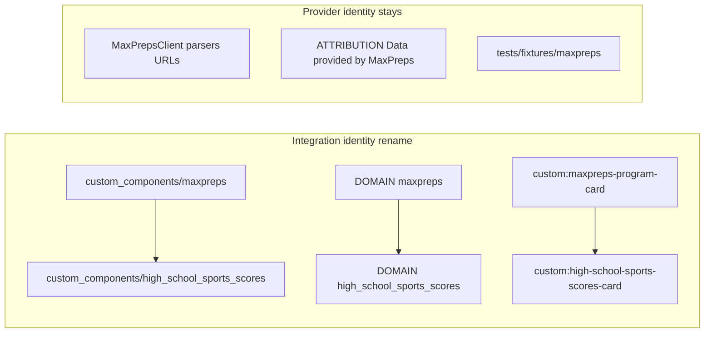

# Phase 5

This file has two parts:

1. **Approved plan** — the Phase 5 public-release plan after planning review, **plus owner amendments dated 2026-09-09** that lock product identity, MIT license, HACS ZIP-release architecture, card type, beta-coverage intent, and a version-syntax evidence checkpoint.
2. **Implementation Notes** — what completed slices actually did. Do not rewrite historical notes as though later owner decisions existed at the time. Differences from the then-current plan belong there.

Do not treat Implementation Notes as amendments to the approved plan.
Do not rewrite historical Phase 3 or Phase 4 notes in [docs/PHASE3_PLAN.md](PHASE3_PLAN.md) or [docs/PHASE4_PLAN.md](PHASE4_PLAN.md).

### Owner amendments (2026-09-09)

These decisions supersede any planning-time “recommend MIT”, “all three testers must complete”, “lock `0.1.0-beta.1` in manifest files”, or “card type is a recommendation” language.

- **License: MIT.** Create a conventional MIT `LICENSE` file. README must distinguish that MIT applies to **this project’s source code** and does **not** grant rights to MaxPreps content, trademarks, imagery, or other provider-owned material.
- **Card type is locked:** Lovelace `custom:high-school-sports-scores-card`; picker/`customCards.type` `high-school-sports-scores-card` (no `custom:` prefix in the picker registry — Phase 4 Layer 3 lesson). No compatibility alias for `custom:maxpreps-program-card`.
- **Domain is locked:** `high_school_sports_scores`. No dual-domain shim. No released-user migration (no external releases/users yet).
- **Beta gate is coverage, not headcount.** Seek all three nearby testers; require meaningful independent validation across multiple real HAOS environments. If a tester drops, document why and obtain equivalent independent coverage. Do not silently reduce external coverage.
- **Version-file syntax is not locked** to `0.1.0-beta.1`. Human-facing first beta remains conceptually `v0.1.0-beta.1`; internal manifest/const/pyproject strings must be validated against Home Assistant, HACS/AwesomeVersion, and PEP 440 before any version bump or tag-to-manifest comparison is coded.
- **Public README** describes live/in-progress limitations in user language. Do not expose internal “Q1” shorthand to strangers. Keep Q1 / PRE / IN / POST / OFF in PRODUCT.md and phase docs.
- **Slice order (late-stage):** Slice 6 cuts the first GitHub pre-release artifact. Slice 7 is owner clean-install of that artifact, then external beta. Do not attempt a HACS release-artifact install before a release exists.
- **`hide_default_branch`:** deliberate policy because `main` has no generated frontend bundle — not a claim that `zip_release` makes the default branch universally uninstallable.
- **Brand path:** HA 2026.3+ supported custom-integration location `custom_components/<domain>/brand/icon.png`. HACS requires branding; do not imply HACS uniquely invented that inline path.

---

# Phase 5 — Public HACS release

## 1. Objective

Turn the completed Phase 4 project into a clean, public, HACS-installable Home Assistant integration named **High School Sports Scores** (informal **HSSS**), with:

- permanent domain `high_school_sports_scores`
- public identity/branding cleanup (product vs MaxPreps provider)
- conventional HACS ZIP-release packaging
- deterministic frontend bundling in the release artifact
- GitHub release automation
- HACS/hassfest validation
- clean stranger-facing install docs
- developer clean-install of the **actual release artifact**
- private beta with meaningful independent external HAOS coverage
- first stable `v0.1.0` readiness

Do **not** expand product functionality.

---

## 2. Authorities / baseline

Treat in this order:

| Authority | Role |
|-----------|------|
| [docs/PRODUCT.md](PRODUCT.md) | Product behavior. Current / Decided vs Future / Desired vs Open / TBD. Do not silently overwrite. Slice 0 reconciles landed Phase 4 card wording before release work. |
| This plan | Phase 5 release/identity/packaging intent, including 2026-09-09 owner amendments |
| [docs/PHASE4_PLAN.md](PHASE4_PLAN.md) | Landed card/websocket contracts. Implementation Notes are history, not product authority. |
| [docs/HA_DEVELOPMENT.md](HA_DEVELOPMENT.md) | Core 2026.9 pins, Layer 1/2/3 conventions |
| Landed Phase 3/4 code and tests | Technical contract Phase 5 must not break aside from identity strings/paths |
| Current HACS/HA docs cited in §7–§8 | Do not invent HACS behavior |

Phase 4 is **complete**. Owner Layer 3 visual checks (2026-09-09): light, dark, narrow/mobile, explicit `last_next`, explicit `schedule` all PASS. Stale/rollover notice appearance is deferred/non-blocking.

Current repo facts (2026-09-09):

- Public GitHub: `willbur83/hacs-highschoolscores` on `main`; **0 releases, 0 tags**, empty `.github/`, no `hacs.json`, no `LICENSE`, no `info.md`, no `CODEOWNERS` file
- Package root: [`custom_components/maxpreps/`](../custom_components/maxpreps/); `manifest.json` domain `maxpreps`, name `MaxPreps`, version `0.0.0`, **missing `issue_tracker`** (HACS-required)
- Card: `custom:maxpreps-program-card`; bundle `www/maxpreps-card.js` **gitignored**
- GitHub description still says “MaxPreps”; topics empty; GitHub license `null`

---

## 3. Locked owner decisions

Do not re-litigate:

| Item | Decision |
|------|----------|
| Public name | High School Sports Scores |
| Informal shorthand | HSSS |
| HA domain | `high_school_sports_scores` |
| Provider | MaxPreps (unchanged) |
| Lovelace type | `custom:high-school-sports-scores-card` |
| Picker / custom element type | `high-school-sports-scores-card` |
| Old card type | No compatibility alias for `custom:maxpreps-program-card` |
| Migration | No dual-domain shim; no released-user migration |
| Rename timing | Now, before any beta/public release |
| License | **MIT** for this repository’s source code |
| Release model | Conventional HACS integration; GitHub Releases; `zip_release`; CI-produced ZIP; no custom installer |
| Frontend source | stays in `frontend/` |
| Generated JS | remains gitignored in git; **must** be inside the release ZIP under `custom_components/high_school_sports_scores/www/` |
| End-user HAOS | no npm requirement |
| First beta (human-facing) | conceptually `v0.1.0-beta.1` |
| First stable (human-facing) | `v0.1.0` |
| Attribution | independent-project disclaimer + MaxPreps as data source |
| Branding | no MaxPreps logos as project branding |
| Beta cohort | three nearby HAOS testers are the planned/default cohort; gate is independent coverage, not exact headcount |
| Product scope | no new sports, polling, Q1 implementation, timezone, calendar, region/rank, card redesign |

Provider-specific implementation names may remain `MaxPreps` where they genuinely refer to the upstream provider/client/parser/data source. Do not blindly rename those symbols.

---

## 4. Key risks / unknowns requiring evidence

| Risk | Evidence / handling |
|------|---------------------|
| HACS ZIP vs preferred model | **No conflict found.** Current HACS docs: `zip_release` is **supported for integrations** and requires `filename`. HACS downloads that GitHub Release asset and `extractall`s into `custom_components/<domain>/`. If later HACS evidence proves incompatibility, **stop and report** before changing direction. |
| ZIP internal layout | Files must sit at **archive root** (`manifest.json` at zip root). A nested `high_school_sports_scores/` folder would install as `custom_components/high_school_sports_scores/high_school_sports_scores/`. |
| Default-branch install | This project sets `hide_default_branch: true` because `main` does not contain the generated runtime frontend bundle. Supported end-user installs must use a GitHub Release ZIP. If HACS behavior differs during Slice 3/6 validation, record it; do not expose `main` as a supported install path merely because HACS can technically offer it. |
| Pre-release visibility | GitHub pre-releases are not the default HACS version. Testers must pick the beta via HACS “Need a different version?” / pre-release enablement. Document this in the beta gate. |
| HACS Action does not verify the zip asset exists | Add **our own** packaging assertion in CI/release. Do not rely on `hacs/action` for “zip contains the card JS”. |
| Brand assets path | Branding is required for the public integration. For Home Assistant 2026.3+, use the supported custom-integration location [`custom_components/<domain>/brand/icon.png`](https://developers.home-assistant.io/docs/core/integration/brand_images/). Do **not** submit to `home-assistant/brands` unless later requirements explicitly call for it. HACS **dashboard** may still show a CDN placeholder until HACS serves local/repo icons; HA Devices & services on 2026.9 will show the local icon. Not a release blocker. |
| Domain length | `high_school_sports_scores` is locked and is valid HA domain syntax (lowercase + underscores). hassfest requires domain == directory name. If hassfest rejects length, **stop and report** — do not silently shorten. |
| Dev sandbox leftovers | Old `maxpreps` config entries, devices `(maxpreps, school_id)`, entity registry `platform=maxpreps`, Lovelace `custom:maxpreps-program-card` will **not** auto-migrate. Wipe/re-add is acceptable (no external users). Do not write `async_migrate_entry` for a released `maxpreps` domain. |
| Layer 2 in CI | Practical with Python 3.14 + pins in [HA_DEVELOPMENT.md](HA_DEVELOPMENT.md). If GHA/phacc cannot install, stop and report; do not drop Layer 2 from CI silently. |
| **Version syntax (tag vs manifest)** | **Not locked.** See §7.1. Do not assume `manifest.json` / `const.VERSION` / `pyproject.toml` should literally contain `0.1.0-beta.1`. Do not implement naive `tag.lstrip("v") == manifest["version"]` until the mapping is evidenced. |

---

## 5. Domain rename strategy

Clean break. No dual-domain shim. No entity unique_id rewrite. Config entry `unique_id` remains MaxPreps `school_id`. Entity unique_id remains `{school_id}:{gender}:{level}:{sport}`.

### HA implications (precise)

- Config entries are keyed by **domain**. Old `maxpreps` entries become orphaned after the folder/domain change.
- Device identifiers are `(DOMAIN, school_id)` in [`sensor.py`](../custom_components/maxpreps/sensor.py) → devices re-created on re-add.
- Entity registry `platform` becomes `high_school_sports_scores`. Generated `entity_id` slugs (school + program name) can stay the same after re-add; do not promise they will.
- Websocket commands are `f"{DOMAIN}/..."`. Card JS **must** match in the same change set.
- Static URL is `/{DOMAIN}/<card.js>` via [`frontend_register.py`](../custom_components/maxpreps/frontend_register.py).
- `ConfigFlow.VERSION` stays `1` (no schema migration).

Developer sandbox: remove old MaxPreps integration entries (or reset `.storage` outside git), restart, add **High School Sports Scores**. Do not blindly delete unrelated HA data.



### A. MUST rename (integration identity)

| Surface | Current | Target |
|---------|---------|--------|
| Package path | `custom_components/maxpreps/` | `custom_components/high_school_sports_scores/` |
| [`manifest.json`](../custom_components/maxpreps/manifest.json) `domain` / `name` | `maxpreps` / `MaxPreps` | `high_school_sports_scores` / `High School Sports Scores` |
| [`const.py`](../custom_components/maxpreps/const.py) `DOMAIN` | `"maxpreps"` | `"high_school_sports_scores"` |
| Config flow registration | `MaxPrepsConfigFlow(..., domain=DOMAIN)` | `HighSchoolSportsScoresConfigFlow` + new `DOMAIN` |
| Device identifiers | `(DOMAIN, school_id)` | new `DOMAIN` |
| WS ownership | `entity_entry.platform != DOMAIN` | auto via `DOMAIN` |
| WS commands | `maxpreps/get_program_schedule`, `maxpreps/subscribe_program_schedule_updates` | `high_school_sports_scores/...` |
| WS error | `not_maxpreps_program` | `not_program_sensor` |
| Static URL / bundle file | `/maxpreps/maxpreps-card.js` | `/high_school_sports_scores/high-school-sports-scores-card.js` |
| User-Agent | `HomeAssistant-MaxPreps/{VERSION}` | `HomeAssistant-HighSchoolSportsScores/{VERSION}` |
| translations/strings titles | `"title": "MaxPreps"` (user step) | `"High School Sports Scores"` |
| Logger package | `custom_components.maxpreps.*` | `custom_components.high_school_sports_scores.*` |
| Tests asserting HA ownership | `custom_components.maxpreps`, `DOMAIN == "maxpreps"` | new package/domain |
| `.gitignore` | `custom_components/maxpreps/www/*.js` | new path |
| Vite `outDir` | `../custom_components/maxpreps/www` | new path |
| Cursor rule globs | `custom_components/maxpreps/**` | new path |
| HACS metadata | absent | `hacs.json` name High School Sports Scores |
| HA class names that are product/UI | `MaxPrepsConfigFlow`, `MaxPrepsOptionsFlow`, `MaxPrepsProgramSensor` | `HighSchoolSportsScores*` |
| Lovelace type | `custom:maxpreps-program-card` | `custom:high-school-sports-scores-card` |

Keep search copy that names the **data source** (“Search MaxPreps by short school name…”).

### B. MAY stay MaxPreps (provider)

- `MaxPrepsClient`, `AsyncMaxPrepsClient`, `MaxPrepsError` and subclasses
- [`parsing/`](../custom_components/maxpreps/parsing/), [`urls.py`](../custom_components/maxpreps/urls.py) (`maxpreps.com`)
- `ATTRIBUTION = "Data provided by MaxPreps"`
- `MaxPrepsDataUpdateCoordinator` / `MaxPrepsCoordinatorData` (HA wrappers of MaxPreps fetch/snapshot — provider-flavored; **do not blindly rename**)
- [`tests/fixtures/maxpreps/`](../tests/fixtures/maxpreps/), [`docs/MAXPREPS_RESEARCH.md`](MAXPREPS_RESEARCH.md)
- Config abort strings that describe MaxPreps responses
- Fixture `source_url` / CDN URLs

Do **not** rewrite [PHASE3_PLAN.md](PHASE3_PLAN.md) / Phase 4 approved-plan history to pretend the domain was always HSSS.

---

## 6. Public naming / card naming strategy

**Locked:**

| Role | Value |
|------|--------|
| Integration title | High School Sports Scores |
| Domain | `high_school_sports_scores` |
| Lovelace type | `custom:high-school-sports-scores-card` |
| Custom element / `customCards.type` | `high-school-sports-scores-card` (no `custom:` prefix in the picker registry) |
| Picker display name | High School Sports Scores |
| Built filename | `high-school-sports-scores-card.js` |
| ZIP asset | `high_school_sports_scores.zip` |

Rejected:

- `custom:maxpreps-program-card` — provider-branded
- `custom:hsss-program-card` — YAML readers should not need the informal acronym
- `custom:high-school-sports-scores-program-card` — redundant “program”

HSSS remains docs/conversation shorthand, not the Lovelace type.

No compatibility alias for the old card type.

If hassfest/HACS later rejects a locked identifier, **stop and report** — do not silently invent a substitute.

---

## 7. HACS packaging / release architecture

**Current HACS requirements (cite and follow; do not invent):**

From [General](https://www.hacs.xyz/docs/publish/start/) + [Integrations](https://www.hacs.xyz/docs/publish/integration/):

- Public GitHub repo; description; topics; README
- Root [`hacs.json`](https://www.hacs.xyz/docs/publish/start/) with required `name`
- Exactly **one** directory under `custom_components/`
- All runtime files under `custom_components/<domain>/`
- `manifest.json` keys: `domain`, `documentation`, `issue_tracker`, `codeowners`, `name`, `version`
- Brand assets are required for the public integration. For Home Assistant 2026.3+, use the supported custom-integration location: `custom_components/high_school_sports_scores/brand/icon.png`. Do not submit to `home-assistant/brands` unless later requirements explicitly call for it.

**Proposed `hacs.json` (only currently documented keys):**

```json
{
  "name": "High School Sports Scores",
  "zip_release": true,
  "filename": "high_school_sports_scores.zip",
  "hide_default_branch": true,
  "homeassistant": "2026.9.0"
}
```

`hide_default_branch: true` is a **deliberate release-policy choice**: the default branch does not contain the generated runtime frontend bundle. Supported end-user installs must use a GitHub Release ZIP. Do not expose `main` as a supported install path merely because HACS can technically offer the default branch.

Do **not** set `content_in_root` (git layout is the standard subdirectory). Do **not** add undocumented keys (`render_readme`, `iot_class` in hacs.json). No `info.md` — README is the user doc.

**ZIP layout** (HACS `extractall` into `/config/custom_components/high_school_sports_scores/`):

```
manifest.json
__init__.py
brand/icon.png
www/high-school-sports-scores-card.js
...remaining integration files...
```

Exclude: `__pycache__`, tests, `frontend/`, docs, `.git`.

**Generated JS policy:** keep gitignoring `www/*.js`. Developers still `npm run build`. Missing bundle remains **non-fatal** for git checkouts (Phase 4 contract). Release ZIP **must** contain the built file; missing-bundle is not acceptable for the artifact testers install. End users on HAOS must not need npm.

**Custom-repo install (before HACS default):**

1. HACS → Custom repositories → `willbur83/hacs-highschoolscores`, category Integration
2. Download a **GitHub Release** (the supported path; `main` is hidden and is not a supported install)
3. Restart Home Assistant
4. Settings → Devices & services → Add → High School Sports Scores

Optional my-link: [HACS repository redirect](https://my.home-assistant.io/create-link/?redirect=hacs_repository) for `willbur83/hacs-highschoolscores` / `integration`.

**Later default HACS inclusion (not a Phase 5 completion requirement):** public repo already; HACS Action **with no ignores**; hassfest; at least one GitHub Release; PR to [`hacs/default`](https://github.com/hacs/default) `integration` list (alpha order); repo description, issues enabled, topics. Queue is months-long. Document as post-v0.1.0 follow-up. Do **not** file that PR in Phase 5.

### 7.1 Version-format evidence checkpoint (technical, not an owner product decision)

Human-facing targets remain:

- first beta conceptually `v0.1.0-beta.1`
- first stable `v0.1.0`

**Do not lock** internal `manifest.json` / `const.VERSION` / `pyproject.toml` strings to `0.1.0-beta.1` until this checkpoint is closed with evidence.

Planning-time evidence (not yet a locked mapping):

- Home Assistant custom-integration `version` must be recognized by **AwesomeVersion** (hassfest `verify_version` allows CALVER, SEMVER, SIMPLEVER, BUILDVER, PEP440). Docs: [integration manifest — Version](https://developers.home-assistant.io/docs/creating_integration_manifest/).
- Home Assistant Core’s own pre-releases use PEP 440 canonical forms such as `2026.5.0b0`, not `2026.5.0-beta.0` ([HA versioning](https://developers.home-assistant.io/docs/versioning/)).
- PEP 440 canonical public beta spelling is `0.1.0b1`. `0.1.0-beta.1` is a valid *input* that **normalizes** to `0.1.0b1` (`packaging.version.Version("0.1.0-beta.1").public == "0.1.0b1"`). Published identifiers SHOULD use the canonical form.
- HACS remote version is the GitHub **release tag name** (releases required, not bare tags). AwesomeVersion commonly accepts a leading `v`.
- A naive CI check `manifest["version"] == tag.lstrip("v")` **fails** if the tag is `v0.1.0-beta.1` and the manifest is `0.1.0b1`. Do not write that comparison until the mapping is documented.

**Stop and report (Slice 3, before Slice 4 tag comparison and before Slice 6 version bump) after running hassfest-equivalent AwesomeVersion checks on candidate strings**, including at least:

- `v0.1.0-beta.1` (human-facing GitHub tag candidate)
- `0.1.0-beta.1`
- `0.1.0b1`
- `v0.1.0` / `0.1.0` (stable)

Then document one consistent mapping used by git tags, GitHub Releases (including pre-release flag), `manifest.json`, `const.VERSION`, `pyproject.toml` if it participates, and CI. Do not mix incompatible spellings. If pyproject does not need to track the integration version, say so explicitly rather than inventing a third string.

Bump versions **in git** on the release PR; CI verifies the documented mapping; do not inject a different version only inside the ZIP.

---

## 8. CI / release workflow

Add conventional GitHub Actions. No custom installer. No npm on the end-user HAOS host.

**`validate.yml`** (push, PR, nightly, `workflow_dispatch`):

- Layer 1: Python 3.12, `pip install -e ".[dev]"`, `pytest` (skip HA-import tests as today)
- Frontend: Node LTS, `cd frontend && npm ci && npm test`
- Layer 2: Python 3.14, same two-step pins as [HA_DEVELOPMENT.md](HA_DEVELOPMENT.md), canonical pytest file list (plus any new packaging tests)
- Packaging dry-run: `npm run build`, zip the integration dir as release would, assert zip-root `manifest.json`, `www/*.js`, `brand/icon.png`, no nested domain folder
- hassfest: `home-assistant/actions/hassfest@master`
- HACS: `hacs/action@main` with `category: integration` and **no ignores** (ship brands + GitHub description/topics/issues first)
- Version-syntax evidence (Slice 3): AwesomeVersion/hassfest checks of candidate strings; record the mapping in Implementation Notes before coding tag comparison

Do **not** declare `frontend`/`http` manifest dependencies (Phase 4 phacc evidence).

**`release.yml`** (tag pattern TBD after §7.1):

1. Checkout the tag
2. Assert git tag ↔ `manifest.json` version using the **documented** mapping from §7.1 (not a guessed `lstrip("v")`)
3. `npm ci && npm test && npm run build` into `custom_components/high_school_sports_scores/www/`
4. Re-run packaging assertions
5. `gh release create` **with the zip attached in the same call** (never publish a release then hope the zip lands). Mark the first beta as a GitHub **pre-release**.

Pin actions by SHA or tagged major + Dependabot later if desired; first pass may use current major tags plus a comment to pin before stable if owner wants extra supply-chain hardness.

---

## 9. Documentation / disclaimer work

**README** becomes stranger-facing (not a phase log):

- Title: High School Sports Scores
- Independent-project disclaimer, approximately:

  > High School Sports Scores is an independent, open-source Home Assistant integration and is not affiliated with, endorsed by, sponsored by, or associated with MaxPreps. The integration retrieves publicly available sports schedule and score data from MaxPreps.com. MaxPreps remains the original source of that data. Users are encouraged to visit and support MaxPreps and the services they provide to high school sports communities.

- Separate LICENSE sentence: the MIT license applies to **this project’s source code**. It does **not** grant rights to MaxPreps content, trademarks, imagery, or other provider-owned material.
- HACS custom-repository install (and my-link)
- First-time setup: Add Integration → High School Sports Scores → short school name → allowlisted sports
- Supported sports: Football, Baseball, Basketball, Volleyball
- Card: picker + `custom:high-school-sports-scores-card`; modes `both` / `last_next` / `schedule`
- Known limitations in **user language**, including:
  - Provider datetimes are timezone-naive and are not reliable kickoff timestamps
  - **Live/in-progress game state is not currently supported. Program entities currently expose `scheduled`, `final`, or `unknown` status.**
  - Conservative ~12 hour polling (daily only while waiting for a new school year to be published)
- Do **not** write “Q1 remains open” or PRE / IN / POST / OFF in README. Keep that terminology in PRODUCT.md and phase planning docs.
- Troubleshooting: missing card (should not happen on HACS ZIP; if git clone, need npm build), school search tips, reload
- Beta feedback: GitHub Issues; forbid private hostnames/IPs/paths in reports
- Screenshots only if captured without private infra
- Development pointer to [HA_DEVELOPMENT.md](HA_DEVELOPMENT.md)

**Do not** put compose, bind-mount hosts, `/srv/`, or operator IPs in README.

[HA_DEVELOPMENT.md](HA_DEVELOPMENT.md): update paths/domain/card type; keep Core pins; describe release-ZIP vs bind-mount; fix leftover “Phase 4 gate not closed” language after Slice 0.

[PRODUCT.md](PRODUCT.md): Slice 0 applies Phase 4 Future→Current from PHASE4_PLAN Slice 6 **proposed wording** (do not invent extra product history). After stable gate, promote HACS custom-repo items 1/15 to Current; keep default-store listing Future until a `hacs/default` PR is actually filed.

LICENSE file is MIT (Slice 2). README License section must include the source-code vs MaxPreps-material distinction.

GitHub repo metadata (via `gh`): description without branding the product as MaxPreps; topics `home-assistant`, `hacs`, `custom-integration`, `lovelace`, `high-school-sports`; issues enabled.

Do not expand Phase 5 into a broad legal analysis or legal-release gate.

---

## 10. Clean-install gate (developer)

This gate runs in **Slice 7**, after **Slice 6** has published a real GitHub pre-release with `high_school_sports_scores.zip` attached. Do not attempt it before a release exists.

Must use the **actual GitHub Release artifact** (HACS install of that release, or the release ZIP unpacked into `custom_components/high_school_sports_scores/`).

Forbidden as the gate path: bind mounts, local npm on the HA host, installing from a git source checkout / `main`.

Checklist:

- Fresh HAOS or disposable HA + HACS (not the bind-mount Core sandbox as the **gate** machine)
- Add custom repository → install the release under test
- Confirm `www/high-school-sports-scores-card.js` exists on disk after install
- Config flow, entities, card picker, `both` / `last_next` / `schedule`, restart persistence
- No developer npm step

Stop if the real release artifact cannot be installed cleanly without npm, a source checkout, or bind mounts, or if HACS installs a tree without the JS (that means zip_release/filename/layout is wrong).

---

## 11. External beta gate

Planned/default cohort: three nearby testers with mature real-world HAOS installs, preferably different schools/programs.

Human-facing first beta: conceptually `v0.1.0-beta.1` as a GitHub **pre-release** created in Slice 6, using the version mapping from §7.1. Slice 7 then clean-installs that same artifact (owner first, then external testers).

Exercise: HACS custom-repo install, config flow, entity creation, card picker, all three card modes, schedule, restart persistence, and **upgrade from one beta release to another** if a second beta is needed.

**Coverage rule (replaces exact headcount):**

- Seek beta coverage from all three available testers
- Require meaningful independent validation across **multiple** real HAOS environments
- If one tester drops out or cannot complete the beta, **document why**
- Require equivalent independent coverage through another HAOS installation or repeated independent clean-install/update validation
- Do **not** silently reduce external coverage
- Release quality is the gate, not an arbitrary headcount of three named people

Provide a short tester brief (install + pre-release selection + issue template). Collect findings; fix release-blocking bugs before stable. Do not expand product scope to satisfy nice-to-haves.

---

## 12. Stable-release gate

- Beta findings resolved or explicitly deferred as known limitations
- Independent external coverage recorded per §11
- GitHub Release `v0.1.0` (not pre-release), using the §7.1 mapping
- `hacs/action` and hassfest green **without ignores**
- Packaging assertions green; ZIP contains card JS + `brand/icon.png`
- README install path verified on a clean HACS install of `v0.1.0`
- PRODUCT §24 items 1 and 15 become Current for **custom-repository** HACS (default store still Future)

---

## 13. Slice breakdown

Keep the tree green. Automated tests: **zero live MaxPreps**. Each slice: Implementation Notes append-only below.

### Slice 0 — PRODUCT / Phase 4 reconciliation

- **Objective:** Promote landed Phase 4 card behavior to Current/Decided using the **already-proposed** PHASE4_PLAN Slice 6 wording. Note Phase 4 owner visual gate passed. Do not start rename/HACS files.
- **Files:** [PRODUCT.md](PRODUCT.md) (snapshot table, §§17–18, §24 items 10–11, §27.B, working-definition footer); light [HA_DEVELOPMENT.md](HA_DEVELOPMENT.md) Phase 4 “gate not closed” correction; this plan’s notes.
- **Tests:** none (docs).
- **Layer 3 / manual:** none.
- **Stop if:** wording would invent behavior Phase 4 did not land (Q1, live scores, HACS).
- **Must not change:** Python/frontend runtime; PHASE3/4 historical plan text.
- **Deliverable:** PRODUCT matches shipped card; Phase 5 coding unblocked.

### Slice 1 — Domain, package, and card identity rename

- **Objective:** One coherent identity cutover: path, `DOMAIN`, manifest name, WS namespace, static URL, Lovelace type `custom:high-school-sports-scores-card`, User-Agent, translations title, tests, vite/gitignore/cursor globs.
- **Files:** move `custom_components/maxpreps/` → `high_school_sports_scores/`; [`const.py`](../custom_components/maxpreps/const.py), [`manifest.json`](../custom_components/maxpreps/manifest.json), [`config_flow.py`](../custom_components/maxpreps/config_flow.py), [`sensor.py`](../custom_components/maxpreps/sensor.py), [`websocket.py`](../custom_components/maxpreps/websocket.py), [`frontend_register.py`](../custom_components/maxpreps/frontend_register.py), [`strings.json`](../custom_components/maxpreps/strings.json), [`translations/en.json`](../custom_components/maxpreps/translations/en.json); all `from custom_components.maxpreps` imports; [`frontend/`](../frontend/) card tag, WS constants, vite outDir, package name, tests; [`.gitignore`](../.gitignore); [`.cursor/rules/ha-integration.mdc`](../.cursor/rules/ha-integration.mdc); HA_DEVELOPMENT/README path strings needed for correctness.
- **Tests:** Layer 1+2+frontend green with new domain/WS/card type; missing-bundle still non-fatal; registry ownership still uses `DOMAIN`.
- **Layer 3 / manual:** sandbox wipe old `maxpreps` entry; re-add; card picker shows new type.
- **Stop if:** hassfest/domain mismatch; hidden unique_id format change; temptation to add migration for released users.
- **Must not change:** parsers, client, fixtures, polling, entity unique_id formula, compact state, DTO schema (except WS type prefix).
- **Deliverable:** git checkout runs as `high_school_sports_scores` with renamed card (local npm build still required for the card in this slice).

### Slice 2 — HACS metadata, MIT LICENSE, brands, GitHub repo fields

- **Objective:** Valid HACS integration **source** metadata without yet publishing a release.
- **Files:** root `hacs.json`; MIT `LICENSE`; `manifest.json` `issue_tracker` + documentation URL; `custom_components/high_school_sports_scores/brand/icon.png` (+ optional `logo.png`); GitHub description/topics via `gh`; tests for required manifest keys including `issue_tracker`.
- **Tests:** `test_manifest.py` updated; packaging path exists for `brand/icon.png`.
- **Layer 3 / manual:** HA 2026.9 Devices & services shows local original icon (not MaxPreps art).
- **Stop if:** branding cannot be shipped at `custom_components/<domain>/brand/icon.png` for HA 2026.9 — report with evidence before inventing a second brand location.
- **Must not change:** scrape/parse behavior; do not use MaxPreps trademarks as the icon.
- **Deliverable:** MIT LICENSE in repo; `hacs/action` can pass on the branch once description/topics exist.

### Slice 3 — CI validation and version-syntax evidence

- **Objective:** PR/push CI for Layer 1, frontend unit, Layer 2, packaging dry-run, hassfest, HACS Action; **and** close §7.1 with recorded AwesomeVersion/hassfest/PEP 440 evidence before any release tag comparison or version bump.
- **Files:** `.github/workflows/validate.yml`; optional `scripts/ci/pack_release_zip.sh` used by CI and release; Implementation Notes recording the version mapping.
- **Tests:** workflow green on `main`/PR; packaging dry-run fails if JS or `brand/icon.png` missing from the assembled zip; version-candidate checks recorded.
- **Layer 3 / manual:** none.
- **Stop if:** Layer 2 cannot run on GHA with documented pins; hassfest flags a real manifest issue; candidate version strings disagree across HA/HACS/PEP 440 — document a mapping or stop; do not invent a hybrid.
- **Must not change:** product behavior; do not bump off `0.0.0` in this slice.
- **Deliverable:** conventional validation CI; documented tag ↔ manifest ↔ pyproject mapping.

### Slice 4 — Release ZIP automation

- **Objective:** Tag-driven GitHub Release whose asset is the tested zip with built card JS. Uses the §7.1 mapping from Slice 3.
- **Files:** `.github/workflows/release.yml`; version still `0.0.0` in this slice until Slice 6; docs in HA_DEVELOPMENT for how to cut a tag.
- **Tests:** dry-run pack script. Do not publish a real GitHub Release in this slice.
- **Layer 3 / manual:** none. First real pre-release is Slice 6.
- **Stop if:** zip layout would nest the domain folder; asset name ≠ `hacs.json` `filename`; tag/manifest comparison does not match the documented mapping.
- **Must not change:** gitignore of `www/*.js` (keep uncommitted).
- **Deliverable:** reproducible `high_school_sports_scores.zip`.

### Slice 5 — Public README and user docs

- **Objective:** Stranger can install from README without operator knowledge.
- **Files:** [`README.md`](../README.md); HA_DEVELOPMENT separated as developer; optional `docs/BETA.md` or a README section for testers; GitHub issue template that forbids private infra.
- **Tests:** none beyond link/path sanity.
- **Layer 3 / manual:** none.
- **Stop if:** docs would document bind-mount as the user install path; README uses “Q1” or PRE/IN/POST/OFF as end-user terminology.
- **Must not change:** runtime.
- **Deliverable:** HACS custom-repo install + disclaimer + MIT vs MaxPreps distinction + card + user-language limitations + beta reporting.

### Slice 6 — First beta release artifact

- **Objective:** Create the first real GitHub pre-release using the validated §7.1 version mapping and the Slice 4 release workflow.
- **Files:** version fields (`manifest` / `const.py` / `pyproject.toml` as mapped); git tag / GitHub pre-release; `high_school_sports_scores.zip` attached in the same release create; Implementation Notes recording tag, asset name, and mapping used.
- **Tests:** full CI on the version-bump PR; release workflow produces the zip; confirm the GitHub Release asset exists and matches `hacs.json` `filename`.
- **Layer 3 / manual:** none beyond verifying the release/asset exists (list the zip; confirm `manifest.json` and `www/*.js` at zip root). Do **not** run the clean-install gate in this slice.
- **Stop if:** release asset is missing, malformed, nested-domain, missing frontend JS, or version/tag mapping is wrong.
- **Must not change:** product behavior; gitignore of `www/*.js`.
- **Deliverable:** a GitHub pre-release with the actual HACS-installable ZIP attached (human-facing first beta, conceptually `v0.1.0-beta.1`).

### Slice 7 — Clean-install and external beta

- **Objective:** Validate the **Slice 6** beta release artifact first on the owner’s clean HA/HACS environment, then on independent external HAOS environments.
- **Order:**
  1. Owner clean-install gate (§10) of that real beta artifact
  2. External beta cohort (§11)
  3. If bugs require a later beta, cut it (same workflow as Slice 6) and verify HACS upgrade from the previous beta
- **Files:** Implementation Notes (coverage record, findings); bugfixes if the artifact/install path is wrong; tester brief if not already in Slice 5.
- **Tests:** existing automated suite still green after any fixes.
- **Layer 3 / manual:** owner clean-install (no bind mount, no local npm, no source checkout); then external testers — install, setup, entities, card picker, all card modes, restart persistence; upgrade between betas if a second beta is needed.
- **Stop if:** the real release artifact cannot be installed cleanly without npm/source checkout/bind mounts; do not paper over with “clone main”; do not treat a dropped tester as silent coverage reduction.
- **Must not change:** allowlist, polling, Q1; do not expand product scope to satisfy nice-to-haves.
- **Deliverable:** recorded owner clean-install PASS; beta findings list; blocking items fixed or explicitly deferred; coverage record (who tested, who dropped and why, equivalent coverage if needed).

### Slice 8 — Stable `v0.1.0` and Phase 5 closure

- **Objective:** Non-pre-release `v0.1.0`; PRODUCT/README status; completion gate.
- **Files:** version bump per mapping; PRODUCT HACS Current for custom-repo; this file’s Implementation Notes gate table.
- **Tests:** CI green on the tag.
- **Layer 3 / manual:** one more clean HACS install of stable.
- **Stop if:** beta blockers remain; independent external coverage was silently reduced.
- **Must not change:** scope creep.
- **Deliverable:** public `v0.1.0` ready; default-store PR explicitly **out of this slice**.

---

## 14. Completion gate

Phase 5 is complete only if all are true:

1. Domain is `high_school_sports_scores`; integration title High School Sports Scores; no `custom_components/maxpreps/` in the tree.
2. Card type is `custom:high-school-sports-scores-card`; no requirement to keep the old type.
3. `hacs.json` uses `zip_release` + `filename` + `hide_default_branch`.
4. Generated JS is gitignored; **release ZIP** contains `www/*.js` at zip-root layout.
5. HACS custom-repository install of the release artifact works without npm.
6. Developer clean-install gate passed against a real GitHub Release artifact (Slice 7 after Slice 6; no bind mount, no local npm, no source checkout as the gate).
7. Meaningful independent external HAOS validation is recorded (planned cohort: three nearby testers). If a tester cannot complete, the reason is documented and equivalent independent coverage exists. External coverage was not silently reduced.
8. `v0.1.0` published using the documented version mapping; hassfest + HACS Action green without ignores.
9. README has disclaimer, MIT source-code vs MaxPreps-material distinction, HACS install, setup, sports, card, user-language limitations (no “Q1”), troubleshooting.
10. No MaxPreps logos as project branding; attribution present.
11. No live MaxPreps in CI; Phase 3/4 runtime contracts unchanged aside from identity strings/paths.
12. Public-repo hygiene on every release commit.

---

## 15. Explicit non-goals

Do **not** add or solve:

- region record, state rank, league/region/class metadata
- new sports
- adaptive/game-day polling
- PRE / IN / POST / OFF implementation (Q1 stays open in PRODUCT.md)
- timezone correction
- calendar entities
- live-score guarantees
- historical seasons
- major card redesign
- unrelated infrastructure
- provider scraping changes except as required by packaging/rename
- HACS default-store submission (`hacs/default`)
- Home Assistant Core inclusion
- dual-domain migration
- custom installer
- committing minified JS to git
- broad legal analysis as a release gate

---

## 16. Documentation impact

| File | When |
|------|------|
| [docs/PHASE5_PLAN.md](PHASE5_PLAN.md) | This planning deliverable; Implementation Notes per slice |
| [docs/PRODUCT.md](PRODUCT.md) | Slice 0 Phase 4 Current; Slice 8 HACS custom-repo Current |
| [docs/HA_DEVELOPMENT.md](HA_DEVELOPMENT.md) | Paths, domain, card, CI pins, ZIP vs bind-mount, version mapping |
| `README.md` | Slice 5 — user docs (no internal Q1 shorthand) |
| [docs/PHASE4_PLAN.md](PHASE4_PLAN.md) | Do not rewrite; cite as complete |
| [docs/PHASE3_PLAN.md](PHASE3_PLAN.md) | Do not rewrite |
| `.cursor/rules/ha-integration.mdc` | Slice 1 glob/path |
| `LICENSE` | Slice 2 — MIT |

---

## 17. Open owner checkpoints

No remaining **product** owner checkpoints. Identity, MIT, card type, domain, ZIP-release architecture, and attribution posture are locked.

Remaining items are **technical or Layer 3 visual**, not product decisions:

1. **Version-file syntax mapping** (§7.1 / Slice 3). Close with hassfest/AwesomeVersion/PEP 440 evidence before Slice 6 tagging. Not an owner taste choice.
2. **Brand icon artwork.** Slice 2 ships a simple original mark (not MaxPreps). Owner visual OK at Layer 3; not a legal-release review.

If implementation evidence (hassfest/HACS) conflicts with a locked identifier or with `zip_release`, **stop and report** — do not silently change direction.

---

# Implementation Notes

_Template only. Coding slices append below this heading. Do not edit the approved plan text above to match later implementation._

Each slice note should include: what landed, decisions, pytest/npm/CI command/result, deviations (technical correction vs newly discovered constraint vs **proposed** product change), and PRODUCT drift check.

## Slice 0 — PRODUCT / Phase 4 reconciliation (2026-09-09)

### What landed

- **`docs/PRODUCT.md`:** Promoted landed Phase 4 Lovelace card behavior from **Future / Desired** → **Current / Decided** using the PHASE4_PLAN Slice 6 proposed wording (snapshot table, §§2.1–2.2, 17, 18, 24 items 10–11, 27.B, §28 assumption 10, §31 working definition). HACS store listing remains **Future / Desired** (Phase 5). Identity strings unchanged (`maxpreps`, `custom:maxpreps-program-card`).
- **`docs/HA_DEVELOPMENT.md`:** Corrected leftover “Phase 4 gate not closed / partial” sandbox language to match PHASE4_PLAN owner visual gate closure (light, dark, narrow/mobile, explicit `last_next`, explicit `schedule` = PASS; stale/rollover notice deferred/non-blocking).
- **This file:** Slice 0 Implementation Notes (this block).

### Tests

None (docs-only slice). No pytest, npm, or live MaxPreps.

### Deviations

None.

### PRODUCT drift check

Phase 3 entity state/attributes, polling, allowlist, coordinator `programs[].terms[]` contract, and no full schedule on entity attributes unchanged. Q1 `PRE` / `IN` / `POST` / `OFF` remains **Open / TBD**. No HACS install marked Current. No invented timezone, live-score, or calendar behavior.

## Slice 1 — Identity cutover (2026-09-10)

### What landed

- **Package move:** `custom_components/maxpreps/` → `custom_components/high_school_sports_scores/` (old directory removed).
- **Integration identity:** `DOMAIN = "high_school_sports_scores"`; manifest `domain` / `name` → `high_school_sports_scores` / `High School Sports Scores`; `USER_AGENT` → `HomeAssistant-HighSchoolSportsScores/{VERSION}`; `ATTRIBUTION` unchanged.
- **HA product classes:** `HighSchoolSportsScoresConfigFlow`, `HighSchoolSportsScoresOptionsFlow`, `HighSchoolSportsScoresProgramSensor`.
- **Websocket:** commands `high_school_sports_scores/get_program_schedule` and `high_school_sports_scores/subscribe_program_schedule_updates`; error code `not_program_sensor` (was `not_maxpreps_program`).
- **Frontend:** `frontend/src/high-school-sports-scores-card.ts`; element/picker type `high-school-sports-scores-card`; Lovelace type `custom:high-school-sports-scores-card`; picker display name **High School Sports Scores**; Vite output `custom_components/high_school_sports_scores/www/high-school-sports-scores-card.js` (gitignored).
- **Docs/rules:** `README.md`, `docs/HA_DEVELOPMENT.md`, `docs/PRODUCT.md` (identity strings + §2.2 frontend TBD reconciled to Phase 4 custom card); `.gitignore`; `.cursor/rules/ha-integration.mdc`.
- **Not in this slice:** `hacs.json`, `LICENSE`, brands, CI/release packaging, `www/*.js` committed, migration shims.
- **Slice 1 correction (identity cleanup):** Renamed integration-facing frontend heuristic `isMaxPrepsProgramEntity` → `isProgramEntity`; card config helper and websocket user-facing errors now say “High School Sports Scores program sensor” (not “MaxPreps program sensor”). Provider/client symbols unchanged.

### Tests

| Command | Result |
|---------|--------|
| `.venv/bin/pip install -e ".[dev]" && .venv/bin/pytest` (host Python 3.12) | **202 passed**, 10 skipped (Layer 2 modules importorskip without HA on host) |
| `cd frontend && npm ci && npm test` | **78 passed** (after `isProgramEntity` rename) |
| `cd frontend && npm run build` | Success → `custom_components/high_school_sports_scores/www/high-school-sports-scores-card.js` (~50 kB) |
| **Layer 2 (canonical)** — `ghcr.io/home-assistant/home-assistant:2026.9.0` container (Python 3.14); two-step install per [HA_DEVELOPMENT.md](HA_DEVELOPMENT.md); `PYTHONPATH=/work python3 -m pytest --import-mode=importlib --rootdir=/work` on the canonical file list including `tests/test_websocket.py` | **103 passed** in 8.04s |

Layer 2 container command (mount checkout at `/work`):

```bash
docker run --rm -v <checkout>:/work -w /work ghcr.io/home-assistant/home-assistant:2026.9.0 bash -lc '
python3 -m pip install pytest-homeassistant-custom-component==0.13.362
python3 -m pip install homeassistant==2026.9.0
python3 -m pip install -e .
PYTHONPATH=/work python3 -m pytest --import-mode=importlib --rootdir=/work \
  tests/test_manifest.py tests/test_init.py tests/test_ha_transport.py \
  tests/test_config_flow.py tests/test_programs.py tests/test_coordinator.py \
  tests/test_sensor.py tests/test_options_flow.py tests/test_multi_school.py \
  tests/test_failure.py tests/test_rollover.py tests/test_websocket.py
'
```

Pins: `homeassistant==2026.9.0`, `pytest-homeassistant-custom-component==0.13.362` (pip reports phacc wants `2026.9.0b6`; two-step install per HA_DEVELOPMENT is intentional). Zero live MaxPreps.

### Identity-cutover audit (remaining `maxpreps` / `MaxPreps` hits)

| Area | Classification | Notes |
|------|----------------|-------|
| `MaxPrepsClient`, `AsyncMaxPrepsClient`, `MaxPrepsError`, `MaxPrepsDataUpdateCoordinator`, `MaxPrepsCoordinatorData` | **A — provider** | Upstream client/coordinator names retained per §5 |
| `parsing/`, `urls.py`, `maxpreps.com` / `maxpreps.io` in fixtures/tests | **A — provider** | |
| `ATTRIBUTION`, config-flow/search copy naming MaxPreps data source | **A — provider** | |
| `tests/fixtures/maxpreps/`, `tests/helpers/fixtures.py` path | **A — provider** | |
| `isProgramEntity` (was `isMaxPrepsProgramEntity`) | **B → renamed** | Integration/card compatibility heuristic; neutral name |
| Card config helper + websocket user-facing errors (was “MaxPreps program sensor”) | **B → renamed** | Now “High School Sports Scores program sensor” / coordinator wording |
| `docs/PHASE3_PLAN.md`, `docs/PHASE4_PLAN.md`, `docs/MAXPREPS_RESEARCH.md` | **A — historical** | Not rewritten |
| Active runtime tree (`custom_components/high_school_sports_scores/`, `frontend/`, `tests/*.py`) | **No stale B hits** | No `DOMAIN = "maxpreps"`, no `custom_components.maxpreps` imports, no old card type/path/WS namespace, no integration-facing `isMaxPreps*` symbols |

### Deviations

None. `ConfigFlow.VERSION` remains 1; config entry `unique_id` remains MaxPreps `school_id`; entity `unique_id` formula unchanged; no `async_migrate_entry`.

### PRODUCT drift check

Updated identity strings only (`custom_components/high_school_sports_scores/`, `custom:high-school-sports-scores-card`, websocket command names, bind-mount paths). §2.2 stale “exact frontend implementation Open / TBD” reconciled to Phase 4 custom card (factual cleanup). Polling, compact state, allowlist, coordinator `programs[].terms[]`, no `terms[]` on entity attributes, Q1 open, HACS install still **Future / Desired** — unchanged.

## Slice 2 — HACS metadata, MIT LICENSE, brands, GitHub repo fields (2026-09-10)

### What landed

- **Hygiene cleanup:** Removed leftover `custom_components/maxpreps/` containing only Slice 1 disposable frontend build output (`www/high-school-sports-scores-card.js`). No tracked or unexpected source files remained. Working tree now has exactly one integration directory: `custom_components/high_school_sports_scores/`.
- **`hacs.json`:** Root file with locked keys only — `name`, `zip_release`, `filename`, `hide_default_branch`, `homeassistant`. No `content_in_root`, no `render_readme`, no `iot_class`, no `info.md`.
- **`LICENSE`:** Conventional MIT text; copyright year 2026; holder **High School Sports Scores contributors**.
- **`manifest.json`:** Added `issue_tracker` (`https://github.com/willbur83/hacs-highschoolscores/issues`). `documentation` unchanged. No `frontend`/`http` dependencies. Domain/name/version unchanged (`0.0.0`).
- **Brand assets (owner-provided):** `custom_components/high_school_sports_scores/brand/icon.png` (512×512 scoreboard icon) and optional `logo.png` (512×153 horizontal wordmark). No MaxPreps logos/wordmarks. No `dark_*` or `@2x` variants in this slice.
- **`README.md`:** License section replaced TBD with MIT + pointer to `LICENSE` and source-code vs MaxPreps-material distinction (one sentence).
- **`tests/test_manifest.py`:** Required keys now include `issue_tracker`, `documentation`, `codeowners`; `test_brand_icon_exists` asserts `brand/icon.png` on disk; module docstring no longer says “MaxPreps integration”.
- **Not in this slice:** CI workflows, version bump, GitHub Release, `hacs/action` workflow, `info.md`, `CODEOWNERS` file, `content_in_root`, committed `www/*.js`.

### GitHub repo metadata (applied)

Owner-authorized updates via `gh repo edit`:

| Field | Before | After |
|-------|--------|-------|
| Description | `Home Assistant integration for MaxPreps school sports schedules and scores` | `High School Sports Scores — a Home Assistant integration for high school sports schedules and scores.` |
| Topics | *(empty)* | `custom-integration`, `hacs`, `high-school-sports`, `home-assistant`, `lovelace` |
| Issues | enabled | enabled (unchanged) |

Verified with `gh repo view willbur83/hacs-highschoolscores --json description,repositoryTopics,hasIssuesEnabled`.

### Tests

| Command | Result |
|---------|--------|
| `.venv/bin/pip install -e ".[dev]" && .venv/bin/pytest` (host Python 3.12) | **203 passed**, 10 skipped |
| **Layer 2 (canonical)** — `ghcr.io/home-assistant/home-assistant:2026.9.0` container; two-step phacc + `homeassistant==2026.9.0`; canonical file list including `tests/test_websocket.py` | **104 passed** in 9.08s |

Layer 2 container command (mount checkout at `/work`):

```bash
docker run --rm -v <checkout>:/work -w /work ghcr.io/home-assistant/home-assistant:2026.9.0 bash -lc '
python3 -m pip install pytest-homeassistant-custom-component==0.13.362
python3 -m pip install homeassistant==2026.9.0
python3 -m pip install -e .
PYTHONPATH=/work python3 -m pytest --import-mode=importlib --rootdir=/work \
  tests/test_manifest.py tests/test_init.py tests/test_ha_transport.py \
  tests/test_config_flow.py tests/test_programs.py tests/test_coordinator.py \
  tests/test_sensor.py tests/test_options_flow.py tests/test_multi_school.py \
  tests/test_failure.py tests/test_rollover.py tests/test_websocket.py
'
```

Pins: `homeassistant==2026.9.0`, `pytest-homeassistant-custom-component==0.13.362`. Zero live MaxPreps.

**Layer 3 / manual:** Not run — no Core sandbox bind-mount was available in this session. Owner should confirm HA 2026.9 **Settings → Devices & services** shows the local `brand/icon.png` for High School Sports Scores after bind-mounting `custom_components/high_school_sports_scores`.

### Deviations

None.

### PRODUCT drift check

No `docs/PRODUCT.md` changes. HACS install remains **Future / Desired**. Version stays `0.0.0`. Parsers/client/fixtures, unique_id formula, polling, DTO schema, Q1, provider symbols, ATTRIBUTION, and MaxPreps search copy unchanged.

## Slice 3 — CI validation and version-syntax evidence (2026-09-10)

### What landed

- **`.github/workflows/validate.yml`:** push, `pull_request`, nightly (`0 3 * * *` UTC), `workflow_dispatch`; top-level `permissions: contents: read`. Jobs reproduce proven commands:
  - Layer 1 — `actions/setup-python` 3.12 → `pip install -e ".[dev]"` → `pytest`
  - Frontend — Node LTS → `cd frontend && npm ci && npm test`
  - Layer 2 — `docker run` `ghcr.io/home-assistant/home-assistant:2026.9.0` with two-step `pytest-homeassistant-custom-component==0.13.362` then `homeassistant==2026.9.0`, `pip install -e .`, canonical `PYTHONPATH` / `--import-mode=importlib` / file list (unchanged)
  - Packaging dry-run — `npm ci && npm run build`, `scripts/ci/pack_release_zip.sh`, `scripts/ci/assert_release_zip.sh`
  - hassfest — `home-assistant/actions/hassfest@master`
  - HACS — `hacs/action@main`, `category: integration`, no ignores
- **`scripts/ci/pack_release_zip.sh`:** zips `custom_components/high_school_sports_scores/` with integration files at archive root (HACS `extractall` layout); excludes `__pycache__` / `*.pyc`.
- **`scripts/ci/assert_release_zip.sh`:** asserts `manifest.json`, `brand/icon.png`, `www/high-school-sports-scores-card.js` at zip root; no nested `high_school_sports_scores/`; zip basename matches `hacs.json` `filename` (`high_school_sports_scores.zip`); fails when JS bundle absent.
- **`tests/test_version_mapping.py`:** Layer 1 re-check of §7.1 candidate matrix and locked first-beta / first-stable mapping (uses hassfest-equivalent `AwesomeVersion` `ensure_strategy` list).
- **`pyproject.toml` `[dev]`:** added `awesomeversion` + `packaging` for version-evidence tests only.
- **`docs/HA_DEVELOPMENT.md`:** CI section documenting that Actions jobs mirror the Layer 1 / frontend / Layer 2 commands above.
- **hassfest hygiene (no version bump):** `manifest.json` keys sorted per hassfest (`iot_class` before `issue_tracker`); `frontend_register.py` uses `importlib.import_module` for optional `http` / `frontend` registration so hassfest dependencies validation passes **without** adding `frontend` / `http` manifest dependencies (Phase 4 phacc constraint preserved).
- **Not in this slice:** `release.yml`, GitHub Release, version bump off `0.0.0`, committed `www/*.js`.

### §7.1 version-syntax evidence (HA 2026.9.0 / awesomeversion 25.8.0)

Source: hassfest `verify_version` in `home-assistant/core` `script/hassfest/manifest.py` (2026.9.0) — `AwesomeVersion(value, ensure_strategy=[CALVER, SEMVER, SIMPLEVER, BUILDVER, PEP440])`. Evidence run inside `ghcr.io/home-assistant/home-assistant:2026.9.0` after `pip install homeassistant==2026.9.0`.

| candidate | hassfest | parsed (AwesomeVersion) | strategy | PEP 440 `.public` | PEP 440 prerelease |
|-----------|----------|---------------------------|----------|-------------------|-------------------|
| `v0.1.0-beta.1` | PASS | `v0.1.0-beta.1` | SEMVER | `0.1.0b1` | yes |
| `0.1.0-beta.1` | PASS | `0.1.0-beta.1` | SEMVER | `0.1.0b1` | yes |
| `0.1.0b1` | PASS | `0.1.0b1` | PEP440 | `0.1.0b1` | yes |
| `v0.1.0b1` | PASS | `v0.1.0b1` | PEP440 | `0.1.0b1` | yes |
| `v0.1.0` | PASS | `v0.1.0` | SEMVER | `0.1.0` | no |
| `0.1.0` | PASS | `0.1.0` | SEMVER | `0.1.0` | no |

**Equality (AwesomeVersion, hassfest strategies):**

- `AwesomeVersion("v0.1.0-beta.1") == AwesomeVersion("0.1.0b1")` → **False** (SEMVER vs PEP440 strings)
- `AwesomeVersion("v0.1.0-beta.1") == AwesomeVersion("0.1.0-beta.1")` → **True**
- `AwesomeVersion("v0.1.0b1") == AwesomeVersion("0.1.0b1")` → **True**
- `AwesomeVersion("v0.1.0") == AwesomeVersion("0.1.0")` → **True**

**Naive `tag.removeprefix("v") == manifest_version`:**

| tag | manifest | passes naive strip |
|-----|----------|-------------------|
| `v0.1.0-beta.1` | `0.1.0b1` | **no** |
| `v0.1.0-beta.1` | `0.1.0-beta.1` | **yes** |
| `v0.1.0` | `0.1.0` | **yes** |
| `v0.1.0` | `0.1.0b1` | **no** |
| `v0.1.0b1` | `0.1.0b1` | **yes** |

**Locked mapping (Slice 4 / Slice 6):**

| Field | First beta | First stable |
|-------|------------|--------------|
| GitHub tag | `v0.1.0-beta.1` | `v0.1.0` |
| GitHub Release pre-release flag | **yes** | **no** |
| `manifest.json` `"version"` / `const.VERSION` | `0.1.0-beta.1` | `0.1.0` |
| `pyproject.toml` `[project].version` | Same string as manifest on the Slice 6 release PR only; stays `0.0.0` until then. Pyproject is for local `pip install -e` / Layer 1 tests — **not** shipped in the HACS ZIP. |
| Slice 4 tag ↔ manifest check | `tag.removeprefix("v") == manifest["version"]` (sufficient for both locked pairs above). Equivalent: `AwesomeVersion(tag, ensure_strategy=hassfest_list) == AwesomeVersion(manifest["version"], …)` for callers that prefer normalized comparison. |

**Do not** use manifest `0.1.0b1` with tag `v0.1.0-beta.1` — naive strip fails and AwesomeVersion equality fails across SEMVER vs PEP440 spellings. Human-facing beta tag stays `v0.1.0-beta.1`; internal manifest uses matching SEMVER `0.1.0-beta.1` (PEP 440 still normalizes both to public `0.1.0b1`).

### Tests

**Local / pre-push verification:**

| Command | Result |
|---------|--------|
| `.venv/bin/pip install -e ".[dev]" && .venv/bin/pytest` (host Python 3.12) | **219 passed**, 10 skipped (includes `tests/test_version_mapping.py`) |
| `cd frontend && npm ci && npm test` | **78 passed** |
| **Layer 2 (canonical)** — `ghcr.io/home-assistant/home-assistant:2026.9.0` container; two-step phacc + `homeassistant==2026.9.0`; canonical file list | **104 passed** in 7.67s |
| Packaging dry-run — `npm run build`, `pack_release_zip.sh`, `assert_release_zip.sh` | **PASS** (assert script **fails** when `www/high-school-sports-scores-card.js` missing — verified) |
| hassfest — `ghcr.io/home-assistant/hassfest` on checkout | **PASS** (0 errors; `CONFIG_SCHEMA` warning only — config-entry-only integration, pre-existing) |
| Version evidence | Recorded above; re-checked by `tests/test_version_mapping.py` |

**GitHub Actions verification (`validate.yml` on `willbur83/hacs-highschoolscores`):**

| Run | Trigger | Result |
|-----|---------|--------|
| [34502930544](https://github.com/willbur83/hacs-highschoolscores/actions/runs/34502930544) | push `phase5-slices-1-3-validate` (Slices 1–3 only) | **failure** — see interim notes below |
| [34503317968](https://github.com/willbur83/hacs-highschoolscores/actions/runs/34503317968) | push `main` (Slices 1–3 + Layer 2 CI fix) | **success** — all required jobs green |

**Run 34503317968 job results (authoritative closure):**

| Job | Result |
|-----|--------|
| Layer 1 (Python 3.12) | **success** |
| Frontend unit | **success** |
| Layer 2 (HA Core container) | **success** |
| Packaging dry-run | **success** |
| hassfest | **success** |
| HACS Action | **success** |

Interim run **34502930544** (branch-only, before `main` had `LICENSE`):

- **Layer 2:** `104 passed`, **1 error** — phacc lingering `DataUpdateCoordinator` refresh timer on `tests/test_options_flow.py::test_clear_logo_override_preserves_subscriptions` teardown. Fixed by `await hass.async_block_till_done()` after options `CREATE_ENTRY` (commit on `main`, no test weakening).
- **HACS Action:** `<Validation license> failed: The repository has no license` — GitHub repo `.license` metadata was empty while `LICENSE` existed only on the feature branch (`main` still pointed at pre–Slice 2 `maxpreps`). After Slices 1–3 landed on **`main`**, HACS license validation passed with **no** `zip_release` / release-asset workaround and **no** `hacs.json` changes.

Pins unchanged: `homeassistant==2026.9.0`, `pytest-homeassistant-custom-component==0.13.362`. Zero live MaxPreps.

### pyproject.toml beta spelling (toolchain evidence, disposable copy)

Disposable copy of the repo with `[project].version = "0.1.0-beta.1"` only (real tree unchanged at `0.0.0`):

| Check | Result |
|-------|--------|
| `python -m build --wheel` (setuptools **84.0.0** build backend) | **accepted** — built `hacs_highschoolscores-0.1.0b1-py3-none-any.whl` |
| Wheel `METADATA` `Version:` | `0.1.0b1` (PEP 440 normalization from source `0.1.0-beta.1`) |
| `pip install` wheel → `pip show` / `importlib.metadata.version` | `0.1.0b1` |
| `pip install -e .` → `PKG-INFO` `Version:` | `0.1.0b1` |

**Mapping impact:** none. Slice 6 release PR still sets **source** `pyproject.toml` / `manifest.json` / `const.VERSION` to the literal `0.1.0-beta.1` (hassfest SEMVER + `tag.removeprefix("v")` alignment). Setuptools/pip **installed metadata** may report canonical `0.1.0b1`; the HACS ZIP carries `manifest.json` from the integration tree, not wheel metadata.

**Repository version files after Slice 3 closure:** `pyproject.toml`, `manifest.json`, and `const.VERSION` remain **`0.0.0`**.

### Deviations

- **`frontend_register.py`:** switched `http` / `frontend` imports to `importlib.import_module` so hassfest dependencies validation passes without manifest `dependencies` / `after_dependencies` on `http` / `frontend` (Phase 4 phacc constraint). Runtime behavior unchanged.
- **`manifest.json`:** key order only (`iot_class` before `issue_tracker`) for hassfest; no version or domain change.
- **`tests/test_options_flow.py`:** one `async_block_till_done()` after options configure (CI phacc timer teardown; behavior unchanged).

### PRODUCT drift check

No `docs/PRODUCT.md` changes. Version stays `0.0.0`. HACS install remains **Future / Desired**. Polling, DTO, Q1, provider symbols, `hacs.json` `zip_release` policy, and MaxPreps client/fixtures unchanged.

## Slice 4 — Release ZIP automation (2026-09-10)

### What landed

- **`.github/workflows/release.yml`:** Tag-driven GitHub Release automation (`on.push.tags: v*`) plus **`workflow_dispatch`** pack-only validation (never calls `gh release create`).
  - Default workflow `permissions: contents: read`; **`publish`** job alone requests `contents: write`.
  - **Tag path:** checkout at the pushed tag → **version gate** (before frontend build or release) using source literals from git:
    - `github.ref_name.removeprefix("v") == manifest.json["version"]`
    - `const.VERSION == manifest.json["version"]`
    - `pyproject.toml [project].version == manifest.json["version"]`
    - manifest version must not be `0.0.0` (blocks accidental `v0.0.0` even when strip matches the current tree)
  - Frontend: `cd frontend && npm ci && npm test && npm run build`
  - Reuses **`scripts/ci/pack_release_zip.sh`** and **`scripts/ci/assert_release_zip.sh`** (HACS `extractall` layout; asset basename `high_school_sports_scores.zip` per `hacs.json`)
  - **`gh release create`** attaches `dist/high_school_sports_scores.zip` in the **same invocation** (no separate upload step). Pre-release flag: `--prerelease` when manifest version is not a plain stable `X.Y.Z` core (e.g. `0.1.0-beta.1` → pre-release; `0.1.0` → stable release).
- **`docs/HA_DEVELOPMENT.md`:** Short “GitHub Releases (HACS zip)” section — `main` has no committed JS; Slice 6 tag cut steps; release workflow is the supported artifact path; `workflow_dispatch` is CI pack validation only.
- **Not in this slice:** No git tag pushed, no GitHub Release published, no version bump off `0.0.0`, no README rewrite (Slice 5), no Slice 6 beta tag `v0.1.0-beta.1`.

### Version mapping enforcement (release workflow)

Same locked rules as Slice 3 Implementation Notes — **no** `0.1.0b1` manifest pairing with `v0.1.0-beta.1`; ZIP carries `manifest.json` from the tagged tree without rewritten versions.

### Tests

| Command | Result |
|---------|--------|
| `.venv/bin/pytest` (host Python 3.12, `[dev]`) | **219 passed**, 10 skipped |
| `cd frontend && npm ci && npm test` | **78 passed** |
| Packaging dry-run — `npm run build`, `pack_release_zip.sh`, `assert_release_zip.sh` | **PASS** (zip root: `manifest.json`, `brand/icon.png`, `www/high-school-sports-scores-card.js`; no nested `high_school_sports_scores/`) |
| `actionlint` on `release.yml` | **skipped** (`actionlint` not installed in dev environment) |
| Layer 2 container | **not run** (no Python/HA test changes) |

**GitHub Actions verification (`release.yml` `workflow_dispatch` on `willbur83/hacs-highschoolscores`):**

| Run | Trigger | Result |
|-----|---------|--------|
| [34515142164](https://github.com/willbur83/hacs-highschoolscores/actions/runs/34515142164) | `workflow_dispatch` on `main` (commit `03dd5cb`) | **success** |

**Run 34515142164 job results:**

| Job | Result |
|-----|--------|
| Package validation (manual) | **success** — checkout, Node setup, `npm ci && npm test && npm run build`, `pack_release_zip.sh`, `assert_release_zip.sh` (log: `Release zip assertions passed` for `high_school_sports_scores.zip`) |
| Publish GitHub Release | **skipped** (`if: push` + `refs/tags/` — no `gh release create` step ran) |

**Closure checks:** zero git tags and zero GitHub Releases on the repo after the run (`gh release list` empty; tags API count 0). Remote `main` `manifest.json` version remains **`0.0.0`** (`const.VERSION` / `pyproject.toml` unchanged on `main`). Tag-driven publish path not exercised in Slice 4.

Zero live MaxPreps.

### Deviations

None.

### PRODUCT drift check

No `docs/PRODUCT.md` changes. Repository version files remain **`0.0.0`**. HACS install remains **Future / Desired**. `validate.yml`, `hacs.json`, parsers/client/fixtures, polling, DTO, Q1, and product behavior unchanged.

## Slice 5 — Public README and user docs (2026-09-12)

### What landed

- **`README.md`:** Rewritten from Phase 3/4 development log to stranger-facing user documentation — pre-release status banner, independent-project disclaimer (§9), MIT vs MaxPreps-material license distinction, HACS custom-repository install path targeting GitHub Release ZIP (`high_school_sports_scores.zip`, `hide_default_branch`), my.home-assistant.io optional custom-repo link, first-time setup (short school name, allowlisted sports, options/logo override), supported sports table, Lovelace card picker + `custom:high-school-sports-scores-card` modes, user-language limitations (naive datetimes, no live/in-progress, ~12h/daily rollover polling), troubleshooting (clone vs release, search tips, reload/restart, main not supported), beta/issue reporting hygiene, developer pointer to `docs/HA_DEVELOPMENT.md` only (no bind-mount/npm as user install).
- **`docs/BETA.md`:** External beta workflow — custom repo, pre-release version selection (HACS wording kept flexible for Slice 7 tightening), restart, integration setup, entity/card mode/restart checks, upgrade between betas, GitHub Issues with public-safe diagnostics rules aligned with §11 coverage intent.
- **`.github/ISSUE_TEMPLATE/bug_report.yml`** + **`config.yml`:** Conventional bug report form requesting HA/integration/HACS install context, repro steps, sanitized logs; explicit do-not-include list (hostnames, IPs, paths, compose, secrets, full dumps). Links to README and BETA.md.
- **This file:** Slice 5 Implementation Notes (this block).

### Tests

Docs-only slice. No pytest, npm, or live MaxPreps. Manual link/path sanity on new markdown and issue template URLs.

### Deviations

None.

### PRODUCT drift check

No `docs/PRODUCT.md` changes. HACS custom-repo install remains **Future / Desired** (Slice 8). No version bump, no git tag, no GitHub Release (Slice 6). No README use of Q1 or PRE/IN/POST/OFF end-user terminology. Runtime, `hacs.json`, LICENSE legal text, parsers/client/fixtures, and `ATTRIBUTION` unchanged.

### Slice 5 correction — minimum Home Assistant version + doc hygiene (2026-09-12)

#### Compatibility audit (runtime APIs)

| API / usage | Code | Earliest Core tag (evidence) | Hard vs presentation |
|-------------|------|------------------------------|----------------------|
| `OptionsFlowWithReload` | `config_flow.py` | **2025.8.0** — [core#146910](https://github.com/home-assistant/core/pull/146910) merged 2025-07-19; class absent in `config_entries.py` at tag `2025.7.4`, present at `2025.8.0` (raw tag file grep) | **Hard** (import fails below floor) |
| `ConfigEntry.runtime_data` | `__init__.py`, `websocket.py`, `sensor.py` | **2024.6.0** — [core#115669](https://github.com/home-assistant/core/pull/115669); `runtime_data` absent at `2024.5.4`, present at `2024.6.0` | Hard |
| `http.StaticPathConfig` + `async_register_static_paths` | `frontend_register.py` | **2024.7.0** — [dev blog 2024-06-18](https://developers.home-assistant.io/blog/2024/06/18/async_register_static_paths/); symbol absent at tag `2024.6.0`, present at `2024.7.0` | Hard for card static path (integration still loads if bundle missing) |
| `async_forward_entry_setups` / `async_unload_platforms` | `__init__.py` | Pre-2024.6 (platform forward API migrations, e.g. core#86565) | Hard |
| `DataUpdateCoordinator`, `CoordinatorEntity`, `DeviceInfo`, selectors, websocket commands, `add_extra_js_url` | coordinator / sensor / websocket / frontend | Well before 2025.8 | Hard where used |
| `custom_components/.../brand/icon.png` | on-disk for hassfest | **2026.3+** branding convention per `tests/test_manifest.py` comment | **Presentation / hassfest only** — not runtime minimum |

**Recommended minimum supported Core version:** **`2025.8.0`** (maximum of hard runtime rows above).

#### Layer 2 empirical checks (canonical file list; zero live MaxPreps)

| Core tag | Result | Notes |
|----------|--------|-------|
| **2025.7.4** (one release before floor) | **Integration does not import** — `ImportError: cannot import name 'OptionsFlowWithReload'` when loading `config_flow.py` | Expected below-floor failure |
| **2025.8.0** (candidate minimum) | **102 passed**, 2 failed in 6.61s | Failures are **tests only** (`DeviceRegistry.async_get_device_by_identifier` helper absent on 2025.8; integration runtime does not call it). Container: `phacc==0.13.316`, no `pip install homeassistant` override (use image Core). |
| **2026.9.0** (primary CI pin) | **104 passed** in 7.22s | Matches `.github/workflows/validate.yml` Layer 2 command (`phacc==0.13.362`, `homeassistant==2026.9.0`). |

#### Files changed (minimum version + README cleanup)

- **`hacs.json`:** `homeassistant` **`2025.8.0`** (HACS minimum gate; was incorrectly pinned to CI target `2026.9.0`).
- **`README.md`:** Requirements **`2025.8.0+`**; end-user install wording (published release via HACS; development branch not supported); reduced `hide_default_branch` / `main` implementation detail in primary prose.
- **`docs/BETA.md`:** Minimum **`2025.8.0+`**; same release-vs-development-branch wording.
- **`docs/HA_DEVELOPMENT.md`:** New **Supported Home Assistant versions** table (minimum vs primary CI pin **`2026.9.0`** unchanged in Layer 2 job).

#### Public-doc hygiene audit

Grepped `README.md`, `docs/BETA.md`, `.github/ISSUE_TEMPLATE/**` for `vscode-remote`, `vscode-resource`, private hostnames/IPs, and local infra paths. **No VS Code remote or `/srv/` install links** in those files. README/BETA retain **sanitized examples** of paths users must not post in issues (`/home/...`, `/srv/...`). Repository-relative Markdown links only (`docs/BETA.md`, `hacs.json`, `LICENSE`, etc.).

#### Deviations

Initial Slice 5 README/BETA listed **`2026.9.0`** as the user minimum — that mirrored the CI/dev pin, not a compatibility audit. Corrected without runtime code changes.

#### PRODUCT drift check

Still no `docs/PRODUCT.md` changes. No Slice 6 tag/release/version bump. Minimum supported version documentation only.

### Slice 5 correction — Layer 2 green on documented HA floor (2026-09-12)

#### Test-only 2025.8.0 failures

Two Layer 2 tests called `DeviceRegistry.async_get_device_by_identifier`, added in newer Home Assistant for config-entry-scoped device lookup. That API is **not** present on Core **2025.8.0** and is **not** used by integration runtime (`DeviceInfo` only).

#### Fix

- **`tests/device_registry_compat.py`:** `async_get_device_for_config_entry()` uses `async_get_device_by_identifier` when available (2026.9+), otherwise `async_get_device(identifiers=…)` plus `config_entry_id in device.config_entries` (2025.8+).
- **`tests/test_sensor.py`**, **`tests/test_multi_school.py`:** device assertions routed through the helper.

Runtime integration code unchanged.

#### Layer 2 re-check (canonical file list; zero live MaxPreps)

| Core tag | Result |
|----------|--------|
| **2025.7.4** | **Expected boundary failure** — `ImportError: cannot import name 'OptionsFlowWithReload'` loading `config_flow.py` |
| **2025.8.0** | **104 passed** (documented minimum; `phacc==0.13.316`, image Core, no HA pip override) |
| **2026.9.0** | **104 passed** (primary CI pin; `phacc==0.13.362`, `homeassistant==2026.9.0`) |

Primary CI target remains **2026.9.0** in `.github/workflows/validate.yml`; no old-version CI matrix added.

#### Public-doc wording

- **`docs/BETA.md`:** “allowlisted sport” → “supported sport” in tester prerequisites.
- **`.github/ISSUE_TEMPLATE/bug_report.yml`:** neutral HA version placeholder (“e.g. 2025.8.0 or newer”).

## Slice 6 — First beta release artifact (2026-09-12)

### What landed

- **Version bump (PR [#2](https://github.com/willbur83/hacs-highschoolscores/pull/2)):** `manifest.json`, `const.VERSION`, and `pyproject.toml` `[project].version` set to **`0.1.0-beta.1`** (same literal in all three; not `0.1.0b1`). Layer 1 tests updated (`test_version_mapping`, `test_manifest`, `test_async_transport` User-Agent).
- **`.github/workflows/release.yml`:** `--generate-notes` on tag-driven `gh release create` (pre-release flag unchanged for non-`X.Y.Z` manifest cores).
- **Git tag / GitHub pre-release:** Annotated tag **`v0.1.0-beta.1`** on validated merge commit; workflow attached **`high_school_sports_scores.zip`** in the same `gh release create` invocation.
- **`README.md` / `docs/BETA.md`:** Public beta status (post-release); HACS custom-repo install via published pre-releases; removed “beta not published yet” prerequisite wording.

**Prerequisite closure (Slice 5 Layer 2 on HA 2025.8.0):** merged PR [#1](https://github.com/willbur83/hacs-highschoolscores/pull/1) (`tests/device_registry_compat.py`) before the version bump.

### Locked version mapping used

| Field | Value |
|-------|-------|
| GitHub tag | `v0.1.0-beta.1` |
| Pre-release | yes |
| `manifest.json` `"version"` | `0.1.0-beta.1` |
| `const.VERSION` | `0.1.0-beta.1` |
| `pyproject.toml` `[project].version` | `0.1.0-beta.1` |
| Gate | `tag.removeprefix("v") == manifest == const == pyproject` |

### Tag / commit / CI

| Item | Value |
|------|-------|
| Validated merge commit (tag target) | `f61e0657dab7f68a3b3ce9b8686658432beb971d` |
| `validate.yml` on that commit | [34706748189](https://github.com/willbur83/hacs-highschoolscores/actions/runs/34706748189) — **success** |
| Version-bump PR CI | [34706599329](https://github.com/willbur83/hacs-highschoolscores/actions/runs/34706599329) — **success** |
| `release.yml` publish (tag push) | [34706930956](https://github.com/willbur83/hacs-highschoolscores/actions/runs/34706930956) — **success** |
| GitHub Release | [v0.1.0-beta.1](https://github.com/willbur83/hacs-highschoolscores/releases/tag/v0.1.0-beta.1) — pre-release, not draft |
| Release asset basename | `high_school_sports_scores.zip` (only zip asset) |

### Release asset verification (downloaded from GitHub Release)

Used `gh release download v0.1.0-beta.1` (not local `dist/`). `scripts/ci/assert_release_zip.sh` **PASS**. Archive-root `manifest.json` **`"version": "0.1.0-beta.1"`**. Required entries present: `brand/icon.png`, `www/high-school-sports-scores-card.js`. No nested `high_school_sports_scores/` folder.

**ZIP archive root (top-level names):** `manifest.json`, `brand/`, `www/`, `parsing/`, `translations/`, plus integration Python modules at archive root (`__init__.py`, `config_flow.py`, `coordinator.py`, `sensor.py`, `websocket.py`, … — flat HACS `extractall` layout).

### Tests

| Command / check | Result |
|-----------------|--------|
| `validate.yml` on version-bump PR #2 | **success** (Layer 1/2, hassfest, HACS action, packaging dry-run, frontend) |
| `validate.yml` on merge commit `f61e0657` | **success** ([34706748189](https://github.com/willbur83/hacs-highschoolscores/actions/runs/34706748189)) |
| `release.yml` tag `v0.1.0-beta.1` | **success** — version gate, frontend build/test, pack, assert, `gh release create` |
| Downloaded release ZIP assert | **PASS** (layout + manifest version) |

Zero live MaxPreps.

### Deviations

None.

### PRODUCT drift check

No `docs/PRODUCT.md` changes. HACS **default store** listing remains **Future / Desired** (Slice 8). Custom-repo install documented in README/BETA only; not promoted to PRODUCT Current. No stable `v0.1.0` tag. Slice 7/8 scope not started.

### Slice 6 correction — user-facing release body (2026-09-12)

The GitHub pre-release **`v0.1.0-beta.1`** description was edited with `gh release edit` to add beta-user install, feedback, and limitation text above the existing generated “What’s Changed” section. **No** tag, version, ZIP asset, or new release was created or replaced.

## Slice 7 — Clean-install and external beta (in progress)

**Slice status:** **Owner clean-install gate not yet recorded** — awaiting Layer 3 evidence from the owner. **No owner PASS/FAIL claimed** in this note. External beta cohort (§11) **not started** until owner gate is **PASS**.

**Artifact under test (from Slice 6):**

| Item | Value |
|------|-------|
| GitHub pre-release | [v0.1.0-beta.1](https://github.com/willbur83/hacs-highschoolscores/releases/tag/v0.1.0-beta.1) |
| Release asset | `high_school_sports_scores.zip` |
| Tag commit | `f61e0657dab7f68a3b3ce9b8686658432beb971d` |
| `manifest.json` version | `0.1.0-beta.1` |

**Forbidden gate paths:** Phase 3/4 Core bind-mount sandbox; `npm` on the HA host; install from `main`/git checkout; unpacking a locally built `dist/` zip instead of the GitHub Release asset.

**Acceptable gate paths:** HACS custom repository → download published pre-release (preferred). Manual unpack of the **GitHub Release** ZIP into `custom_components/high_school_sports_scores/` only as a **documented fallback** when HACS itself is the failure under test — not a substitute for “HACS worked” unless HACS is unavailable (then stop/report).

**Clean install definition:** This integration has **never** been installed on that Home Assistant instance before the gate run; no leftover dev copy, bind mount, manual `custom_components` tree, or Lovelace resource from prior testing. The HA instance itself does **not** need to be newly created.

**Tester brief:** [docs/BETA.md](BETA.md) (Slice 5). No wording changes in Slice 7 until owner/external testing shows a materially wrong instruction.

**Follow-up beta:** None cut in this slice so far. Upgrade-between-betas validation applies only if a later pre-release (e.g. `v0.1.0-beta.2` / `0.1.0-beta.2`) is published after a release-blocking fix.

### Owner install failure — HACS + GitHub pre-release (release-blocking, 2026-09-12)

**Symptom:** HACS error downloading `willbur83/hacs-highschoolscores` with version **`e497188`** (short `main` commit), not **`v0.1.0-beta.1`**.

**Cause:** `hacs.json` uses **`zip_release`** + **`hide_default_branch`** (required: `main` has no built card JS). Slice 6 **`release.yml`** also marked GitHub Releases as **`--prerelease`** when manifest ≠ plain `X.Y.Z`. With **only** a GitHub pre-release and no stable release, HACS 2.x does not set `last_version`; default **Download** targets **`main`**, which has no `high_school_sports_scores.zip` release asset → generic “Could not download”.

**Fix (not tester homework):**

| Action | Status |
|--------|--------|
| `gh release edit v0.1.0-beta.1 --prerelease=false` (same ZIP asset) | **done** |
| `release.yml`: stop auto `--prerelease` for zip_release repos | **local change** (merge to `main` for future tags) |
| README / BETA / HA_DEVELOPMENT: install = custom repo → **Download** → restart | **updated** |

**Still required (normal for custom integrations):** one-time **custom repository** add (not in HACS default store until Slice 8). **Not** required: HACS beta switch entity, “Need a different version?”, or enabling GitHub pre-releases in the UI.

**Owner gate:** Re-try HACS **Update information** → **Download** after the release flag change; record PASS/FAIL in the template below.

---

### Owner clean-install gate — recording template (§10)

Fill this table from a **real** owner machine. Do not use the developer bind-mount path.

#### Environment

| Field | Record here |
|-------|-------------|
| Date | |
| Machine class | HAOS / supervised / container / other (no private hostname) |
| Home Assistant version | |
| HACS version | (if known) |
| Prior High School Sports Scores on this instance? | must be **no** for clean install |
| Install path used | HACS custom repo (preferred) / Release ZIP manual fallback (document why) |
| HACS pre-release UI path | exact menus/buttons used to select `0.1.0-beta.1` |
| Developer npm / git clone / bind-mount on this machine? | must be **no** |

#### Checklist (PASS / FAIL / N/A)

| Step | Result | Notes |
|------|--------|-------|
| Add custom repository `willbur83/hacs-highschoolscores`, category **Integration** | | |
| Download GitHub pre-release **v0.1.0-beta.1** (`high_school_sports_scores.zip` via HACS or documented fallback) | | |
| Restart Home Assistant | | |
| Bundled Lovelace card: appears in **card picker** | | |
| Bundled card: registered JS/resource loads (no npm on HA host) | | |
| If normal filesystem access already available: `www/high-school-sports-scores-card.js` under installed integration dir | yes / no / not checked | Do not add SSH/Terminal solely for this |
| Config flow: short school name → pick school → subscribe supported sport (Football, Baseball, Basketball, Volleyball) | | |
| Program sensors appear; `unique_id` pattern unchanged from pre-release docs | | |
| Lovelace: picker **High School Sports Scores**; type `custom:high-school-sports-scores-card` | | |
| Card mode **`both`** | | |
| Card mode **`last_next`** | | |
| Card mode **`schedule`** | | |
| Second restart: config entries, entities, card still work | | |

#### Owner gate outcome

| Outcome | |
|---------|---|
| **Overall §10 gate** | **PASS** / **FAIL** / **pending** |
| Blocking findings | (list; empty if PASS) |
| Deferred (non-blocking) findings | (list) |

**Stop rule:** If overall gate is **FAIL** (artifact won’t install cleanly, or tree missing card JS), do **not** invite external testers as complete; fix packaging/release or cut a follow-up beta per Slice 6 workflow.

---

### External beta coverage — recording template (§11)

**Prerequisite:** Owner §10 gate **PASS** recorded above.

**Planned cohort (anonymous labels only):** Tester A, Tester B, Tester C — mature HAOS (or equivalent), preferably different schools/programs. Gate is **coverage**, not headcount.

#### Per-tester record

| Label | Machine class | HA version | HACS version | School/program tested (optional) | Install version | Overall | Dropped? Why? |
|-------|---------------|------------|--------------|-----------------------------------|-----------------|---------|---------------|
| Tester A | | | | | `0.1.0-beta.1` | PASS/FAIL/pending | |
| Tester B | | | | | `0.1.0-beta.1` | PASS/FAIL/pending | |
| Tester C | | | | | `0.1.0-beta.1` | PASS/FAIL/pending | |

**Exercise each active tester:** custom repo + pre-release, setup, entities, card picker, all three card modes, schedule, restart persistence. **Beta upgrade path:** N/A until a second beta exists.

**Equivalent coverage (if someone drops):**

| Original slot | Reason dropped | Replacement coverage |
|---------------|----------------|----------------------|
| | | |

#### External gate outcome

| Outcome | |
|---------|---|
| **§11 coverage complete** | **yes** / **no** / **pending** |
| Blocking issues (install, load, config flow, entities, card, modes, restart, beta upgrade) | |
| Deferred issues (cosmetic, nice-to-have) | |

Reports: GitHub Issues ([bug report template](../.github/ISSUE_TEMPLATE/bug_report.yml)). No real names, emails, hostnames, or IPs in this file.

---

### Automated tests (Slice 7)

No Layer 3 pytest for owner/external gates. Existing CI expectations unchanged: **zero live MaxPreps**. Re-run full suite only if release-blocking bugfixes land in this slice.

### Deviations

None yet.

### Follow-up beta `v0.1.0-beta.2` (Slice 7 — in flight)

**Why:** Owner HAOS testing found release-blocking / high-impact issues after `v0.1.0-beta.1`: HACS default download targeted `main` when GitHub **pre-release** flag was set; Lovelace card fixed **6-row** grid sizing caused gap collapsed and overlap expanded.

**Version bump (PR branch `slice7-beta-2`):** `manifest.json` / `const.VERSION` / `pyproject.toml` → **`0.1.0-beta.2`** (same literal trio; tag **`v0.1.0-beta.2`** after merge).

**Shipped in artifact (not exhaustive):**

- `release.yml`: no GitHub `--prerelease` for `zip_release` repos (HACS “latest release” install).
- Lovelace: `getGridOptions().rows: "auto"`, dynamic `getCardSize`, `ResizeObserver` + `card-refresh` on expand/schedule load.
- README / BETA / HA_DEVELOPMENT install wording (no HACS beta-switch ceremony).
- Live GitHub edit: `v0.1.0-beta.1` **pre-release flag cleared** (same ZIP); upgrade path still testable beta.1 → beta.2.

**After merge:** push annotated tag `v0.1.0-beta.2`; `release.yml` publishes `high_school_sports_scores.zip`. Owner: HACS **Redownload** → restart HA → verify card layout + upgrade from beta.1 if desired.

### PRODUCT drift check

No `docs/PRODUCT.md` changes. No stable `v0.1.0`. No HACS default-store / PRODUCT **Current** promotion (Slice 8). Allowlist, polling, Q1 unchanged.

### Resume instructions for coding agent

1. Owner supplies completed **Owner clean-install gate** table with evidence → update outcome row; if **PASS**, external cohort may proceed using [docs/BETA.md](BETA.md).  
2. External testers supply results → fill **External beta coverage** tables; classify blocking vs deferred; cut follow-up beta only if required.  
3. Do **not** simulate or infer human PASS. Do **not** publish stable `v0.1.0` in Slice 7.
